# 1.1 简短历史

1958 年，杰克·基尔比在德州仪器制造出第一个采用两个晶体管的集成电路触发器。2008 年，英特尔安腾微处理器已包含超过 20 亿个晶体管，而 16 Gb 的闪存则包含超过 40 亿个晶体管。这相当于在 50 年内保持 53% 的年复合增长率。历史上没有其他技术能维持如此之高且如此持久的增长速度。

这种惊人的增长源于晶体管的不断微型化以及制造工艺的持续改进。大多数其他工程领域都需要在性能、功耗和价格之间做出权衡。然而，当晶体管缩小时，它们反而变得更快、功耗更低，并且制造成本更低。这种协同效应不仅彻底改变了电子学，也极大地改变了整个社会。

曾经专用于机密政府超级计算机的处理性能，如今已出现在一次性手机中。曾经整个公司会计系统所需的内存，如今一个少女就可以随身携带在她的 iPod 里。集成电路的进步使太空探索成为可能，让汽车更安全、更省油，彻底改变了战争形态，将人类的大量知识带到我们的网络浏览器中，也让世界变得更加平坦。

图 1.1 展示了全球半导体市场的年销售额。1994 年，集成电路成为一个年产值 1000 亿美元的产业。2007 年，该行业制造了约 6 百亿亿（6 × 10¹⁸）个晶体管，几乎为地球上每个人制造了近十亿个。成千上万的工程师在这一领域创造了财富。对于那些拥有创新想法并有才能将其变为现实的人来说，新的财富仍在前方等待。

在二十世纪上半叶，电子电路使用体积庞大、价格昂贵、功耗高且不可靠的真空管。1947 年，约翰·巴丁和沃尔特·布拉顿在贝尔实验室制造出第一个能工作的点接触晶体管，如图 1.2(a) 所示 [Riordan97]。它差点被列为军事机密，但贝尔实验室在次年向公众展示了该器件。

*我们将其称为晶体管（Transistor，拼作 T-R-A-N-S-I-S-T-O-R），是因为它是一种电阻器或半导体器件，能够在电信号从输入端通过它传输至输出端时对其进行放大。可以说，它就是真空管放大器的电气等价物。但相似之处仅止于此。它没有真空，没有灯丝，没有玻璃管壳，完全由冷的固态物质构成。*

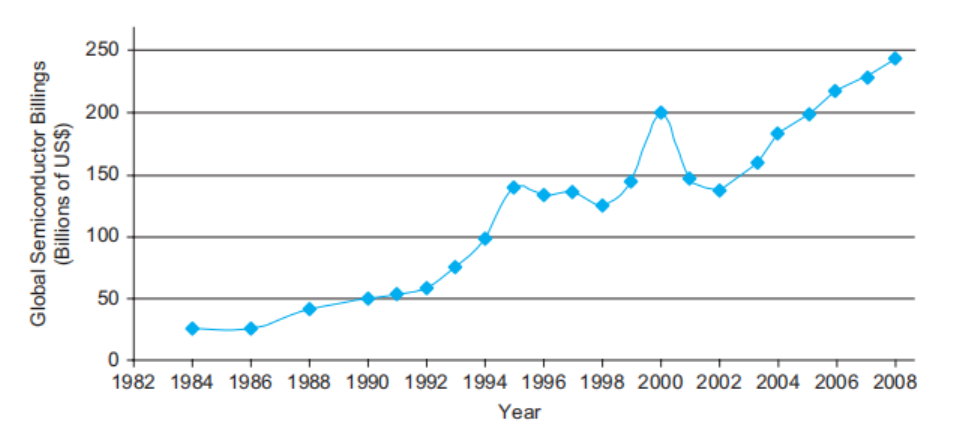

图 1.1  全球半导体市场规模（由半导体行业协会提供。）

十年后，德州仪器公司的杰克·基尔比意识到，如果能在一片硅片上制造多个晶体管，将带来巨大的小型化潜力。图 1.2(b) 展示了他用锗片和金线制成的第一个集成电路原型。

晶体管的发明为巴丁、布拉顿及其导师威廉·肖克利赢得了 1956 年的诺贝尔物理学奖。基尔比则因发明集成电路于 2000 年获得诺贝尔物理学奖。

晶体管可看作电控开关，它有一个控制端和另外两个端子，根据施加在控制端的电压或电流，这两个端子之间导通或断开。点接触晶体管发明后不久，贝尔实验室便开发出了双极结型晶体管。双极型晶体管更可靠、噪声更低，也更省电。早期的集成电路主要使用双极型晶体管。双极型晶体管需要向控制端（基极）注入一个小电流，才能在另外两端（发射极和集电极）之间切换大得多的电流。这些基极电流即使在电路不切换时也会被吸取，

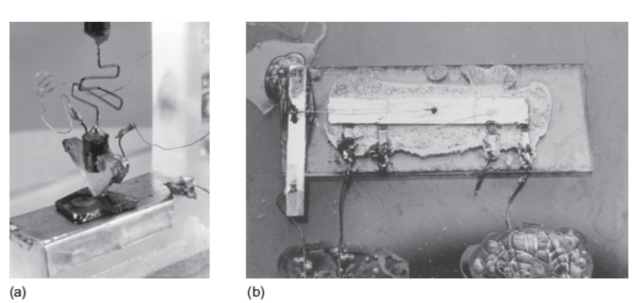

<small>图 1.2 (a) 第一只晶体管（图片归 AT&T 档案所有。经 AT&T 许可转载）和 (b) 第一块集成电路（由德州仪器公司提供）</small>

由此产生的静态功耗限制了可集成在单颗芯片上的晶体管的最大数量。到 20 世纪 60 年代，金属氧化物半导体场效应晶体管（MOSFET）开始投入生产。MOSFET 具有一个显著优势，即在空闲时几乎不吸取控制电流。它们分为两种类型：nMOS 和 pMOS，分别使用 n 型和 p 型硅。场效应晶体管的最初构想可追溯到 1925 年德国科学家尤利乌斯·利连菲尔德 [美国专利 1,745,175]，而一种与 MOSFET 极为相似的结构则于 1935 年由奥斯卡·海尔提出 [英国专利 439,457]，但材料问题使早期制造可工作器件的尝试受挫。

1963 年，仙童半导体公司的弗兰克·万拉斯描述了首批使用 MOSFET 的逻辑门 [Wanlass63]。仙童的门电路同时使用了 nMOS 和 pMOS 晶体管，因而得名互补金属氧化物半导体，即 CMOS。这些电路虽由分立晶体管构成，功耗却仅为纳瓦级，比同等的双极型电路低了六个数量级。随着硅平面工艺的发展，MOS 集成电路因其每个晶体管占用面积更小且制造工艺更简单而因低成本变得极具吸引力 [Vadasz69]。早期的商业工艺仅使用 pMOS 晶体管，在性能、良率和可靠性方面均不尽人意。使用 nMOS 晶体管的工艺则在 20 世纪 70 年代开始普及 [Mead80]。英特尔凭借其 1101 256 位静态随机存取存储器和 4004 4 位微处理器（如图 1.3 所示），在 nMOS 技术领域走在前列。虽然 nMOS 工艺比 CMOS 便宜，但 nMOS 逻辑门在空闲时依然会消耗功耗。到了 20 世纪 80 年代，当数十万个晶体管被集成到单颗芯片上时，功耗便成了一个主要问题。CMOS 工艺因此被广泛采用，并已基本上取代了 nMOS 和双极型工艺，用于几乎所有的数字逻辑应用。

1965 年，戈登·摩尔观察到，将可最经济地制造于一块芯片上的晶体管数目在半对数坐标纸上绘制出来，得到的是一条直线 [Moore65]。当时，他发现晶体管数量每 18 个月翻一番。这一观察被称为摩尔定律，并已成为一个自我实现的预言。图 1.4 表明，自 4004 发明以来，英特尔微处理器中的晶体管数量每 26 个月翻一番。摩尔定律主要由晶体管尺寸的微缩驱动，并在较小程度上得益于芯片面积的增大。芯片的集成度被划分为小规模、中规模、大规模和超大规模。小规模集成（SSI）电路，如 7404 反相器，门数不足 10

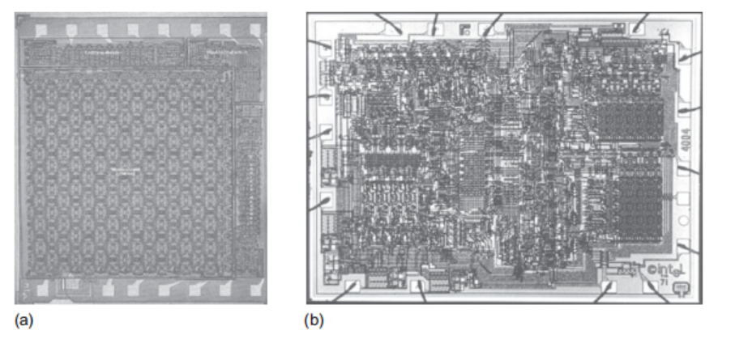

<small>图 1.3 (a) 英特尔 1101 静态随机存取存储器（© IEEE 1969 [Vadasz69]）和 (b) 4004 微处理器（经英特尔公司许可转载）</small>

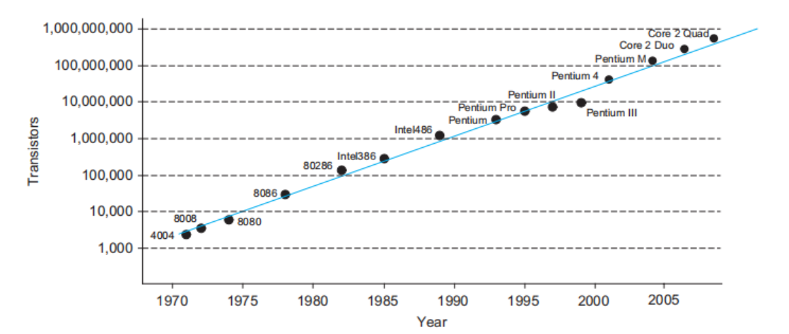

<small>图 1.4 Intel微处理器中的晶体管</small>

个，每个门约有六个晶体管。中规模集成（MSI）电路，如 74161 计数器，门数最多约 1000 个。大规模集成（LSI）电路，如简单的 8 位微处理器，门数多达 10,000 个。人们很快意识到，若该命名趋势持续下去，每隔五年就得创造新名称，因此超大规模集成（VLSI）一词被用来指代 20 世纪 80 年代以后的绝大多数集成电路。摩尔定律的一个推论是登纳德缩放定律 [Dennard74]：随着晶体管缩小，它们会变得更快、功耗更低，且制造成本更低。图 1.5 显示，英特尔微处理器的时钟频率大约每 34 个月翻一番。这种频率提升在 2004 年前后撞上了功耗墙，时钟频率于是稳定在 3 GHz 左右。计算机的性能，以运行应用程序所需时间来衡量，其进步甚至超过了单纯的时钟速度。目前，性能由芯片上的内核数量而非时钟频率来驱动。尽管单个 CMOS 晶体管每次开关消耗的能量极少，但海量晶体管以极高速度开关，使功耗再度成为一项主要的设计考量。而且，随着晶体管变得如此之小，它们已无法彻底关断。每个晶体管泄露的微小电流，当乘以芯片上数百万乃至数十亿个晶体管时，便会导致巨大的功耗。

CMOS 制造工艺的特征尺寸是指能够可靠制造出的晶体管的最小尺寸。1971 年，4004 的特征尺寸为 10 µm。2008 年，酷睿 2 双核的特征尺寸为 45 nm。制造商每两到三年推出一代新工艺（也称技术节点），其特征尺寸缩小 30%，以在相同面积内容纳两倍数量的晶体管。图 1.6 展示了工艺代的演进。0.25 µm 及以上的特征尺寸通常以微米（10⁻⁶ m）表示，更小的特征尺寸则以纳米（10⁻⁹ m）表示。那些在微米工艺中相对次要的效应，如晶体管漏电、相邻晶体管特性差异以及导线电阻，在纳米工艺中变得极为重要。

摩尔定律已成为一个自我实现的预言，因为每家公司都必须跟上竞争对手的步伐。显然，这种微缩不可能永远持续下去，因为晶体管不可能比原子还小。登纳德缩放定律已经开始放缓。到了 45 纳米世代，

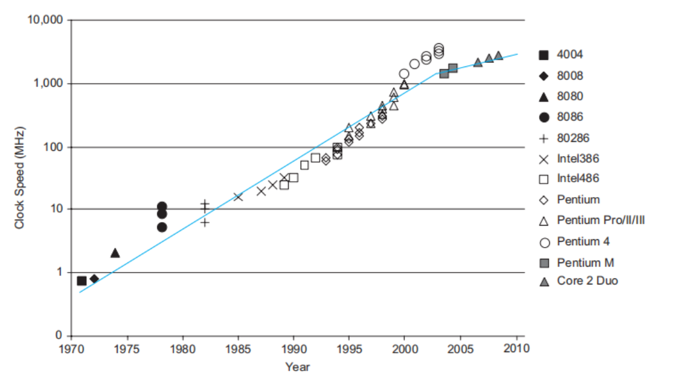

<small>图1.5 Intel微处理器中的时钟频率</small>

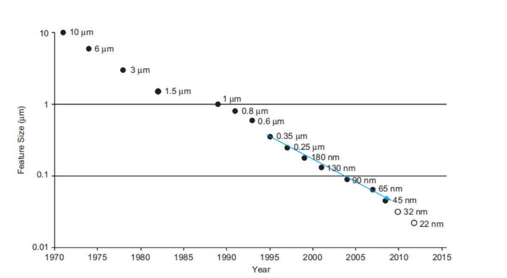

<small>图1.6 工艺代数。来自于[SIA2007]的预测</small>

设计者不得不在改善功耗与改善延迟之间进行权衡。尽管印制每个晶体管的成本在下降，但一次性设计费用却在呈指数级增长，这使得最先进的工艺只能用于那些销量巨大或有尖端性能要求的芯片。然而，许多关于微缩存在根本极限的预测已被证明是错误的。富有创造力的工程师和材料科学家若能领先于竞争对手，便有数十亿美元的巨大收益。在 20 世纪 90 年代初期，专家们一致认为微缩至少还会持续十年，但那之后的未来则不甚明朗。到了 2009 年，我们依然相信摩尔定律至少还会再延续十年。未来，正等待你去创造。

# 1.2 综述
随着芯片上晶体管数量的指数级增长，设计者越来越依赖更高程度的自动化，以期获得相应的生产率提升。许多设计者将大量精力花在用硬件描述语言描述功能上，很少去关注实际的晶体管。然而，芯片设计并非软件工程。解决更棘手的问题需要对电路和物理设计有根本性的理解。因此，本书着重于自底向上地建立对集成电路的理解。

在本章中，我们将把 CMOS 晶体管简化为开关来看待。利用这个模型，我们将构建出 CMOS 逻辑门和锁存器。CMOS 晶体管是在硅晶圆上采用类似印刷机的光刻步骤大规模制造的。我们将探索如何通过指定矩形来设计晶体管版图，这些矩形标明应在何处扩散掺杂剂、生长多晶硅、淀积金属导线以及刻蚀接触孔以连接各层。到本章中段，你将掌握设计和绘制自己简单的 CMOS 芯片所需的全部原理。

本章最后以一个扩展示例结束，演示了一个简单 8 位 MIPS 微处理器芯片的设计。该处理器引出了许多设计问题，这些问题将在本书后续章节中更深入地展开。学习 VLSI 设计的最佳方式就是动手实践。www.cmosvlsi.com 上提供了一套实验练习，指导你设计自己的微处理器芯片。

# 1.3 MOS晶体管
硅（Si）是一种半导体，是大多数集成电路的基本起始材料[Tsividis99]。纯硅由原子的三维晶格构成。硅是第IV族元素，因此与四个相邻原子形成共价键，如图1.7(a)所示。为便于绘制，图中将晶格显示在平面上，但它实际上形成的是立方晶体。由于所有价电子都参与形成化学键，纯硅是电的不良导体。可以通过向硅晶格中引入少量称为掺杂剂的杂质来提高其导电性。来自元素周期表第V族的掺杂剂（如砷）具有五个价电子。它取代晶格中的一个硅原子，并仍然与四个相邻原子键合，因此第五个价电子较松散地束缚在砷原子上，如图1.7(b)所示。室温下晶格的热振动就足以使该电子挣脱束缚自由移动，留下一个带正电的As⁺离子和一个自由电子。自由电子能够承载电流，因此导电性得以提高。我们称其为n型

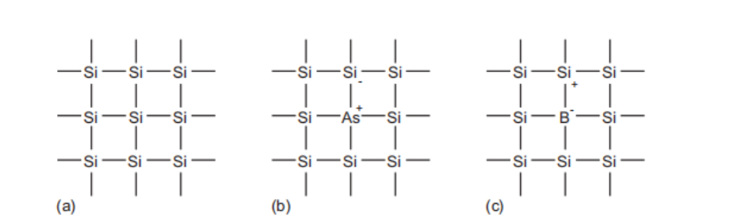

<small>图1.7 硅晶格与掺杂原子</small>
半导体，因为其自由载流子是带负电的电子。类似地，第III族掺杂剂（如硼）具有三个价电子，如图1.7(c)所示。掺杂剂原子可以向相邻的硅原子借用一个电子，该硅原子随之缺少一个电子。那个原子又可以向其他原子借电子，如此延续，这样缺失的电子——即空穴——便能在晶格中传播。空穴充当正载流子，因此我们称之为p型半导体。

p 型硅与 n 型硅之间的结被称为二极管，如图 1.8 所示。当 p 型半导体（称为阳极）的电压高于 n 型阴极时，二极管正向偏置，电流导通。当阳极电压低于或等于阴极电压时，二极管反向偏置，仅有极小的电流流过。

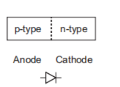

<small>图1.8 p-n 结二极管结构与符号</small>

金属-氧化物-半导体（MOS）结构是通过叠加多层导电和绝缘材料，形成类似三明治的层叠结构而制成的。这些结构采用一系列化学工艺步骤制造，包括硅的氧化、选择性引入掺杂剂，以及金属导线和接触孔的淀积与刻蚀。晶体管制造在近乎完美的硅单晶上，这种单晶以直径 15 至 30 厘米的薄而平的圆形晶圆形式提供。CMOS 技术提供两种类型的晶体管（也称为器件）：n 型晶体管（nMOS）和 p 型晶体管（pMOS）。晶体管的工作由电场控制，因此这些器件也被称为金属氧化物半导体场效应晶体管（MOSFET），或简称为 FET。这些晶体管的截面图和符号如图 1.9 所示。n⁺ 和 p⁺ 区域表示重掺杂的 n 型或 p 型硅。

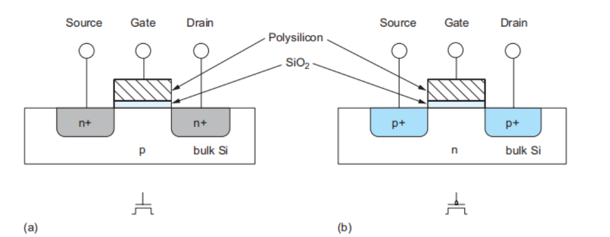

<small>图1.9 nMOS晶体管(a)和pMOS晶体管(b)</small>

每个晶体管由导电栅极、一层绝缘的二氧化硅（SiO₂，俗称玻璃）以及硅晶圆（也称衬底、体或基体）堆叠而成。早期晶体管的栅极由金属制成，因此这种堆叠被称为金属-氧化物-半导体，即 MOS。自 20 世纪 70 年代起，栅极改用多晶硅（polysilicon）形成，但名称沿用至今。（有趣的是，2007 年金属栅极重新出现，以解决先进制造工艺中的材料问题。）nMOS 晶体管采用 p 型体，并在紧邻栅极的区域设有 n 型半导体区，称为源极和漏极。它们在物理上是对称的，目前我们可视其为可互换。体通常接地。pMOS 晶体管则恰好相反，由 p 型源极和漏极区以及 n 型体构成。在同时包含这两种晶体管的 CMOS 工艺中，衬底要么是 n 型，要么是 p 型。另一种类型的晶体管必须制作在专门的阱中，通过添加掺杂原子在该阱中形成相反类型的体。

栅极是控制输入端：它影响源极和漏极之间电流的流动。以 nMOS 晶体管为例。体通常接地，因此源极和漏极与体之间的 p–n 结处于反向偏置。若栅极也接地，则没有电流流过反向偏置的结，我们称晶体管处于关断状态。如果提高栅极电压，就会产生电场，开始将自由电子吸引到 Si–SiO₂ 界面的下侧。若电压足够高，电子数量超过空穴，栅极下方一个称为沟道的薄区域会发生反型，呈现为 n 型半导体。这样，从源极到漏极就形成了一条由电子载流子构成的导电通路，电流得以流通。我们称晶体管处于导通状态。

对于 pMOS 晶体管，情况再次相反。体接正电压。当栅极也处于正电压时，源极和漏极的结反向偏置，无电流流过，晶体管关断。当栅极电压降低时，正电荷被吸引到 Si–SiO₂ 界面的下侧。足够低的栅极电压使沟道反型，形成一条由正载流子构成的从源极到漏极的导电通路，晶体管导通。注意，pMOS 晶体管的符号在栅极上有一个小圆圈，表示其工作特性与 nMOS 相反。

正电压通常称为 VDD 或 POWER（电源），在数字电路中代表逻辑 1。在 20 世纪 70 和 80 年代的主流逻辑系列中，VDD 通常设为 5 伏。后来更小、更新的晶体管无法承受如此高的电压，转而使用 3.3 V、2.5 V、1.8 V、1.5 V、1.2 V、1.0 V 等电源电压。低电压称为 GROUND（地，GND）或 VSS，代表逻辑 0，通常为 0 伏。

总而言之，MOS 晶体管的栅极控制着源极与漏极之间电流的流动。将这一点极度简化，便可将 MOS 晶体管视为简单的开/关开关。当 nMOS 晶体管的栅极为 1 时，晶体管导通，源极与漏极之间存在一条导电通路。当栅极为低电平时，nMOS 晶体管关断，几乎没有电流从源极流向漏极。pMOS 晶体管则恰好相反，栅极为低电平时导通，栅极为高电平时关断。图 1.10 展示了这一开关模型，其中 g、s 和 d 分别表示栅极、源极和漏极。在我们讨论电路行为时，该模型将是我们最常用的模型。

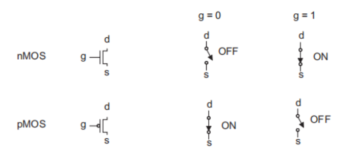

<small>图1.10 晶体管符号和开关级模型</small>

# 1.4 CMOS逻辑
## 1.4.1 反相器
图 1.11 展示了使用一个 nMOS 晶体管和一个 pMOS 晶体管构成的 CMOS 反相器（即非门）的电路图和符号。顶部的横条表示 VDD（电源），底部的三角形表示 GND（地）。当输入 A 为 0 时，nMOS 晶体管关断，pMOS 晶体管导通。因此，输出 Y 被上拉至 1，因为它与 VDD 连通而与 GND 断开。相反，当 A 为 1 时，nMOS 导通，pMOS 关断，Y 被下拉至 0。表 1.1 总结了这一关系。

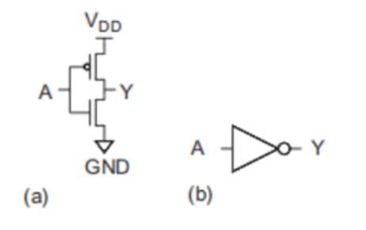

<small>图1.11 反相器电路图（a）和符号（b）</small>

表 1.1 反相器真值表

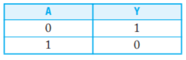

## 1.4.2 与非门
图 1.12(a) 展示了一个2输入CMOS与非门（NAND gate）。它由串联在 Y 与 GND 之间的两个 nMOS 晶体管和并联在 Y 与 VDD 之间的两个 pMOS 晶体管组成。若输入端 A 或 B 中任何一个为 0，则至少有一个 nMOS 晶体管关断，从而切断 Y 到 GND 的通路。但至少有一个 pMOS 晶体管会导通，形成 Y 到 VDD 的通路。因此，输出 Y 将为 1。若两个输入均为 1，则两个 nMOS 晶体管均导通，而两个 pMOS 晶体管均关断。因此，输出将为 0。真值表如表 1.2 所示，符号如图 1.12(b) 所示。注意，根据德摩根定律，求反的小圆圈可以画在门的任意一侧。本书图示中，在 T 形交点处相交的两条线是相连的。两条线交叉时，当且仅当交叉点画有圆点才表示相连。

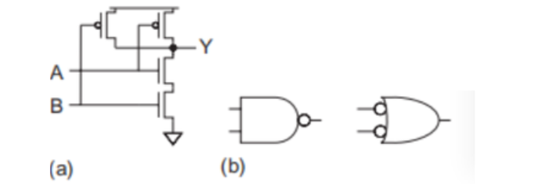

<small>图1.12 两输入与非门电路图（a）和符号（b）</small>

表 1.2 与非门真值表

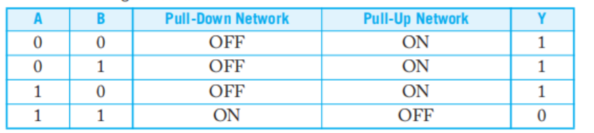

k 输入与非门由 k 个串联的 nMOS 晶体管和 k 个并联的 pMOS 晶体管构成。例如，图 1.13 显示了一个 3 输入与非门。当任意输入为 0 时，输出通过并联的 pMOS 晶体管被上拉至高电平。当所有输入均为 1 时，输出通过串联的 nMOS 晶体管被下拉至低电平。

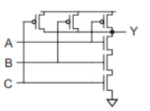

<small>图1.13 三输入与非门电路图</small>

## 1.4.3 CMOS逻辑门
反相器和与非门是静态 CMOS 逻辑门的例子，也称为互补 CMOS 门。一般来说，静态 CMOS 门包含一个 nMOS 下拉网络，用于将输出连接到 0（GND），以及一个 pMOS 上拉网络，用于将输出连接到 1（VDD），如图 1.14 所示。这两个网络被设计成对于任何输入模式，一个导通而另一个关断。

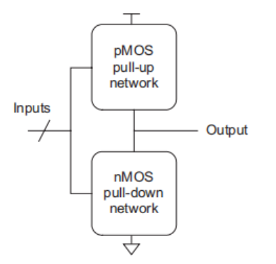

<small>图1.14 使用上拉和下拉网络的通用逻辑门</small>

反相器中的上拉和下拉网络各由一个晶体管组成。与非门采用串联下拉网络和并联上拉网络。更复杂的门则使用更精细的网络。两个或多个串联的晶体管只有在所有串联晶体管都导通时才导通。两个或多个并联的晶体管只要其中任何一个导通即为导通。图1.15针对nMOS和pMOS晶体管对对此进行了说明。通过组合使用这些结构，可以构建出CMOS组合逻辑门。尽管此类静态CMOS门应用最为广泛，但第9章将探讨用晶体管构建门电路的其它方法。

一般来说，当我们连接一个上拉网络和一个下拉网络以构成如图1.14所示的逻辑门时，两者都会试图在输出端施加一个逻辑电平。输出端可能出现的电平如表1.3所示。从该表可以看出，CMOS逻辑门的输出可以处于四种状态。反相器和与非门中已经遇到了1电平和0电平，此时要么上拉网络关断、下拉网络导通，要么反之。当上拉和下拉网络都关断时，就会出现高阻态或称为浮空Z的输出状态。这在多路选择器、存储元件和三态总线驱动器中非常重要。当上拉和下拉网络同时导通时，则存在短路（或竞争）X电平。两个网络之间的竞争会导致不确定的输出电平并消耗静态功耗。这通常是一种不希望出现的情况。

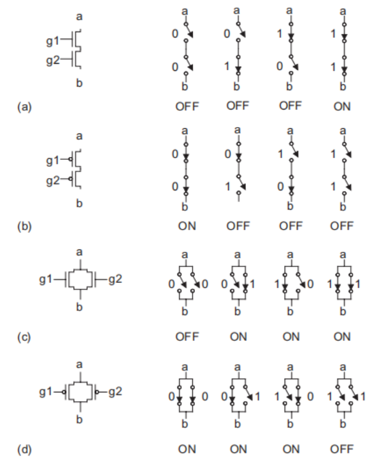

<small>图1.15 串联和并联晶体管的连接方式与工作特性</small>

表 1.3 与非门真值表

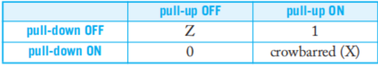

## 1.4.4 或非门
图1.16展示了一个2输入或非门。其中nMOS晶体管并联，以便在任一输入为高电平时将输出拉低。pMOS晶体管串联，以便在两个输入均为低电平时将输出拉高，如表1.4所示。输出永远不会出现竞争（短路）或浮空状态。

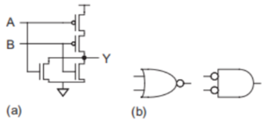

<small>图1.16 两输入或非门电路图和符号</small>

表 1.4 NOR门真值表

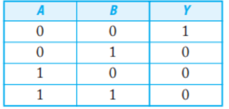

例子 1.1
绘制一个3输入CMOS或非门的草图。
解答：图1.17展示了这样一个门电路。若任一输入为高电平，输出便通过并联的nMOS晶体管被拉低。若所有输入均为低电平，输出则通过串联的pMOS晶体管被拉高。

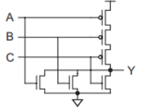

<small>图1.17 三输入或非门电路图</small>

## 1.4.5 复合门
通过在单级逻辑中组合使用串联和并联开关结构，可以形成执行更复杂逻辑功能的复合门。例如，图1.18展示了函数 Y = !((A · B) + (C · D))  电路的推导过程。该函数有时被称为AND-OR-INVERT-22或AOI22，因为它对两个2输入与门的结果执行或非操作。对于nMOS下拉网络，取未取反的表达式 ((A · B) + (C · D))，该表达式指示输出何时应被拉至'0'。与项 (A · B) 和 (C · D) 可通过开关的串联来实现，如图1.18(a)所示。现在，要对结果执行或操作，就需要将这两个结构并联，如图1.18(b)所示。对于pMOS上拉网络，我们必须使用以相反极性导通的开关来计算互补表达式。根据德摩根定律，这等价于交换与操作和或操作。因此，在下拉网络中串联出现的晶体管必须在上拉网络中并联出现。在下拉网络中并联出现的晶体管必须在上拉网络中串联出现。这一原理称为传导互补，并已用于与非门和或非门的设计中。在上拉网络中，A和B的并联组合与C和D的并联组合串联放置。这一过程在图1.18(c)和图1.18(d)中清晰可见。将这些网络组合在一起即得到完整的电路图（图1.18(e)）。其符号如图1.18(f)所示。

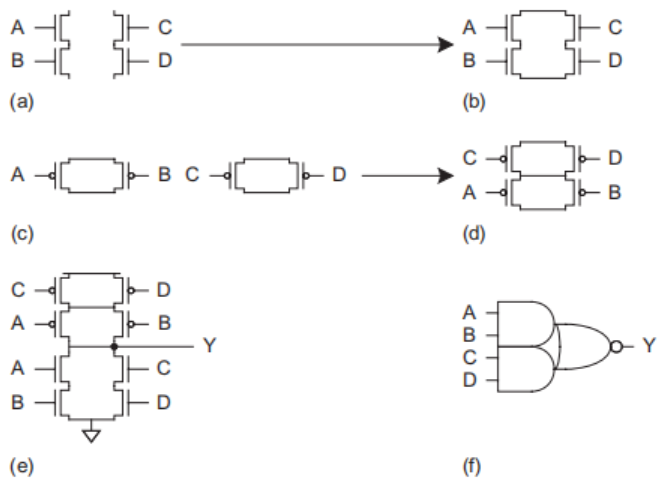

<small>图1.18 实现函数 Y = !((A · B) + (C · D)) 的 CMOS 复合门</small>

这个 AOI22 门可用作 2 输入反相多路选择器，方法是将 C = A 作为选择信号。此时，若 C 为 0，则 Y = B；若 C 为 1，则 Y = D。1.4.8 节展示了改进这种多路选择器设计的一种方法。

例 1.2
绘制一个计算 Y = !((A + B + C) · D) 的静态 CMOS 门。
解：图 1.19 展示了这样一个或-与-非 3-1（OAI31）门。nMOS 下拉网络在 D 为 1 且 A 或 B 或 C 中任意一个为 1 时将输出拉低，因此 D 与 A、B 和 C 的并联组合串联。pMOS 上拉网络是其传导互补，因此 D 必须与 A、B 和 C 的串联组合并联。

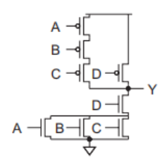

<small>图1.19 实现函数 Y = !((A + B + C) · D) 的 CMOS 复合门</small>

## 1.4.6 传输管与传输门
信号的强度是通过它与理想电压源的接近程度来衡量的。一般来说，信号越强，它能提供或吸收的电流就越多。电源轨（VDD 和 GND）是最强逻辑 1 和逻辑 0 的来源。

nMOS 晶体管在传输 0 时几乎是一个完美的开关，因此我们说它传输强 0。然而，nMOS 晶体管在传输 1 时并不完美。如 2.5.4 节将要解释的那样，其高电平电压会略低于 VDD，我们说它传输的是衰减的或弱的 1。pMOS 晶体管则再次表现出相反的特性：传输强 1，但传输衰减的 0。图 1.20 总结了这些晶体管的符号及其特性，其中 g、s 和 d 分别表示栅极、源极和漏极。

当单独使用一个 nMOS 或 pMOS 作为不完美的开关时，我们有时称其为传输管。通过将一个 nMOS 和一个 pMOS 晶体管并联（图 1.21(a)），我们获得了一个开关：当在 g 施加 1 时导通（图 1.21(b)），并且能以可接受的方式传输 0 和 1（图 1.21(c)）。我们称其为传输门或传输门。在只需传输 0 或只需传输 1 的电路中，可以删去对应的晶体管（n 或 p），从而退化为单个 nMOS 或 pMOS 器件。

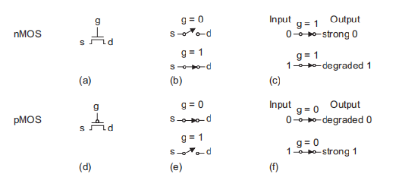
<small>图1.20 传输管的强输出与衰减输出</small>

请注意，传输门既需要控制输入，也需要其互补信号。这被称为双轨逻辑。图 1.21(d) 展示了传输门的一些电路符号¹。这些符号都不如简单的电路图好画，因此本书将使用电路图形式来表示传输门。

到目前为止，在我们所有的示例中，输入驱动的是下拉网络中 nMOS 晶体管的栅极，以及互补上拉网络中 pMOS 晶体管的栅极，如图 1.14 所示。因此，nMOS 晶体管只需传输 0，而 pMOS 晶体管只需传输 1，这样输出始终被强驱动，电平永远不会衰减。这被称为完全恢复的逻辑门，极大地简化了电路设计。与其他需要以上拉和下拉开关网络某种方式按比例设计的逻辑形式不同，静态 CMOS 门无论晶体管的物理尺寸如何都能正确工作。此外，对于任何输入组合，都不会出现从 '1' 电源到 '0' 电源之间通过 '导通' 晶体管的通路（这与单沟道 MOS、GaAs 技术或双极型技术不同）。我们将在后续章节中发现，这正是 CMOS 具有低静态功耗的基础。

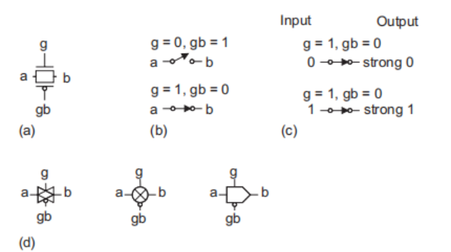
<small>图1.21 传输门</small>

静态 CMOS 门设计的一个必然结果是它们必须是反相的。当输入为 1 时，nMOS 下拉网络导通，导致输出为 0。我们可能会想通过把晶体管上下颠倒来构成一个同相门。例如，图 1.22 给出了一个同相缓冲器。不幸的是，此时 nMOS 和 pMOS 晶体管都会产生衰减的输出，因此这种方法应当避免。取而代之，我们可以通过多级反相门来构成同相功能。图 1.23 显示了由两级反相静态 CMOS 门构建 4 输入与门的几种方法，每种设计在速度、尺寸和功耗方面有不同的取舍。

类似地，图 1.18 中的复合门也可以用两个与门、一个或门和一个反相器来构成。而这些与门和或门又可由与非门/或非门和反相器构成，如图 1.24 所示，总共使用 20 个晶体管，而图 1.18 仅用了 8 个。优秀的 CMOS 逻辑设计师会利用复合门的高效性，而不是大量使用与/或门。

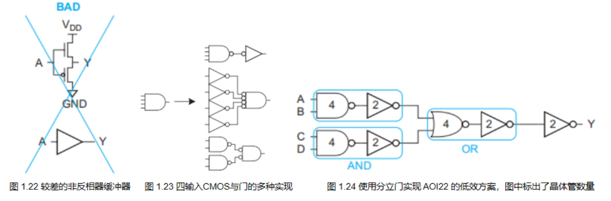

## 1.4.7 三态门
图1.25展示了三态缓冲器的符号。当使能输入EN为1时，输出Y等于输入A，就像一个普通的缓冲器。当使能为0时，Y处于悬空状态（'Z'值）。表1.5对此进行了总结。有时，真使能信号EN和互补使能信号 $\overline{\text{EN}}$ 会同时明确画出，而有时仅显示EN。

表1.5 三态门的真值表

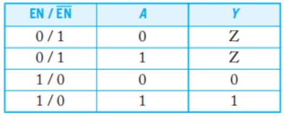

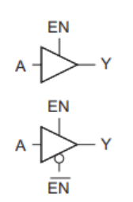     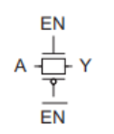
<small>图1.25 三态门符号</small>       <small>图1.26 传输门</small>

图1.26中的传输门与三态缓冲器具有相同的真值表。它仅需两个晶体管，但却是非恢复电路。如果输入存在噪声或其他形式的衰减，输出也会得到同样的噪声。我们将在4.4.2节中看到，一连串非恢复门的延迟会随门的数量急剧增加。

图1.27(a)展示了一个三态反相器。其输出由VDD或GND主动驱动，因此它是一个恢复逻辑门。与迄今为止考虑的所有门不同，三态反相器并不遵循传导互补规则，因为它允许输出在特定输入组合下浮空。当EN为0时（图1.27(b)），两个使能晶体管均关断，使输出悬空。当EN为1时（图1.27(c)），两个使能晶体管均导通。从概念上讲，它们从电路中被移除，留下一个简单的反相器。图1.27(d)展示了三态反相器的符号。互补使能信号既可在内部产生，也可显式地布到单元中。三态缓冲器可由一个普通反相器后接一个三态反相器构成。

三态曾经普遍用于允许多个单元驱动一个公共总线，只要在同一时间恰好只有一个单元使能。如果多个单元驱动总线，就会发生竞争并浪费功耗。如果没有单元驱动总线，它可能浮空至无效的逻辑电平，导致接收器浪费功耗。此外，当使能信号分布在一个大型芯片上时，很难让它们在完全相同的时刻切换。不同使能信号切换之间的延迟可能导致竞争。鉴于这些问题，如今多路选择器比三态总线更受青睐。

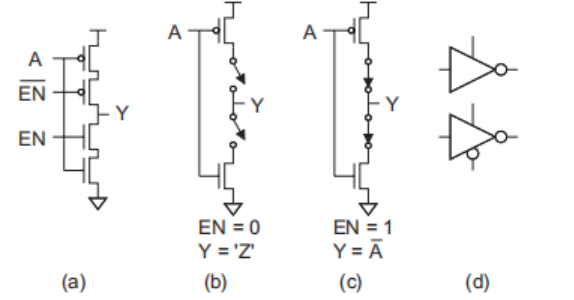

<small>图1.27 三态门反相器</small>

## 1.4.8 多路复用器
多路选择器是CMOS存储元件和数据操作结构中的关键组成部分。多路选择器根据选择信号从多个输入中选出输出。一个2输入，即2:1多路选择器，当选择信号为0时选择输入D0，当选择信号为1时选择输入D1。其真值表由表1.6给出；逻辑函数为 Y = $\overline{\text{S}}$ · D0 + S·D1。

表 1.6 多路复用器真值表
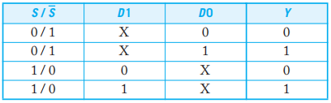

两个传输门可以连接在一起，构成一个紧凑的2输入多路选择器，如图1.28(a)所示。选择信号及其互补信号在任何给定时刻恰好使能两个传输门中的一个。互补选择信号S在符号中通常不画出来，如图1.28(b)所示。

同样，传输门构成的是一种非恢复的多路选择器。我们可以用几种方法由门电路构建一个恢复的、反相的多路选择器。一种方法是使用图1.18(e)的复合门，按图1.29(a)所示连接。另一种方法是将两个三态反相器并联在一起，如图1.29(b)所示。注意，这两种方案的电路图几乎相同，只是图1.29(b)中的上拉网络略有简化并重新排列。这是可行的，因为选择信号及其互补信号是互斥的。三态反相器方案因所需内部连线较少而略显紧凑和快速。同样，如果互补选择信号在单元内部产生，则从符号中省略（图1.29(c)）。

更大的多路选择器可由多个2输入多路选择器构成，或通过直接将多个三态门并联在一起构成。后一种方法需要为每个三态门提供经译码的使能信号；这些使能信号应同时切换以防止竞争。图1.30展示了使用这两种方法各自实现的4输入（4:1）多路选择器。在实践中，无论是反相还是同相的多路选择器，都简称为多路选择器或mux。

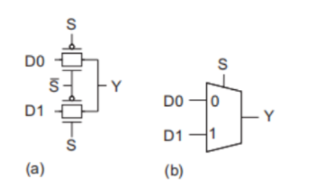

<small> 图1.28 传输门多路复用器 </small>

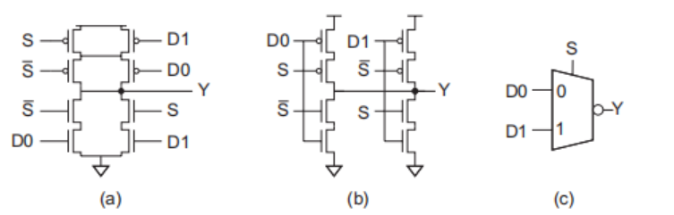

<small> 图1.29 反相的多路复用器 </small>

## 1.4.9 时序电路
到目前为止，我们讨论的都是组合电路，其输出仅取决于当前的输入。时序电路则具有记忆功能：其输出同时取决于当前和之前的输入。利用前面已构建的组合电路，我们现在可以构建诸如锁存器和触发器之类的时序电路。这些元件接收一个时钟信号 CLK 和一个数据输入 D，并产生输出 Q。D 锁存器在 CLK = 1 时是透明的，这意味着 Q 跟随 D。当 CLK = 0 时，它变为不透明，即 Q 保持其先前值并忽略 D 的变化。边沿触发的触发器在 CLK 的上升沿将 D 复制到 Q，并在其他时间保持其旧值。

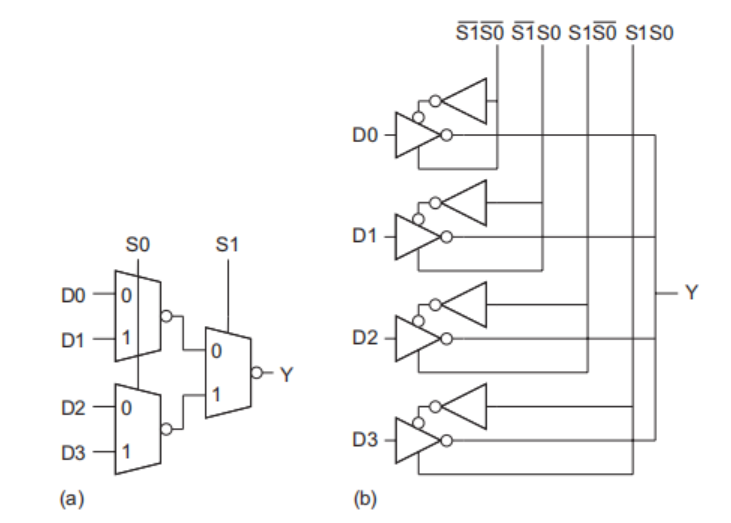

<small> 图1.30 4：1 多路复用器</small>

1.4.9.1 锁存器
图1.31(a)展示了一个由2输入多路选择器和两个反相器构成的D锁存器。因为反相器具有恢复作用，该多路选择器可由一对传输门构成，如图1.31(b)所示。该锁存器还产生互补输出Q。当CLK = 1时，锁存器透明，D直通至Q（图1.31(c)）。当CLK降至0时，锁存器变为不透明。围绕反相器对形成一条反馈通路（图1.31(d)），以无限期保持Q的当前状态。

D锁存器也称为电平敏感锁存器，因为输出状态取决于时钟信号的电平，如图1.31(e)所示。图中所示的是一个正电平敏感锁存器，其符号如图1.31(f)所示。通过将多路选择器的控制连接反相，该锁存器就变为负电平敏感。

1.4.9.2 触发器
通过组合两个电平敏感锁存器，一个为负敏感，一个为正敏感，我们构建出如图1.32(a–b)所示的边沿触发器。第一级锁存器称为主锁存器，第二级称为从锁存器。

当 CLK 为低电平时，主负电平敏感锁存器的输出（QM）跟随 D 输入，而从正电平敏感锁存器则保持先前的值（图1.32(c)）。当时钟从 0 跳变到 1 时，主锁存器变为不透明，并保持时钟跳变时刻的 D 值。从锁存器变为透明，将所存储的主锁存器值（QM）传送到从锁存器的输出（Q）。由于主锁存器已与 D 输入断开，D 输入无法再影响输出（图1.32(d)）。当时钟从 1 跳变到 0 时，从锁存器保持其值，主锁存器则重新开始采样输入。

虽然我们展示的输入级采用了传输门多路选择器，但良好的设计实践会如图1.32(e)那样用反相器对输入和输出进行缓冲，以保持我们所说的“模块化”。模块化将在1.6.2节进一步阐述，而鲁棒锁存器与寄存器将在10.3节深入讨论。

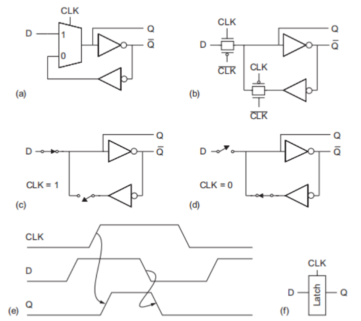

<small> 图1.31 CMOS高电平D锁存器 </small>

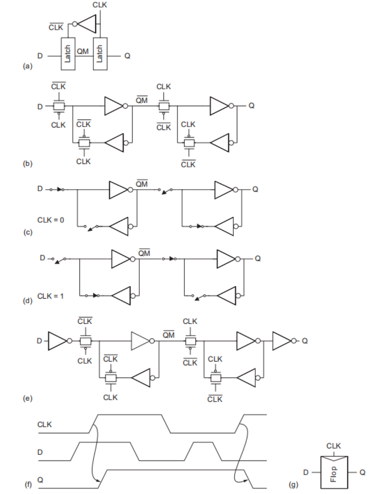

<small> 图1.32 CMOS上升沿触发D触发器 </small>

总之，该触发器在时钟上升沿将 D 复制到 Q，如图 1.32(f) 所示。因此，这种器件被称为上升沿触发的触发器（也称为 D 触发器、D 寄存器或主从触发器）。图 1.32(g) 展示了该触发器的电路符号。通过颠倒锁存器的极性，可以构建下降沿触发的触发器。共享同一时钟输入的一组 D 触发器称为寄存器。寄存器通常画成一个具有多位 D 和 Q 总线的触发器。

在第 10.2.5 节中我们将看到，如果系统时钟偏差过大，即由于时钟到达时间的变化，一个触发器触发得早而另一个触发得晚，触发器就可能发生保持时间失效。在工业设计中，大量的精力被投入到时序仿真中以捕捉保持时间问题。当设计时间更为重要时（例如在课程项目中），可以通过分配双相不交叠时钟来完全避免保持时间问题。图 1.33 展示了采用双相不交叠时钟驱动的触发器。只要两相时钟永不同时有效，在任何给定时刻至少有一个锁存器是不透明的，这样就不会发生保持时间问题。

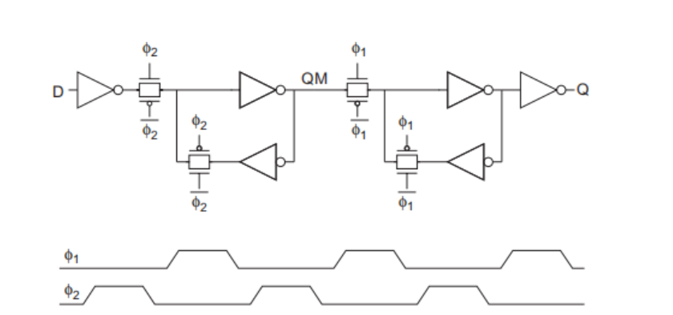

<small>  图1.33  采用两相非重叠时钟的CMOS触发器  </small>

# 1.5 CMOS 制造与版图
既然我们已经能够用晶体管设计逻辑门和寄存器，接下来让我们看看晶体管是如何制造出来的。设计者需要理解电路的物理实现，因为它对性能、功耗和成本有着重大影响。

晶体管制造在薄硅晶圆上，这些晶圆既作为机械支撑，也作为一个称为衬底的电气公共端。我们可以从两个角度来观察晶体管的物理版图。一个是俯视图，通过自上而下观察晶圆获得。另一个是剖面图，通过将晶圆从晶体管中部切开并从侧面观察获得。我们首先来看一个完整CMOS反相器的剖面图。然后，我们再观察同一个反相器的俯视图，并定义一套用于制造反相器不同部分的掩模。晶体管和导线的尺寸由掩模尺寸决定，并受限于制造工艺的分辨率。这一分辨率的不断进步推动了半导体行业的指数级增长。

## 1.5.1 反相器横截面

**图1.34** 展示了一个反相器的横截面及其对应的电路示意图（彩色横截面图见封面内侧）。在此图中，反相器构建在**p型衬底**上。pMOS晶体管需要**n型体区**，因此在其附近的衬底中通过扩散工艺形成**n阱**。如1.3节所述，nMOS晶体管具有重掺杂的**n型源极和漏极**区域，以及在薄层**二氧化硅**（SiO₂，也称**栅氧化层**）之上的**多晶硅栅极**。**n⁺**和**p⁺**扩散区表示重掺杂的n型和p型硅。pMOS晶体管结构类似，具有p型源极和漏极区域。

两个晶体管的多晶硅栅极在图外某处相连，形成**输入A**。nMOS晶体管的源极连接到金属**地线**（GND），pMOS晶体管的源极连接到金属**VDD线**。两个晶体管的漏极通过金属互连，形成**输出Y**。一层厚的SiO₂称为**场氧化层**，用于防止金属与其他层短路，除非在接触孔处被特意刻蚀去除。

金属与轻掺杂半导体之间形成的结为**肖特基二极管**，仅允许单向电流通过。当半导体被重掺杂时，它与金属形成良好的**欧姆接触**，可为双向电流提供低电阻通路。衬底必须接低电位，以避免p型衬底与n⁺ nMOS源/漏区之间的p‑n结正偏；同样，n阱必须接高电位。这一目标通过增加重掺杂的**衬底接触**和**阱接触**（或称**抽头**）来实现，分别将GND和VDD连接到衬底和n阱。

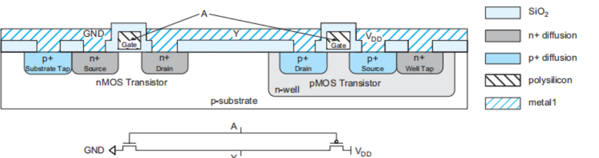

<small>  图1.34 带有阱和衬底接触的反相器横截面。彩色版本见封面内侧。  </small>

## **1.5.2 制造工艺**

尽管芯片极其复杂，但它们的成本却低得惊人，因为所有晶体管和导线都可以像印刷书籍一样以类似的方式“印制”出来。制造流程由一系列步骤组成，在这些步骤中，通过一种称为**光刻**的工艺来定义芯片的各层结构。由于每一步都处理一整片装满芯片的晶圆，因此芯片的成本与其面积成正比，而非与晶体管数量成正比。随着制造工艺的进步，工程师能够制造出更小的晶体管，从而在相同面积内集成更多器件，每个晶体管的成本也随之降低。更小的晶体管速度也更快，因为电子从源极到漏极的行程更短；同时能耗也更低，因为给栅极充电所需的电子更少！这就解释了计算机和电子产品每代都变得更便宜、性能更强的显著趋势。

反相器可以通过一组假设的**六块掩模版**来定义：n阱、多晶硅、n⁺扩散、p⁺扩散、接触孔和金属（实际工艺中的掩模组往往更为复杂，其原因在第3章讨论）。掩模版规定了芯片上各部件将被制造的位置。**图1.35(a)** 展示了这六块掩模版的俯视图（彩色图片见封面内侧）。**图1.34**中反相器的横截面是沿虚线方向剖开的。请花些时间自行理解俯视图与横截面之间的对应关系——这对理解芯片版图至关重要。 

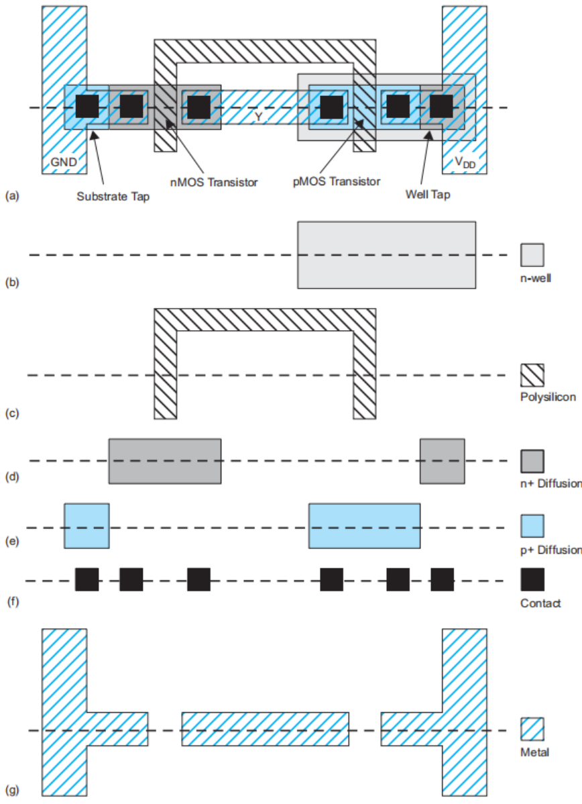

<small>  图1.35 反相器掩模版组。彩色版本见封面内侧。  </small>

考虑一个简单的制造工艺来说明这一概念。该工艺从在裸露的p型硅晶圆上创建n阱开始。图1.36显示了在形成n阱所涉及的每个加工步骤之后晶圆的横截面；图1.36(a)展示了加工前的裸露衬底。形成n阱需要向硅衬底中添加足够的V族掺杂剂，以在阱区域将衬底从p型转变为n型。为了限定哪些区域接受n阱，我们在整个晶圆上生长一层保护性氧化层，然后在需要形成阱的位置将其去除。随后添加n型掺杂剂；掺杂剂被氧化层阻挡，但在没有氧化层的地方进入衬底并形成阱。下一段将详细描述这些步骤。

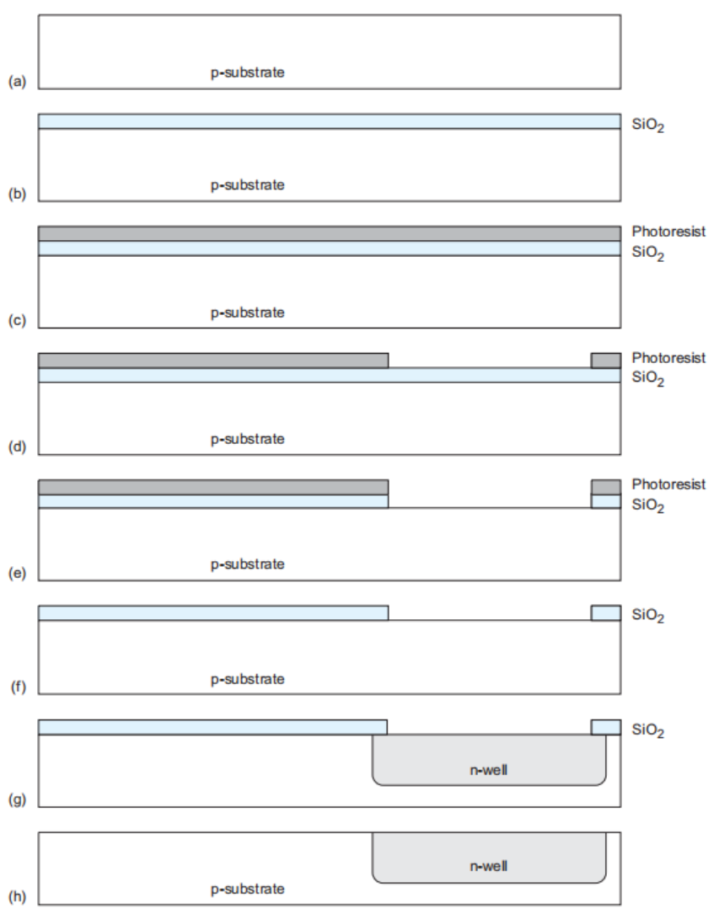

<small>  图1.36 制造n阱过程中的横截面  </small>

晶圆首先在高温（通常为900–1200°C）炉管中进行氧化，使Si与O₂反应，在晶圆表面生成SiO₂（图1.36(b)）。该氧化层需要被图案化以定义n阱。将有机光刻胶²旋涂在晶圆上（光刻胶在曝光处会软化）（图1.36(c)）。通过n阱掩模版（图1.35(b)）对光刻胶进行曝光，该掩模版仅允许光线在需要形成阱的区域通过。去除软化的光刻胶，以暴露下面的氧化层（图1.36(d)）。用氢氟酸（HF）刻蚀掉未被光刻胶保护的氧化层（图1.36(e)），然后用称为“食人鱼”刻蚀的混合酸去除剩余的光刻胶（图1.36(f)）。阱形成在未被氧化层覆盖的衬底区域中。添加掺杂剂的两种方法是扩散和离子注入。在扩散工艺中，晶圆被放置在含有掺杂剂气体的炉管中。加热时，掺杂剂原子扩散进入衬底。注意，由于横向扩散，阱的实际宽度大于氧化层上的开孔宽度（图1.36(g)）。在离子注入中，掺杂剂离子在电场中被加速并轰击进入衬底。无论采用哪种方法，氧化层都能防止掺杂剂原子进入不需要形成阱的衬底区域。最后，用HF去除剩余的氧化层，留下裸露的晶圆，在适当位置形成阱。

接下来形成晶体管的栅极。栅极由多晶硅（通常称为polysilicon）构成，位于薄层氧化层之上。该薄氧化层在炉管中生长。然后将晶圆放入含硅烷气体（SiH₄）的反应器中，再次加热，通过化学气相沉积工艺生长多晶硅层。多晶硅被重掺杂以形成具有较好导电性的导体。所得横截面如图1.37(a)所示。

与之前一样，使用光刻胶和多晶硅掩模版（图1.35(c)）对晶圆进行图案化，使多晶硅栅极保留在薄栅氧化层之上（图1.37(b)）。

随后引入n⁺区域，用于晶体管的有源区和阱接触。与阱的形成类似，先生长一层保护性氧化层（图1.37(c)），并用n扩散掩模版（图1.35(d)）进行图案化，以暴露需要掺杂剂的区域（图1.37(d)）。尽管图1.37(e)中的n⁺区域通常采用离子注入形成，但在历史上是通过扩散形成的，因此至今仍常被称为n扩散。注意，nMOS晶体管上方的多晶硅栅极阻挡了扩散，使得源极和漏极被栅极下方的沟道隔开。这被称为自对准工艺，因为晶体管的源极和漏极自动形成在栅极两侧，无需精确对准掩模版。最后，去除保护性氧化层（图1.37(f)）。

对p扩散掩模版（图1.35(e)）重复上述过程，得到图1.38(a)所示的结构。此处同样使用氧化层作为掩蔽层，因此不再示出。生长场氧化层以隔离晶圆与金属，并用接触孔掩模版（图1.35(f)）进行图案化，在需要金属与扩散区或多晶硅连接的位置留下接触孔（图1.38(b)）。最后，在整个晶圆上溅射铝，同时填充接触孔。溅射是将铝轰击成蒸气，均匀覆盖晶圆表面。用金属掩模版（图1.35(g)）对金属层进行图案化，并通过等离子体刻蚀去除除导线以外所有区域的金属（图1.38(c)）。至此完成了简单的制造工艺。

现代制造流程更为复杂，因为它们必须在晶体管沟道周围形成复杂的掺杂分布，并印制出比光刻所用光波长更小的特征尺寸。然而，这些复杂工艺所需的掩模版可以从我们刚刚讨论过的这套简单掩模版自动生成。现代工艺还拥有5~10层以上的金属层，因此金属和接触孔步骤需要针对每一层重复进行。芯片制造已成为一种商品化服务，许多不同的代工厂都可以根据一套基本掩模版来制造设计。

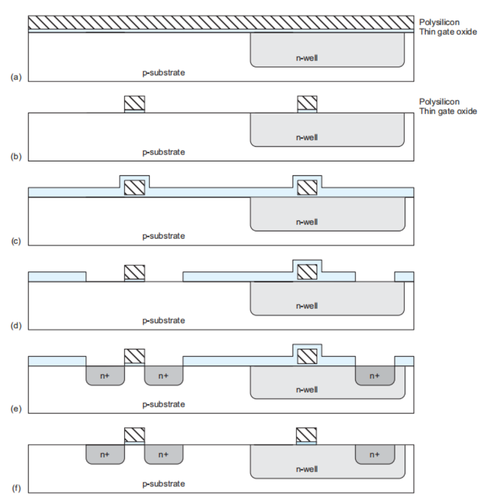

<small>  图1.37 制造多晶硅和n扩散过程中的横截面  </small>

版图设计规则描述了在特定制造工艺中，特征可以做到多小，以及它们之间可以多紧密地可靠排列。工业设计规则通常以微米为单位指定。这使得从一个工艺迁移到更先进的工艺或不同代工厂的工艺变得困难，因为并非所有规则都以相同方式缩放。

大学有时通过使用可缩放设计规则来简化设计，这些规则足够保守，可以适用于许多制造工艺。Mead和Conway[Mead80]推广了基于单一参数λ的可缩放设计规则，该参数表征了工艺的分辨率。λ通常为最小绘制晶体管沟道长度的一半。该长度是晶体管源极和漏极之间的距离，由多晶硅导线的最小宽度决定。例如，180nm工艺的最小多晶硅宽度（因而晶体管长度）为0.18μm，并使用尺寸为λ整数倍的设计规则。然而，它们使版图缩放变得微不足道；同一版图只需指定新的λ值即可迁移到新工艺。本章将以λ为单位来介绍设计规则。以λ规则的简单性和易于缩放为代价，牺牲了微米规则潜在的密度优势。设计人员通常用特征尺寸来描述工艺。特征尺寸指最小晶体管长度，因此λ是特征尺寸的一半。

## 1.5.3 版图设计规则

版图设计规则描述了在特定制造工艺中，特征可以做到多小，以及它们之间可以多紧密地可靠排列。工业设计规则通常以微米为单位指定。这使得从一个工艺迁移到更先进的工艺或不同代工厂的工艺变得困难，因为并非所有规则都以相同方式缩放。

大学有时通过使用可缩放设计规则来简化设计，这些规则足够保守，可以适用于许多制造工艺。Mead和Conway[Mead80]推广了基于单一参数λ的可缩放设计规则，该参数表征了工艺的分辨率。λ通常为最小绘制晶体管沟道长度的一半。该长度是晶体管源极和漏极之间的距离，由多晶硅导线的最小宽度决定。例如，180nm工艺的最小多晶硅宽度（因而晶体管长度）为0.18µm，并使用λ = 0.09µm的设计规则。基于λ的规则必然是保守的，因为它们将尺寸向上取整为λ的整数倍。然而，它们使版图缩放变得微不足道；同一版图只需指定新的λ值即可迁移到新工艺。本章将以λ为单位来介绍设计规则。以λ规则的简单性和易于缩放为代价，牺牲了微米规则潜在的密度优势。设计人员通常用特征尺寸来描述工艺。特征尺寸指最小晶体管长度，因此λ是特征尺寸的一半。

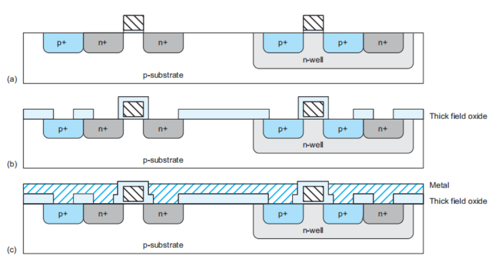

<small>  图 1.38 制造p扩散、接触孔和金属过程中的横截面  </small>

遗憾的是，在180nm以下，设计规则已变得非常复杂且具有工艺特异性，可缩放设计规则难以应用。然而，从一套简单的可缩放规则中获得的直观认识，仍然是理解更复杂规则的宝贵基础。第3章将更详细地探讨其中一些工艺特定规则。

MOSIS服务[Piña02]是一个低成本原型制作服务，它收集来自学术、商业和政府客户的设计，并将它们汇总到一套掩模版上，以分摊间接成本并产生足够吸引制造公司的产量。MOSIS开发了一套基于λ的可缩放设计规则，覆盖了广泛的制造工艺。这些规则描述了避免线条断裂的最小宽度、避免线条之间短路的最小间距，以及确保两层完全重叠的最小交叠量。

对于n阱工艺中带有两层金属的版图，一套保守但易于使用的设计规则如下：

- 金属和扩散区的最小宽度和间距为4λ。
- 接触孔为2λ × 2λ，并且必须在上下各层中被至少1λ的包围。
- 多晶硅的宽度为2λ。
- 多晶硅在需要形成晶体管的地方与扩散区重叠2λ，在不需要形成晶体管的地方与扩散区间距为1λ。
- 多晶硅与多晶硅之间、接触孔与接触孔之间，以及多晶硅与接触孔之间的间距为3λ。
- n阱围绕pMOS晶体管的范围为6λ，且与nMOS晶体管保持6λ的距离。

图1.39展示了具有两层金属工艺的基本MOSIS设计规则。第3.3节将详细阐述这些规则，并与工业设计规则进行比较。

在三层金属工艺中，第三层金属的宽度通常为6λ，间距为4λ。通常，层数更多的工艺会提供更厚、更宽的顶层金属，其电阻更低。

晶体管尺寸通常用其宽长比（W/L）来表示。例如，图1.39中多晶硅与n扩散交叉处形成的nMOS晶体管，其W/L为4/2。在0.6μm工艺中，这对应于实际宽度1.2μm和长度0.6μm。这种最小宽度的带接触孔的晶体管通常称为单位晶体管。pMOS晶体管通常比nMOS晶体管更宽，因为空穴迁移速度比电子慢，因此需要更宽的晶体管才能提供相同的电流。图1.40(a)示出了一个单位反相器版图，其中包含一个单位nMOS晶体管和一个两倍宽度的pMOS晶体管。图1.40(b)给出了该反相器的电路示意图，并标注了每个晶体管的宽长比。在数字系统中，通常选择具有最小可能长度的晶体管，因为短沟道晶体管速度更快、面积更小且功耗更低。图1.40(c)示出了一种我们常用的简写形式，即以单位宽度的倍数表示，并假定长度为最小值。

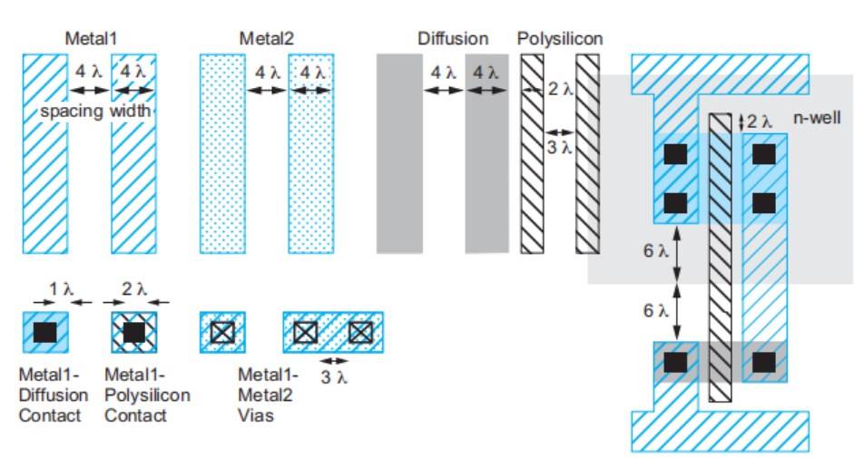

<small>  图 1.39 简化的基于λ的设计规则 </small>

## 1.5.4 门级版图

在设计版图拓扑结构以最小化门或其他单元（如加法器或存储单元）的面积时，可以发挥大量巧思，也可能耗费大量时间。对于许多应用而言，一种直接的版图设计就已足够，并且可以通过自动生成或手工快速构建。本节介绍一种基于“扩散线”规则的简单版图风格，该风格常用于自动化版图系统中的标准单元。此风格由四个水平条带组成：单元底部的金属地线、n扩散区、p扩散区和顶部的金属电源线。电源线和地线通常称为电源轨。多晶硅线垂直走线，形成晶体管的栅极。单元内部的金属线将晶体管适当地互连起来。

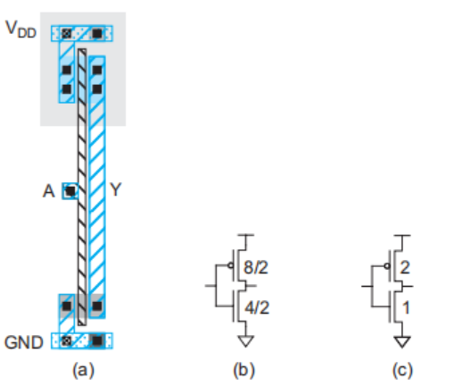

<small>  图 1.40 标注尺寸的反相器 </small>

图1.41(a)展示了这样一个反相器版图。输入A可以从上方、下方或左侧通过多晶硅连接。输出Y在单元右侧以金属线引出。回想一下，p型衬底和n阱必须分别连接到地和电源。图1.41(b)展示了相同的反相器，其中阱接触和衬底接触分别放置在电源轨和地轨下方。图1.42示出了一个三输入与非门。注意nMOS晶体管是串联连接的，而pMOS晶体管是并联连接的。电源线和地线向两侧各延伸2λ，因此如果两个单元拼接在一起，其内容之间将间隔4λ，满足设计规则。单元高度为36λ，如果计入单元与其上方另一条导线之间的4λ间距，则为40λ。所有这些示例均使用宽度为4λ的晶体管。晶体管宽度的选择将在第4–5章中进一步讨论，单元版图风格将在第14.7节中讨论。

这些单元的设计使得栅极连接从多晶硅的上方或下方引出。在当代标准单元中，多晶硅通常不作为布线层使用，因此单元必须允许金属2到金属1以及金属1到多晶硅的接触孔连接到每个栅极。虽然这增大了单元面积，但允许在金属布线层上自由访问所有端子。

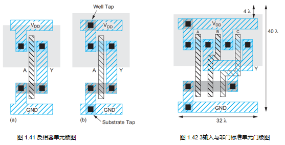

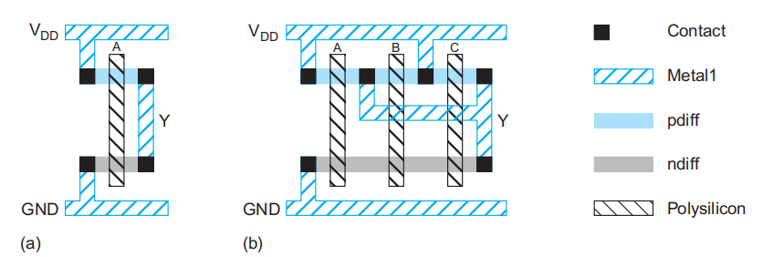

<small>  图 1.43 反相器和三输入与非门的棒状图。彩色版本见封面内侧。 </small>

## 1.5.5 棒状图

由于版图设计耗时，设计人员需要在投入完整版图之前，快速规划单元并估算面积。棒状图易于绘制，因为它们不需要按比例绘制。图1.43和封面内侧展示了反相器和一个三输入与非门的棒状图。虽然本书使用点状图案，但版图设计人员使用干擦记号笔或彩色铅笔。

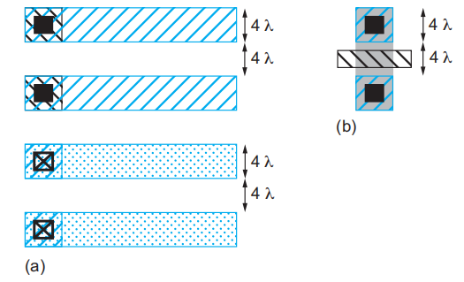

<small>  图 1.44 布线轨道间距 </small>

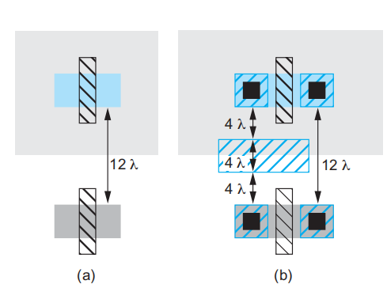

<small>  图 1.45 nMOS晶体管和pMOS晶体管之间的间距 </small>

经过练习，即使棒状图未按比例绘制，也很容易从相应的棒状图估算出版图面积。尽管电路示意图侧重于晶体管，但版图面积通常由金属导线决定，晶体管仅仅是放置在导线下方的元件。我们将一条布线轨道定义为放置一条导线及其与下一条导线之间所需间距的足够空间。如果我们的导线宽度为4λ，与下一条导线的间距为4λ，则轨道间距为8λ，如图1.44(a)所示。该间距也为在导线之间放置晶体管留出了空间（图1.44(b)）。因此，通过数金属轨道的数量并乘以8λ来估算单元的高度和宽度是合理的。一个稍微复杂之处在于，n阱所决定的nMOS与pMOS晶体管之间需要12λ的间距，如图1.45(a)所示。该空间可被额外的一条导线轨道占据，如图1.45(b)所示。因此，无论该轨道中是否实际使用了导线，都必须在nMOS和pMOS晶体管之间分配一条额外的轨道。图1.46展示了如何通过计数轨道来估算三输入与非门的尺寸。有4条垂直导线轨道，乘以每轨道8λ，得到单元宽度为32λ。有5条水平轨道，得到单元高度为40λ。即使水平轨道未按比例绘制，它们仍然易于计数。图1.42显示，实际的与非门版图与棒状图预测的尺寸相符。如果晶体管宽度大于4λ，则额外的宽度必须计入面积估算中。当然，这些估算相对于完整的设计规则而言过于简化，对于真正关键的单元，应进行试布版图。

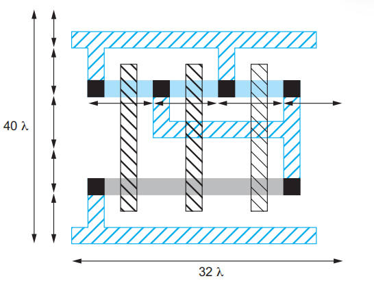

<small>  图 1.46 3输入与非门面积估算 </small>

示例1.3  
绘制一个计算 Y = !((A + B + C) · D) 的CMOS门（见图1.18）的棒状图，并估算单元宽度和高度。  
**解**：图1.47示出了一个棒状图。计数水平和垂直轨距，估算单元尺寸为40λ × 48λ。

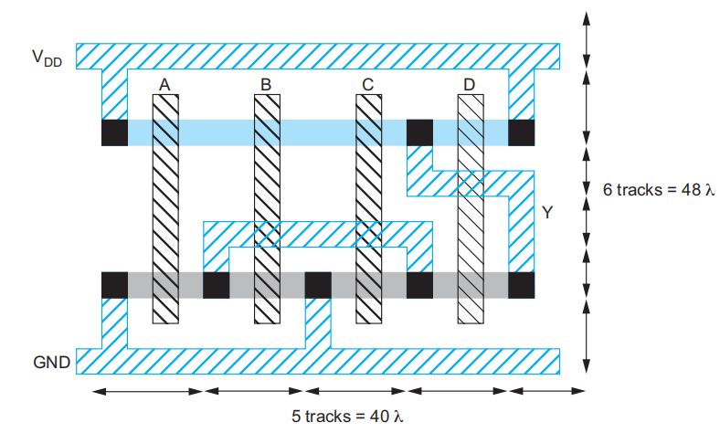

<small> 图 1.47 实现函数 Y = !((A + B + C) · D) 的CMOS复合门 </small>

# 1.6 设计划分

至此，您已经了解到MOS晶体管表现为压控开关。您知道如何用晶体管构建逻辑门。您也知道了晶体管是如何制造的，以及如何绘制版图来指定晶体管的放置和互连方式。您已经掌握了足够的知识来开始构建自己的简单芯片。

现代VLSI设计中最大的挑战不在于设计单个晶体管，而在于管理系统复杂性。现代系统芯片（SOC）设计将存储器、处理器、高速I/O接口和专用的特定应用逻辑集成在单个芯片上。它们使用数亿或数十亿个晶体管，设计成本高达数千万美元（或更多）。实现方案必须由庞大的工程师团队分工完成，并且每位工程师都必须具有很高的生产效率。如果划分过于死板，每个模块可能会独立优化而忽视相邻模块，导致系统整体效果不佳。相反，如果每个任务都与其他所有任务相互依赖，设计进度将过于缓慢。设计经理面临着在这些极端之间选择合适权衡的挑战。在这些选择上，实践经验无可替代，拥有多个设计经验的有才华的工程师对大型项目的成功至关重要。

设计通过多个抽象层次进行，在需要之前隐藏细节。结构化设计的实践——也用于大型软件项目——利用层次性、规则性、模块性和局部性原则来管理复杂性。

## 1.6.1 设计抽象

数字VLSI设计通常划分为五个抽象层次：架构设计、微架构设计、逻辑设计、电路设计和物理设计。架构描述系统的功能。例如，x86微处理器架构规定了指令集、寄存器集和存储器模型。微架构描述架构如何划分为寄存器和功能单元。80386、80486、Pentium、Pentium II、Pentium III、Pentium 4、Core、Core 2、Atom、Cyrix MII、AMD Athlon和Phenom都是为x86架构提供不同性能/晶体管数量/功耗权衡的微架构。逻辑描述功能单元是如何构建的。例如，x86整数单元中32位加法器的各种逻辑设计包括行波进位、超前进位和进位选择。电路设计描述如何使用晶体管来实现逻辑。例如，超前进位加法器可以使用静态CMOS电路、多米诺电路或传输晶体管。电路可以针对高性能或低功耗进行定制。物理设计描述芯片的版图。模拟和RF VLSI设计涉及相同的步骤，但具有不同的抽象层次。

这些要素本质上是相互依存的，并且都影响每个设计目标。例如，微架构和逻辑的选择在很大程度上取决于芯片上可以放置的晶体管数量，而这又取决于物理设计和工艺技术。类似地，将缓存访问从两个周期减少到一个周期的创新电路设计会影响哪种微架构最为理想。时钟频率的选择取决于微架构、逻辑、电路设计和物理设计之间复杂的相互作用。更深的流水线允许更高的频率，但会消耗更多功耗，并且当流水线前期的操作依赖于后期的操作时，会导致更大的性能损失。许多功能具有各种逻辑和电路设计，在速度、面积、功耗和设计工作量之间进行权衡。定制物理设计可以实现更紧凑、更快的电路和更低的制造成本，但涉及巨大的人力成本。使用CAD系统进行自动布局可以减少人力并加快上市时间。

为了应对这些相互依赖性，微架构、逻辑、电路和物理设计必须至少部分并行进行。微架构师依赖电路和物理设计研究来了解所提议的微架构特性的成本。工程师有时被归类为“矮胖型”或“高瘦型”（我们向您保证，这绝非针对个人！）。高瘦型工程师对广泛的主题都有所了解。矮胖型工程师在狭窄的领域内知识渊博。数字VLSI设计偏爱那些能够评估系统某一部分的选择如何影响系统其他部分的高瘦型工程师。

## 1.6.2 结构化设计

层次性是管理复杂设计的关键工具。大型系统可以层次化地划分为多个内核。每个内核由各种单元构建而成。每个单元又由多个功能模块组成。这些模块又由单元构建，而单元最终由晶体管构成。通过将组件视为具有良好定义接口和功能的黑盒子，而不是查看每个单独的晶体管，可以在顶层更容易地理解系统。设计的逻辑视图、电路视图和物理视图应共享相同的层次结构，以便于验证。设计层次结构可以看作一棵树形结构，整个芯片为根，原始单元为叶。

规则性通过设计最少数量的不同模块来帮助管理设计复杂性。一旦一个模块被设计和验证，就可以在许多地方重复使用。模块化要求模块具有良好定义的接口，以避免意外的相互作用。局部性涉及在物理和时间上将信息保留在其使用位置。结构化设计将在第14.2节中进一步讨论。

## 1.6.3 行为域、结构域和物理域

另一种查看设计划分的方式如图1.48所示的Y图表[Gajski83, Kang03]所示。Y图表上的放射线代表三个不同的设计域：行为域、结构域和物理域。这些域可用于描述几乎任何工件的设计，因此构成了描述设计过程的通用分类法。在每个域内，都有多个设计抽象层次，从非常高的层次开始，最终下降到需要聚合以产生顶层功能的各个元素（就芯片设计而言，即晶体管）。

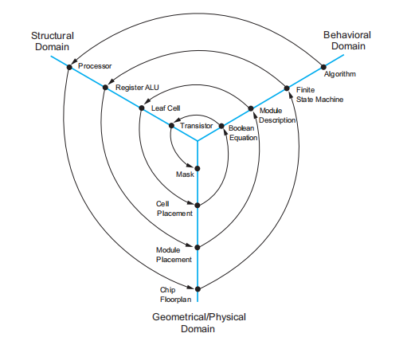

<small> 图 1.48 Y图表（经麦格劳-希尔公司许可，转载自[Kang03]）。 </small>

行为域描述特定系统的功能。例如，在最高层次上，我们可能指定一个电话按键音发生器。这种行为可以逐步细化，以更精确地描述构建该音发生器所需完成的工作（即所需的频率、输出电平、允许的失真等）。

在每个抽象层次上，都可以开发相应的结构描述。结构域描述为实现特定行为所需的模块互连。例如，在最高层次上，按键音发生器可能包括键盘、音发生器芯片、音频放大器、电池和扬声器。最终，在较低的抽象层次上，描述构建音发生器所需的各个门级连接，进而到晶体管级连接。

对于每个抽象层次，物理域描述解释如何物理构建该抽象层次。在高层，这可能包括工程图纸，展示如何将键盘、音发生器芯片、电池和扬声器组装到相关外壳中。在芯片顶层，这可能包括芯片规划图；在较低层次，则是单个晶体管的实际几何形状。

设计过程可以视为在保持域等效性的同时，从一个域到另一个域的转换。行为描述被转换为结构描述，结构描述再被转换为物理描述。这些转换可以是手动的，也可以是自动的。无论哪种方式，验证域间转换的正确性都是常规设计实践。这确保了设计意图跨域传递。通过层次化地指定每个域的逐级抽象细节，我们能够设计非常庞大的系统。

严格描述域和抽象层次的原因在于定义一个精确的设计流程，使得系统的最终功能可以一直追溯到初始行为描述。在理想流程中，不应产生错误设计。如果出现异常，则应修正设计流程，使这些异常不再发生。设计人员应养成严格的设计流程纪律，了解每一次转换及其如何以及为何是可靠无误的。通常，这些步骤在现代设计流程中完全自动化，但了解这些步骤的基础非常重要，以便在出现偏差时进行调试。

Y图表可用于说明各个域以及在不同设计抽象层次上域之间的转换。随着设计过程从外环向内环推进，它从较高的抽象层次和层级向较低的层次推进。

本章剩余大部分内容是一个简单微处理器设计的案例研究，旨在说明VLSI设计在非平凡系统中的应用各个方面。我们首先描述该处理器的架构和微架构，然后考虑逻辑设计并讨论硬件描述语言。该处理器采用我们在1.4节中讨论过的静态CMOS电路构建；同时讨论晶体管级设计和网表格式。我们继续探讨该处理器的物理设计，包括芯片规划和面积估算。设计验证至关重要，并且在设计的每个层次上都对每个元素进行验证。最后，将版图转换为掩模版，以便芯片制造、封装和测试。