# 1.1 简短历史

1958 年，杰克·基尔比在德州仪器制造出第一个采用两个晶体管的集成电路触发器。2008 年，英特尔安腾微处理器已包含超过 20 亿个晶体管，而 16 Gb 的闪存则包含超过 40 亿个晶体管。这相当于在 50 年内保持 53% 的年复合增长率。历史上没有其他技术能维持如此之高且如此持久的增长速度。

这种惊人的增长源于晶体管的不断微型化以及制造工艺的持续改进。大多数其他工程领域都需要在性能、功耗和价格之间做出权衡。然而，当晶体管缩小时，它们反而变得更快、功耗更低，并且制造成本更低。这种协同效应不仅彻底改变了电子学，也极大地改变了整个社会。

曾经专用于机密政府超级计算机的处理性能，如今已出现在一次性手机中。曾经整个公司会计系统所需的内存，如今一个少女就可以随身携带在她的 iPod 里。集成电路的进步使太空探索成为可能，让汽车更安全、更省油，彻底改变了战争形态，将人类的大量知识带到我们的网络浏览器中，也让世界变得更加平坦。

图 1.1 展示了全球半导体市场的年销售额。1994 年，集成电路成为一个年产值 1000 亿美元的产业。2007 年，该行业制造了约 6 百亿亿（6 × 10¹⁸）个晶体管，几乎为地球上每个人制造了近十亿个。成千上万的工程师在这一领域创造了财富。对于那些拥有创新想法并有才能将其变为现实的人来说，新的财富仍在前方等待。

在二十世纪上半叶，电子电路使用体积庞大、价格昂贵、功耗高且不可靠的真空管。1947 年，约翰·巴丁和沃尔特·布拉顿在贝尔实验室制造出第一个能工作的点接触晶体管，如图 1.2(a) 所示 [Riordan97]。它差点被列为军事机密，但贝尔实验室在次年向公众展示了该器件。

*我们将其称为晶体管（Transistor，拼作 T-R-A-N-S-I-S-T-O-R），是因为它是一种电阻器或半导体器件，能够在电信号从输入端通过它传输至输出端时对其进行放大。可以说，它就是真空管放大器的电气等价物。但相似之处仅止于此。它没有真空，没有灯丝，没有玻璃管壳，完全由冷的固态物质构成。*

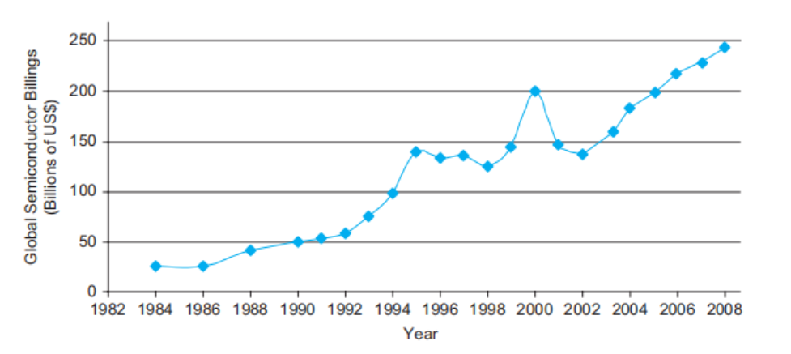

图 1.1  全球半导体市场规模（由半导体行业协会提供。）

十年后，德州仪器公司的杰克·基尔比意识到，如果能在一片硅片上制造多个晶体管，将带来巨大的小型化潜力。图 1.2(b) 展示了他用锗片和金线制成的第一个集成电路原型。

晶体管的发明为巴丁、布拉顿及其导师威廉·肖克利赢得了 1956 年的诺贝尔物理学奖。基尔比则因发明集成电路于 2000 年获得诺贝尔物理学奖。

晶体管可看作电控开关，它有一个控制端和另外两个端子，根据施加在控制端的电压或电流，这两个端子之间导通或断开。点接触晶体管发明后不久，贝尔实验室便开发出了双极结型晶体管。双极型晶体管更可靠、噪声更低，也更省电。早期的集成电路主要使用双极型晶体管。双极型晶体管需要向控制端（基极）注入一个小电流，才能在另外两端（发射极和集电极）之间切换大得多的电流。这些基极电流即使在电路不切换时也会被吸取，

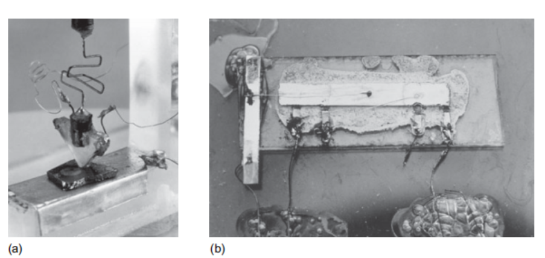

<small>图 1.2 (a) 第一只晶体管（图片归 AT&T 档案所有。经 AT&T 许可转载）和 (b) 第一块集成电路（由德州仪器公司提供）</small>


由此产生的静态功耗限制了可集成在单颗芯片上的晶体管的最大数量。到 20 世纪 60 年代，金属氧化物半导体场效应晶体管（MOSFET）开始投入生产。MOSFET 具有一个显著优势，即在空闲时几乎不吸取控制电流。它们分为两种类型：nMOS 和 pMOS，分别使用 n 型和 p 型硅。场效应晶体管的最初构想可追溯到 1925 年德国科学家尤利乌斯·利连菲尔德 [美国专利 1,745,175]，而一种与 MOSFET 极为相似的结构则于 1935 年由奥斯卡·海尔提出 [英国专利 439,457]，但材料问题使早期制造可工作器件的尝试受挫。

1963 年，仙童半导体公司的弗兰克·万拉斯描述了首批使用 MOSFET 的逻辑门 [Wanlass63]。仙童的门电路同时使用了 nMOS 和 pMOS 晶体管，因而得名互补金属氧化物半导体，即 CMOS。这些电路虽由分立晶体管构成，功耗却仅为纳瓦级，比同等的双极型电路低了六个数量级。随着硅平面工艺的发展，MOS 集成电路因其每个晶体管占用面积更小且制造工艺更简单而因低成本变得极具吸引力 [Vadasz69]。早期的商业工艺仅使用 pMOS 晶体管，在性能、良率和可靠性方面均不尽人意。使用 nMOS 晶体管的工艺则在 20 世纪 70 年代开始普及 [Mead80]。英特尔凭借其 1101 256 位静态随机存取存储器和 4004 4 位微处理器（如图 1.3 所示），在 nMOS 技术领域走在前列。虽然 nMOS 工艺比 CMOS 便宜，但 nMOS 逻辑门在空闲时依然会消耗功耗。到了 20 世纪 80 年代，当数十万个晶体管被集成到单颗芯片上时，功耗便成了一个主要问题。CMOS 工艺因此被广泛采用，并已基本上取代了 nMOS 和双极型工艺，用于几乎所有的数字逻辑应用。

1965 年，戈登·摩尔观察到，将可最经济地制造于一块芯片上的晶体管数目在半对数坐标纸上绘制出来，得到的是一条直线 [Moore65]。当时，他发现晶体管数量每 18 个月翻一番。这一观察被称为摩尔定律，并已成为一个自我实现的预言。图 1.4 表明，自 4004 发明以来，英特尔微处理器中的晶体管数量每 26 个月翻一番。摩尔定律主要由晶体管尺寸的微缩驱动，并在较小程度上得益于芯片面积的增大。芯片的集成度被划分为小规模、中规模、大规模和超大规模。小规模集成（SSI）电路，如 7404 反相器，门数不足 10

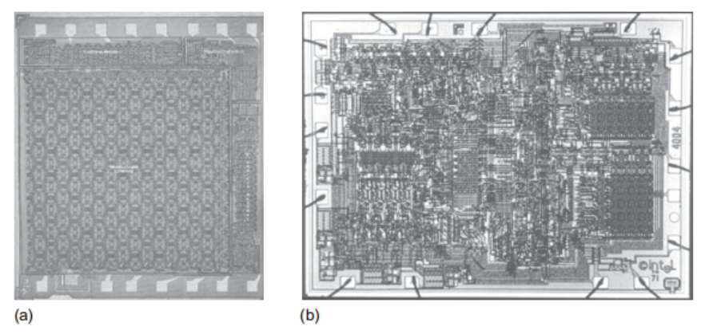

<small>图 1.3 (a) 英特尔 1101 静态随机存取存储器（© IEEE 1969 [Vadasz69]）和 (b) 4004 微处理器（经英特尔公司许可转载）</small>

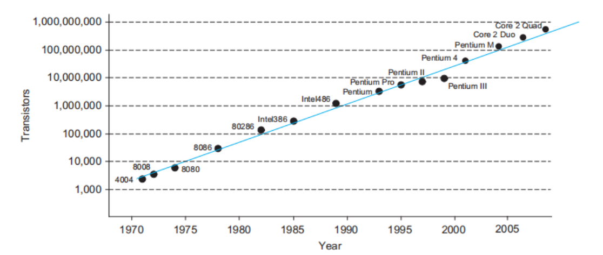

<small>图 1.4 Intel微处理器中的晶体管</small>

个，每个门约有六个晶体管。中规模集成（MSI）电路，如 74161 计数器，门数最多约 1000 个。大规模集成（LSI）电路，如简单的 8 位微处理器，门数多达 10,000 个。人们很快意识到，若该命名趋势持续下去，每隔五年就得创造新名称，因此超大规模集成（VLSI）一词被用来指代 20 世纪 80 年代以后的绝大多数集成电路。摩尔定律的一个推论是登纳德缩放定律 [Dennard74]：随着晶体管缩小，它们会变得更快、功耗更低，且制造成本更低。图 1.5 显示，英特尔微处理器的时钟频率大约每 34 个月翻一番。这种频率提升在 2004 年前后撞上了功耗墙，时钟频率于是稳定在 3 GHz 左右。计算机的性能，以运行应用程序所需时间来衡量，其进步甚至超过了单纯的时钟速度。目前，性能由芯片上的内核数量而非时钟频率来驱动。尽管单个 CMOS 晶体管每次开关消耗的能量极少，但海量晶体管以极高速度开关，使功耗再度成为一项主要的设计考量。而且，随着晶体管变得如此之小，它们已无法彻底关断。每个晶体管泄露的微小电流，当乘以芯片上数百万乃至数十亿个晶体管时，便会导致巨大的功耗。

CMOS 制造工艺的特征尺寸是指能够可靠制造出的晶体管的最小尺寸。1971 年，4004 的特征尺寸为 10 µm。2008 年，酷睿 2 双核的特征尺寸为 45 nm。制造商每两到三年推出一代新工艺（也称技术节点），其特征尺寸缩小 30%，以在相同面积内容纳两倍数量的晶体管。图 1.6 展示了工艺代的演进。0.25 µm 及以上的特征尺寸通常以微米（10⁻⁶ m）表示，更小的特征尺寸则以纳米（10⁻⁹ m）表示。那些在微米工艺中相对次要的效应，如晶体管漏电、相邻晶体管特性差异以及导线电阻，在纳米工艺中变得极为重要。


摩尔定律已成为一个自我实现的预言，因为每家公司都必须跟上竞争对手的步伐。显然，这种微缩不可能永远持续下去，因为晶体管不可能比原子还小。登纳德缩放定律已经开始放缓。到了 45 纳米世代，

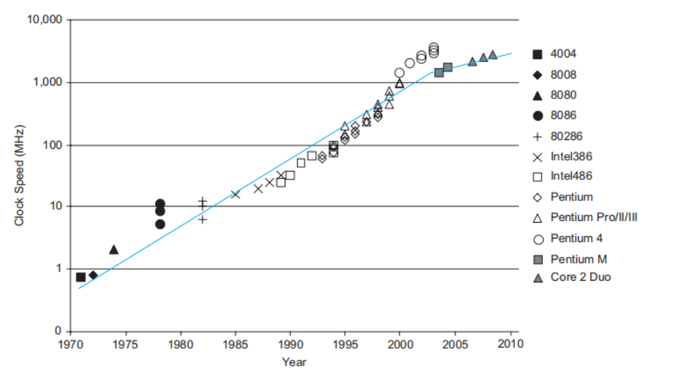

<small>图1.5 Intel微处理器中的时钟频率</small>

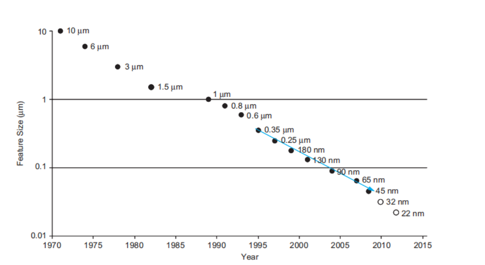

<small>图1.6 工艺代数。来自于[SIA2007]的预测</small>

设计者不得不在改善功耗与改善延迟之间进行权衡。尽管印制每个晶体管的成本在下降，但一次性设计费用却在呈指数级增长，这使得最先进的工艺只能用于那些销量巨大或有尖端性能要求的芯片。然而，许多关于微缩存在根本极限的预测已被证明是错误的。富有创造力的工程师和材料科学家若能领先于竞争对手，便有数十亿美元的巨大收益。在 20 世纪 90 年代初期，专家们一致认为微缩至少还会持续十年，但那之后的未来则不甚明朗。到了 2009 年，我们依然相信摩尔定律至少还会再延续十年。未来，正等待你去创造。


# 1.2 综述
随着芯片上晶体管数量的指数级增长，设计者越来越依赖更高程度的自动化，以期获得相应的生产率提升。许多设计者将大量精力花在用硬件描述语言描述功能上，很少去关注实际的晶体管。然而，芯片设计并非软件工程。解决更棘手的问题需要对电路和物理设计有根本性的理解。因此，本书着重于自底向上地建立对集成电路的理解。

在本章中，我们将把 CMOS 晶体管简化为开关来看待。利用这个模型，我们将构建出 CMOS 逻辑门和锁存器。CMOS 晶体管是在硅晶圆上采用类似印刷机的光刻步骤大规模制造的。我们将探索如何通过指定矩形来设计晶体管版图，这些矩形标明应在何处扩散掺杂剂、生长多晶硅、淀积金属导线以及刻蚀接触孔以连接各层。到本章中段，你将掌握设计和绘制自己简单的 CMOS 芯片所需的全部原理。

本章最后以一个扩展示例结束，演示了一个简单 8 位 MIPS 微处理器芯片的设计。该处理器引出了许多设计问题，这些问题将在本书后续章节中更深入地展开。学习 VLSI 设计的最佳方式就是动手实践。www.cmosvlsi.com 上提供了一套实验练习，指导你设计自己的微处理器芯片。

# 1.3 MOS晶体管
硅（Si）是一种半导体，是大多数集成电路的基本起始材料[Tsividis99]。纯硅由原子的三维晶格构成。硅是第IV族元素，因此与四个相邻原子形成共价键，如图1.7(a)所示。为便于绘制，图中将晶格显示在平面上，但它实际上形成的是立方晶体。由于所有价电子都参与形成化学键，纯硅是电的不良导体。可以通过向硅晶格中引入少量称为掺杂剂的杂质来提高其导电性。来自元素周期表第V族的掺杂剂（如砷）具有五个价电子。它取代晶格中的一个硅原子，并仍然与四个相邻原子键合，因此第五个价电子较松散地束缚在砷原子上，如图1.7(b)所示。室温下晶格的热振动就足以使该电子挣脱束缚自由移动，留下一个带正电的As⁺离子和一个自由电子。自由电子能够承载电流，因此导电性得以提高。我们称其为n型

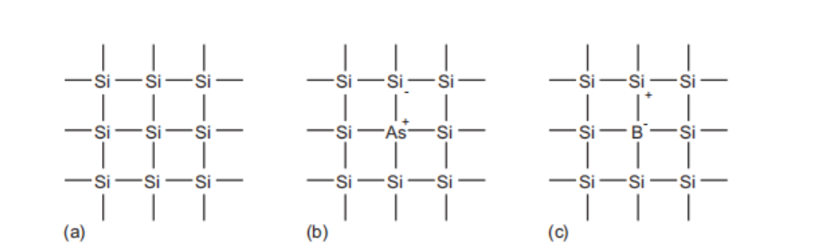

<small>图1.7 硅晶格与掺杂原子</small>
半导体，因为其自由载流子是带负电的电子。类似地，第III族掺杂剂（如硼）具有三个价电子，如图1.7(c)所示。掺杂剂原子可以向相邻的硅原子借用一个电子，该硅原子随之缺少一个电子。那个原子又可以向其他原子借电子，如此延续，这样缺失的电子——即空穴——便能在晶格中传播。空穴充当正载流子，因此我们称之为p型半导体。

p 型硅与 n 型硅之间的结被称为二极管，如图 1.8 所示。当 p 型半导体（称为阳极）的电压高于 n 型阴极时，二极管正向偏置，电流导通。当阳极电压低于或等于阴极电压时，二极管反向偏置，仅有极小的电流流过。

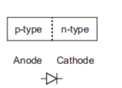

<small>图1.8 p-n 结二极管结构与符号</small>

金属-氧化物-半导体（MOS）结构是通过叠加多层导电和绝缘材料，形成类似三明治的层叠结构而制成的。这些结构采用一系列化学工艺步骤制造，包括硅的氧化、选择性引入掺杂剂，以及金属导线和接触孔的淀积与刻蚀。晶体管制造在近乎完美的硅单晶上，这种单晶以直径 15 至 30 厘米的薄而平的圆形晶圆形式提供。CMOS 技术提供两种类型的晶体管（也称为器件）：n 型晶体管（nMOS）和 p 型晶体管（pMOS）。晶体管的工作由电场控制，因此这些器件也被称为金属氧化物半导体场效应晶体管（MOSFET），或简称为 FET。这些晶体管的截面图和符号如图 1.9 所示。n⁺ 和 p⁺ 区域表示重掺杂的 n 型或 p 型硅。

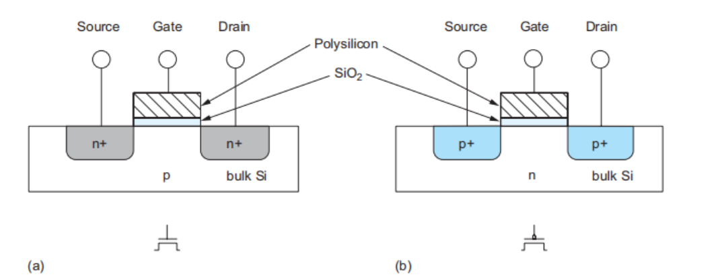

<small>图1.9 nMOS晶体管(a)和pMOS晶体管(b)</small>

每个晶体管由导电栅极、一层绝缘的二氧化硅（SiO₂，俗称玻璃）以及硅晶圆（也称衬底、体或基体）堆叠而成。早期晶体管的栅极由金属制成，因此这种堆叠被称为金属-氧化物-半导体，即 MOS。自 20 世纪 70 年代起，栅极改用多晶硅（polysilicon）形成，但名称沿用至今。（有趣的是，2007 年金属栅极重新出现，以解决先进制造工艺中的材料问题。）nMOS 晶体管采用 p 型体，并在紧邻栅极的区域设有 n 型半导体区，称为源极和漏极。它们在物理上是对称的，目前我们可视其为可互换。体通常接地。pMOS 晶体管则恰好相反，由 p 型源极和漏极区以及 n 型体构成。在同时包含这两种晶体管的 CMOS 工艺中，衬底要么是 n 型，要么是 p 型。另一种类型的晶体管必须制作在专门的阱中，通过添加掺杂原子在该阱中形成相反类型的体。

栅极是控制输入端：它影响源极和漏极之间电流的流动。以 nMOS 晶体管为例。体通常接地，因此源极和漏极与体之间的 p–n 结处于反向偏置。若栅极也接地，则没有电流流过反向偏置的结，我们称晶体管处于关断状态。如果提高栅极电压，就会产生电场，开始将自由电子吸引到 Si–SiO₂ 界面的下侧。若电压足够高，电子数量超过空穴，栅极下方一个称为沟道的薄区域会发生反型，呈现为 n 型半导体。这样，从源极到漏极就形成了一条由电子载流子构成的导电通路，电流得以流通。我们称晶体管处于导通状态。

对于 pMOS 晶体管，情况再次相反。体接正电压。当栅极也处于正电压时，源极和漏极的结反向偏置，无电流流过，晶体管关断。当栅极电压降低时，正电荷被吸引到 Si–SiO₂ 界面的下侧。足够低的栅极电压使沟道反型，形成一条由正载流子构成的从源极到漏极的导电通路，晶体管导通。注意，pMOS 晶体管的符号在栅极上有一个小圆圈，表示其工作特性与 nMOS 相反。

正电压通常称为 VDD 或 POWER（电源），在数字电路中代表逻辑 1。在 20 世纪 70 和 80 年代的主流逻辑系列中，VDD 通常设为 5 伏。后来更小、更新的晶体管无法承受如此高的电压，转而使用 3.3 V、2.5 V、1.8 V、1.5 V、1.2 V、1.0 V 等电源电压。低电压称为 GROUND（地，GND）或 VSS，代表逻辑 0，通常为 0 伏。

总而言之，MOS 晶体管的栅极控制着源极与漏极之间电流的流动。将这一点极度简化，便可将 MOS 晶体管视为简单的开/关开关。当 nMOS 晶体管的栅极为 1 时，晶体管导通，源极与漏极之间存在一条导电通路。当栅极为低电平时，nMOS 晶体管关断，几乎没有电流从源极流向漏极。pMOS 晶体管则恰好相反，栅极为低电平时导通，栅极为高电平时关断。图 1.10 展示了这一开关模型，其中 g、s 和 d 分别表示栅极、源极和漏极。在我们讨论电路行为时，该模型将是我们最常用的模型。

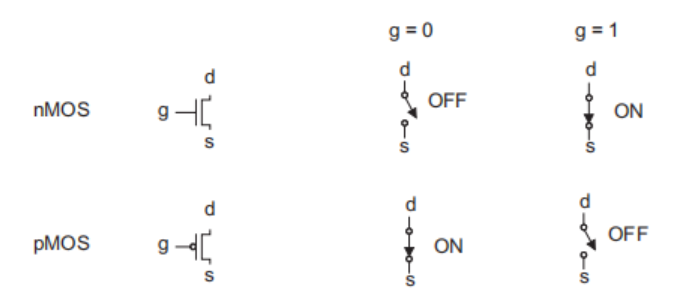

<small>图1.10 晶体管符号和开关级模型</small>

# 1.4 CMOS逻辑
## 1.4.1 反相器
图 1.11 展示了使用一个 nMOS 晶体管和一个 pMOS 晶体管构成的 CMOS 反相器（即非门）的电路图和符号。顶部的横条表示 VDD（电源），底部的三角形表示 GND（地）。当输入 A 为 0 时，nMOS 晶体管关断，pMOS 晶体管导通。因此，输出 Y 被上拉至 1，因为它与 VDD 连通而与 GND 断开。相反，当 A 为 1 时，nMOS 导通，pMOS 关断，Y 被下拉至 0。表 1.1 总结了这一关系。

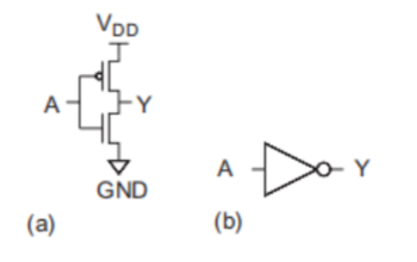

<small>图1.11 反相器电路图（a）和符号（b）</small>

表 1.1 反相器真值表

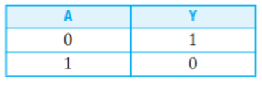

## 1.4.2 与非门
图 1.12(a) 展示了一个2输入CMOS与非门（NAND gate）。它由串联在 Y 与 GND 之间的两个 nMOS 晶体管和并联在 Y 与 VDD 之间的两个 pMOS 晶体管组成。若输入端 A 或 B 中任何一个为 0，则至少有一个 nMOS 晶体管关断，从而切断 Y 到 GND 的通路。但至少有一个 pMOS 晶体管会导通，形成 Y 到 VDD 的通路。因此，输出 Y 将为 1。若两个输入均为 1，则两个 nMOS 晶体管均导通，而两个 pMOS 晶体管均关断。因此，输出将为 0。真值表如表 1.2 所示，符号如图 1.12(b) 所示。注意，根据德摩根定律，求反的小圆圈可以画在门的任意一侧。本书图示中，在 T 形交点处相交的两条线是相连的。两条线交叉时，当且仅当交叉点画有圆点才表示相连。

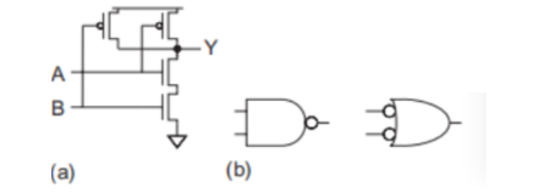

<small>图1.12 两输入与非门电路图（a）和符号（b）</small>

表 1.2 与非门真值表

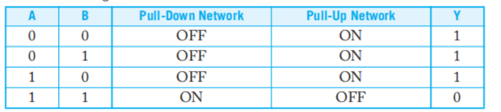

k 输入与非门由 k 个串联的 nMOS 晶体管和 k 个并联的 pMOS 晶体管构成。例如，图 1.13 显示了一个 3 输入与非门。当任意输入为 0 时，输出通过并联的 pMOS 晶体管被上拉至高电平。当所有输入均为 1 时，输出通过串联的 nMOS 晶体管被下拉至低电平。

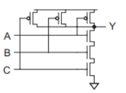

<small>图1.13 三输入与非门电路图</small>

## 1.4.3 CMOS逻辑门
反相器和与非门是静态 CMOS 逻辑门的例子，也称为互补 CMOS 门。一般来说，静态 CMOS 门包含一个 nMOS 下拉网络，用于将输出连接到 0（GND），以及一个 pMOS 上拉网络，用于将输出连接到 1（VDD），如图 1.14 所示。这两个网络被设计成对于任何输入模式，一个导通而另一个关断。

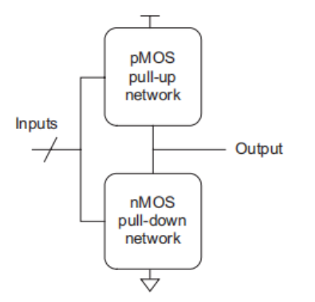

<small>图1.14 使用上拉和下拉网络的通用逻辑门</small>

反相器中的上拉和下拉网络各由一个晶体管组成。与非门采用串联下拉网络和并联上拉网络。更复杂的门则使用更精细的网络。两个或多个串联的晶体管只有在所有串联晶体管都导通时才导通。两个或多个并联的晶体管只要其中任何一个导通即为导通。图1.15针对nMOS和pMOS晶体管对对此进行了说明。通过组合使用这些结构，可以构建出CMOS组合逻辑门。尽管此类静态CMOS门应用最为广泛，但第9章将探讨用晶体管构建门电路的其它方法。

一般来说，当我们连接一个上拉网络和一个下拉网络以构成如图1.14所示的逻辑门时，两者都会试图在输出端施加一个逻辑电平。输出端可能出现的电平如表1.3所示。从该表可以看出，CMOS逻辑门的输出可以处于四种状态。反相器和与非门中已经遇到了1电平和0电平，此时要么上拉网络关断、下拉网络导通，要么反之。当上拉和下拉网络都关断时，就会出现高阻态或称为浮空Z的输出状态。这在多路选择器、存储元件和三态总线驱动器中非常重要。当上拉和下拉网络同时导通时，则存在短路（或竞争）X电平。两个网络之间的竞争会导致不确定的输出电平并消耗静态功耗。这通常是一种不希望出现的情况。

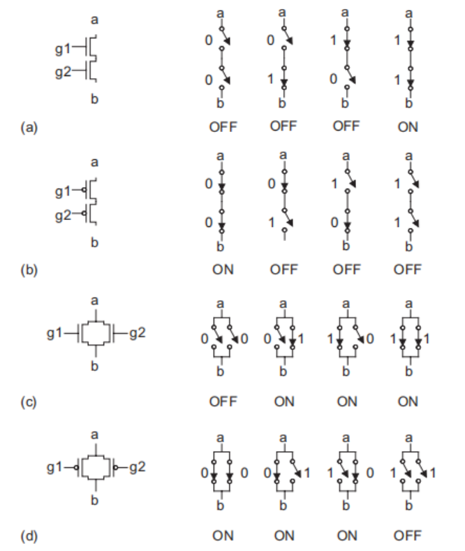

<small>图1.15 串联和并联晶体管的连接方式与工作特性</small>

表 1.3 与非门真值表

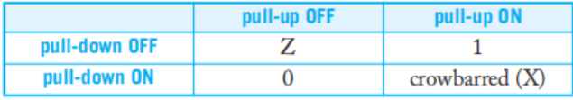

## 1.4.4 或非门
图1.16展示了一个2输入或非门。其中nMOS晶体管并联，以便在任一输入为高电平时将输出拉低。pMOS晶体管串联，以便在两个输入均为低电平时将输出拉高，如表1.4所示。输出永远不会出现竞争（短路）或浮空状态。

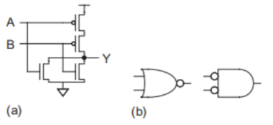

<small>图1.16 两输入或非门电路图和符号</small>

表 1.4 NOR门真值表

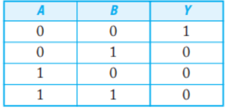

例子 1.1
绘制一个3输入CMOS或非门的草图。
解答：图1.17展示了这样一个门电路。若任一输入为高电平，输出便通过并联的nMOS晶体管被拉低。若所有输入均为低电平，输出则通过串联的pMOS晶体管被拉高。

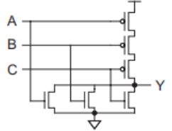

<small>图1.17 三输入或非门电路图</small>

## 1.4.5 复合门
通过在单级逻辑中组合使用串联和并联开关结构，可以形成执行更复杂逻辑功能的复合门。例如，图1.18展示了函数 Y = !((A · B) + (C · D))  电路的推导过程。该函数有时被称为AND-OR-INVERT-22或AOI22，因为它对两个2输入与门的结果执行或非操作。对于nMOS下拉网络，取未取反的表达式 ((A · B) + (C · D))，该表达式指示输出何时应被拉至'0'。与项 (A · B) 和 (C · D) 可通过开关的串联来实现，如图1.18(a)所示。现在，要对结果执行或操作，就需要将这两个结构并联，如图1.18(b)所示。对于pMOS上拉网络，我们必须使用以相反极性导通的开关来计算互补表达式。根据德摩根定律，这等价于交换与操作和或操作。因此，在下拉网络中串联出现的晶体管必须在上拉网络中并联出现。在下拉网络中并联出现的晶体管必须在上拉网络中串联出现。这一原理称为传导互补，并已用于与非门和或非门的设计中。在上拉网络中，A和B的并联组合与C和D的并联组合串联放置。这一过程在图1.18(c)和图1.18(d)中清晰可见。将这些网络组合在一起即得到完整的电路图（图1.18(e)）。其符号如图1.18(f)所示。

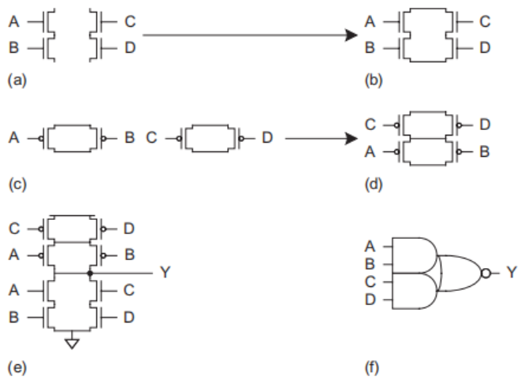

<small>图1.18 实现函数 Y = !((A · B) + (C · D)) 的 CMOS 复合门</small>

这个 AOI22 门可用作 2 输入反相多路选择器，方法是将 C = A 作为选择信号。此时，若 C 为 0，则 Y = B；若 C 为 1，则 Y = D。1.4.8 节展示了改进这种多路选择器设计的一种方法。

例 1.2
绘制一个计算 Y = !((A + B + C) · D) 的静态 CMOS 门。
解：图 1.19 展示了这样一个或-与-非 3-1（OAI31）门。nMOS 下拉网络在 D 为 1 且 A 或 B 或 C 中任意一个为 1 时将输出拉低，因此 D 与 A、B 和 C 的并联组合串联。pMOS 上拉网络是其传导互补，因此 D 必须与 A、B 和 C 的串联组合并联。

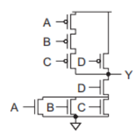

<small>图1.19 实现函数 Y = !((A + B + C) · D) 的 CMOS 复合门</small>

## 1.4.6 传输管与传输门
信号的强度是通过它与理想电压源的接近程度来衡量的。一般来说，信号越强，它能提供或吸收的电流就越多。电源轨（VDD 和 GND）是最强逻辑 1 和逻辑 0 的来源。

nMOS 晶体管在传输 0 时几乎是一个完美的开关，因此我们说它传输强 0。然而，nMOS 晶体管在传输 1 时并不完美。如 2.5.4 节将要解释的那样，其高电平电压会略低于 VDD，我们说它传输的是衰减的或弱的 1。pMOS 晶体管则再次表现出相反的特性：传输强 1，但传输衰减的 0。图 1.20 总结了这些晶体管的符号及其特性，其中 g、s 和 d 分别表示栅极、源极和漏极。

当单独使用一个 nMOS 或 pMOS 作为不完美的开关时，我们有时称其为传输管。通过将一个 nMOS 和一个 pMOS 晶体管并联（图 1.21(a)），我们获得了一个开关：当在 g 施加 1 时导通（图 1.21(b)），并且能以可接受的方式传输 0 和 1（图 1.21(c)）。我们称其为传输门或传输门。在只需传输 0 或只需传输 1 的电路中，可以删去对应的晶体管（n 或 p），从而退化为单个 nMOS 或 pMOS 器件。

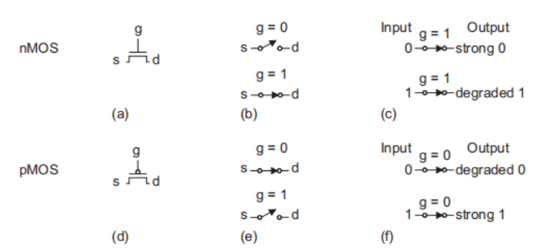
<small>图1.20 传输管的强输出与衰减输出</small>

请注意，传输门既需要控制输入，也需要其互补信号。这被称为双轨逻辑。图 1.21(d) 展示了传输门的一些电路符号¹。这些符号都不如简单的电路图好画，因此本书将使用电路图形式来表示传输门。

到目前为止，在我们所有的示例中，输入驱动的是下拉网络中 nMOS 晶体管的栅极，以及互补上拉网络中 pMOS 晶体管的栅极，如图 1.14 所示。因此，nMOS 晶体管只需传输 0，而 pMOS 晶体管只需传输 1，这样输出始终被强驱动，电平永远不会衰减。这被称为完全恢复的逻辑门，极大地简化了电路设计。与其他需要以上拉和下拉开关网络某种方式按比例设计的逻辑形式不同，静态 CMOS 门无论晶体管的物理尺寸如何都能正确工作。此外，对于任何输入组合，都不会出现从 '1' 电源到 '0' 电源之间通过 '导通' 晶体管的通路（这与单沟道 MOS、GaAs 技术或双极型技术不同）。我们将在后续章节中发现，这正是 CMOS 具有低静态功耗的基础。

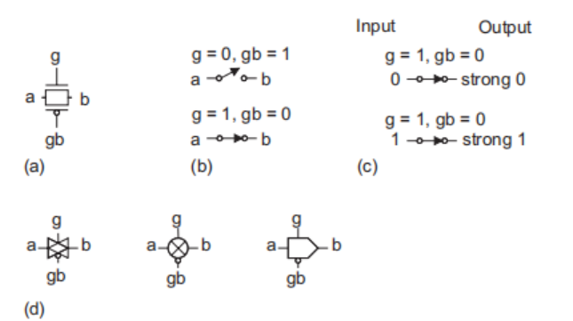
<small>图1.21 传输门</small>

静态 CMOS 门设计的一个必然结果是它们必须是反相的。当输入为 1 时，nMOS 下拉网络导通，导致输出为 0。我们可能会想通过把晶体管上下颠倒来构成一个同相门。例如，图 1.22 给出了一个同相缓冲器。不幸的是，此时 nMOS 和 pMOS 晶体管都会产生衰减的输出，因此这种方法应当避免。取而代之，我们可以通过多级反相门来构成同相功能。图 1.23 显示了由两级反相静态 CMOS 门构建 4 输入与门的几种方法，每种设计在速度、尺寸和功耗方面有不同的取舍。

类似地，图 1.18 中的复合门也可以用两个与门、一个或门和一个反相器来构成。而这些与门和或门又可由与非门/或非门和反相器构成，如图 1.24 所示，总共使用 20 个晶体管，而图 1.18 仅用了 8 个。优秀的 CMOS 逻辑设计师会利用复合门的高效性，而不是大量使用与/或门。

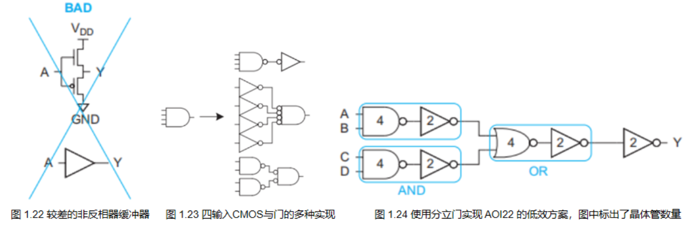

## 1.4.7 三态门
图1.25展示了三态缓冲器的符号。当使能输入EN为1时，输出Y等于输入A，就像一个普通的缓冲器。当使能为0时，Y处于悬空状态（'Z'值）。表1.5对此进行了总结。有时，真使能信号EN和互补使能信号 $\overline{\text{EN}}$ 会同时明确画出，而有时仅显示EN。

表1.5 三态门的真值表

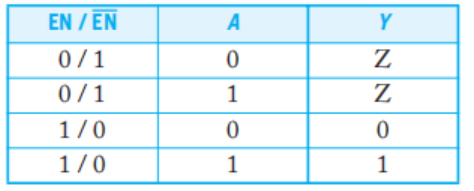

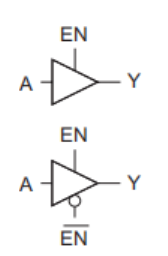     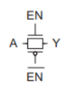
<small>图1.25 三态门符号</small>       <small>图1.26 传输门</small>

图1.26中的传输门与三态缓冲器具有相同的真值表。它仅需两个晶体管，但却是非恢复电路。如果输入存在噪声或其他形式的衰减，输出也会得到同样的噪声。我们将在4.4.2节中看到，一连串非恢复门的延迟会随门的数量急剧增加。

图1.27(a)展示了一个三态反相器。其输出由VDD或GND主动驱动，因此它是一个恢复逻辑门。与迄今为止考虑的所有门不同，三态反相器并不遵循传导互补规则，因为它允许输出在特定输入组合下浮空。当EN为0时（图1.27(b)），两个使能晶体管均关断，使输出悬空。当EN为1时（图1.27(c)），两个使能晶体管均导通。从概念上讲，它们从电路中被移除，留下一个简单的反相器。图1.27(d)展示了三态反相器的符号。互补使能信号既可在内部产生，也可显式地布到单元中。三态缓冲器可由一个普通反相器后接一个三态反相器构成。

三态曾经普遍用于允许多个单元驱动一个公共总线，只要在同一时间恰好只有一个单元使能。如果多个单元驱动总线，就会发生竞争并浪费功耗。如果没有单元驱动总线，它可能浮空至无效的逻辑电平，导致接收器浪费功耗。此外，当使能信号分布在一个大型芯片上时，很难让它们在完全相同的时刻切换。不同使能信号切换之间的延迟可能导致竞争。鉴于这些问题，如今多路选择器比三态总线更受青睐。

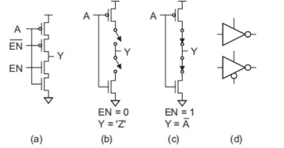

<small>图1.27 三态门反相器</small>

## 1.4.8 多路复用器
多路选择器是CMOS存储元件和数据操作结构中的关键组成部分。多路选择器根据选择信号从多个输入中选出输出。一个2输入，即2:1多路选择器，当选择信号为0时选择输入D0，当选择信号为1时选择输入D1。其真值表由表1.6给出；逻辑函数为 Y = $\overline{\text{S}}$ · D0 + S·D1。

表 1.6 多路复用器真值表
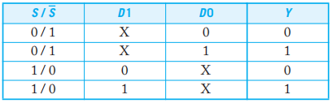

两个传输门可以连接在一起，构成一个紧凑的2输入多路选择器，如图1.28(a)所示。选择信号及其互补信号在任何给定时刻恰好使能两个传输门中的一个。互补选择信号S在符号中通常不画出来，如图1.28(b)所示。

同样，传输门构成的是一种非恢复的多路选择器。我们可以用几种方法由门电路构建一个恢复的、反相的多路选择器。一种方法是使用图1.18(e)的复合门，按图1.29(a)所示连接。另一种方法是将两个三态反相器并联在一起，如图1.29(b)所示。注意，这两种方案的电路图几乎相同，只是图1.29(b)中的上拉网络略有简化并重新排列。这是可行的，因为选择信号及其互补信号是互斥的。三态反相器方案因所需内部连线较少而略显紧凑和快速。同样，如果互补选择信号在单元内部产生，则从符号中省略（图1.29(c)）。

更大的多路选择器可由多个2输入多路选择器构成，或通过直接将多个三态门并联在一起构成。后一种方法需要为每个三态门提供经译码的使能信号；这些使能信号应同时切换以防止竞争。图1.30展示了使用这两种方法各自实现的4输入（4:1）多路选择器。在实践中，无论是反相还是同相的多路选择器，都简称为多路选择器或mux。

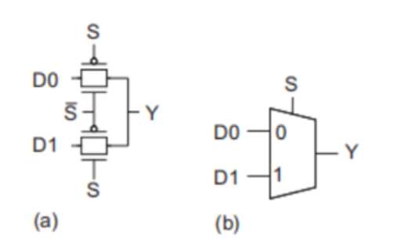

<small> 图1.28 传输门多路复用器 </small>

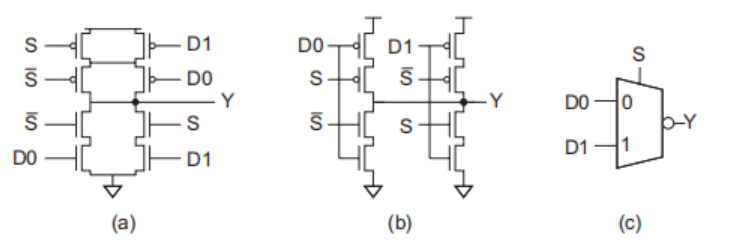

<small> 图1.29 反相的多路复用器 </small>


## 1.4.9 时序电路
到目前为止，我们讨论的都是组合电路，其输出仅取决于当前的输入。时序电路则具有记忆功能：其输出同时取决于当前和之前的输入。利用前面已构建的组合电路，我们现在可以构建诸如锁存器和触发器之类的时序电路。这些元件接收一个时钟信号 CLK 和一个数据输入 D，并产生输出 Q。D 锁存器在 CLK = 1 时是透明的，这意味着 Q 跟随 D。当 CLK = 0 时，它变为不透明，即 Q 保持其先前值并忽略 D 的变化。边沿触发的触发器在 CLK 的上升沿将 D 复制到 Q，并在其他时间保持其旧值。

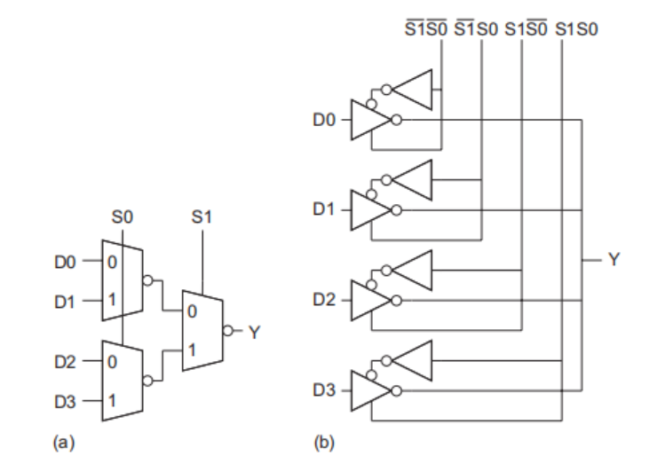

<small> 图1.30 4：1 多路复用器</small>

1.4.9.1 锁存器
图1.31(a)展示了一个由2输入多路选择器和两个反相器构成的D锁存器。因为反相器具有恢复作用，该多路选择器可由一对传输门构成，如图1.31(b)所示。该锁存器还产生互补输出Q。当CLK = 1时，锁存器透明，D直通至Q（图1.31(c)）。当CLK降至0时，锁存器变为不透明。围绕反相器对形成一条反馈通路（图1.31(d)），以无限期保持Q的当前状态。

D锁存器也称为电平敏感锁存器，因为输出状态取决于时钟信号的电平，如图1.31(e)所示。图中所示的是一个正电平敏感锁存器，其符号如图1.31(f)所示。通过将多路选择器的控制连接反相，该锁存器就变为负电平敏感。

1.4.9.2 触发器
通过组合两个电平敏感锁存器，一个为负敏感，一个为正敏感，我们构建出如图1.32(a–b)所示的边沿触发器。第一级锁存器称为主锁存器，第二级称为从锁存器。

当 CLK 为低电平时，主负电平敏感锁存器的输出（QM）跟随 D 输入，而从正电平敏感锁存器则保持先前的值（图1.32(c)）。当时钟从 0 跳变到 1 时，主锁存器变为不透明，并保持时钟跳变时刻的 D 值。从锁存器变为透明，将所存储的主锁存器值（QM）传送到从锁存器的输出（Q）。由于主锁存器已与 D 输入断开，D 输入无法再影响输出（图1.32(d)）。当时钟从 1 跳变到 0 时，从锁存器保持其值，主锁存器则重新开始采样输入。

虽然我们展示的输入级采用了传输门多路选择器，但良好的设计实践会如图1.32(e)那样用反相器对输入和输出进行缓冲，以保持我们所说的“模块化”。模块化将在1.6.2节进一步阐述，而鲁棒锁存器与寄存器将在10.3节深入讨论。

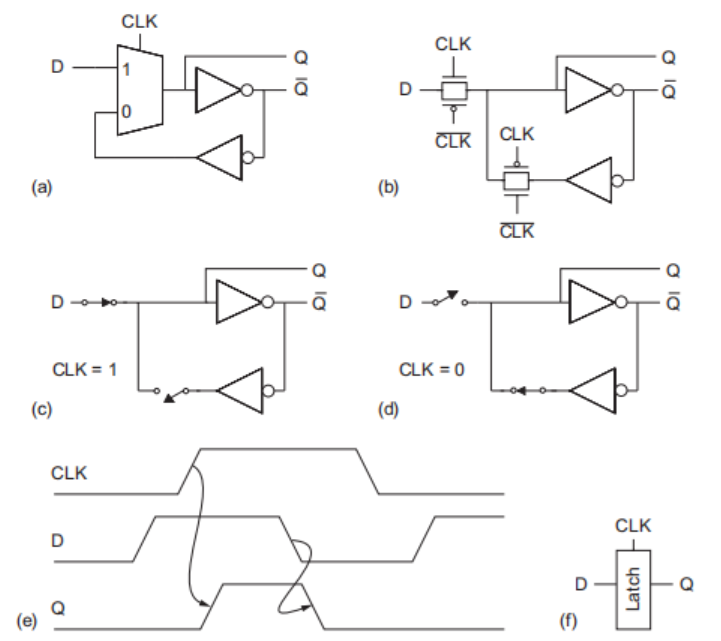

<small> 图1.31 CMOS高电平D锁存器 </small>

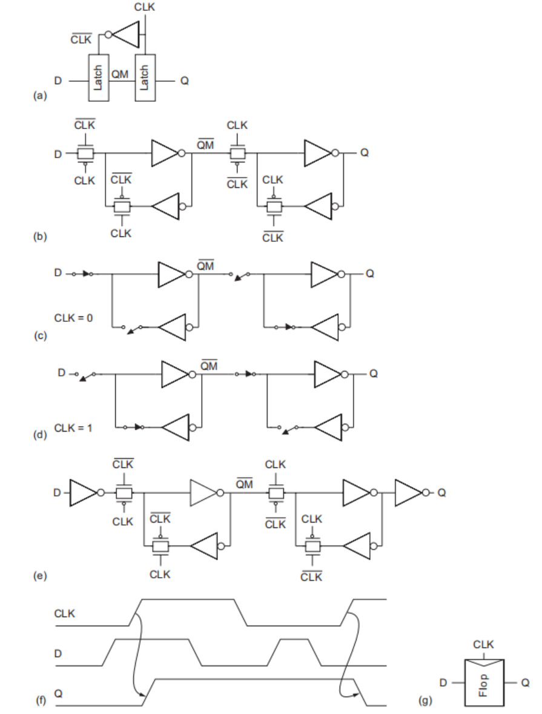

<small> 图1.32 CMOS上升沿触发D触发器 </small>

总之，该触发器在时钟上升沿将 D 复制到 Q，如图 1.32(f) 所示。因此，这种器件被称为上升沿触发的触发器（也称为 D 触发器、D 寄存器或主从触发器）。图 1.32(g) 展示了该触发器的电路符号。通过颠倒锁存器的极性，可以构建下降沿触发的触发器。共享同一时钟输入的一组 D 触发器称为寄存器。寄存器通常画成一个具有多位 D 和 Q 总线的触发器。

在第 10.2.5 节中我们将看到，如果系统时钟偏差过大，即由于时钟到达时间的变化，一个触发器触发得早而另一个触发得晚，触发器就可能发生保持时间失效。在工业设计中，大量的精力被投入到时序仿真中以捕捉保持时间问题。当设计时间更为重要时（例如在课程项目中），可以通过分配双相不交叠时钟来完全避免保持时间问题。图 1.33 展示了采用双相不交叠时钟驱动的触发器。只要两相时钟永不同时有效，在任何给定时刻至少有一个锁存器是不透明的，这样就不会发生保持时间问题。


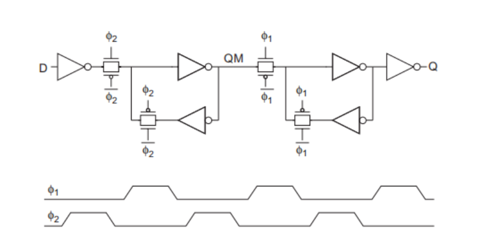

<small>  图1.33  采用两相非重叠时钟的CMOS触发器  </small>


# 1.5 CMOS 制造与版图
既然我们已经能够用晶体管设计逻辑门和寄存器，接下来让我们看看晶体管是如何制造出来的。设计者需要理解电路的物理实现，因为它对性能、功耗和成本有着重大影响。

晶体管制造在薄硅晶圆上，这些晶圆既作为机械支撑，也作为一个称为衬底的电气公共端。我们可以从两个角度来观察晶体管的物理版图。一个是俯视图，通过自上而下观察晶圆获得。另一个是剖面图，通过将晶圆从晶体管中部切开并从侧面观察获得。我们首先来看一个完整CMOS反相器的剖面图。然后，我们再观察同一个反相器的俯视图，并定义一套用于制造反相器不同部分的掩模。晶体管和导线的尺寸由掩模尺寸决定，并受限于制造工艺的分辨率。这一分辨率的不断进步推动了半导体行业的指数级增长。


## 1.5.1 反相器横截面

**图1.34** 展示了一个反相器的横截面及其对应的电路示意图（彩色横截面图见封面内侧）。在此图中，反相器构建在**p型衬底**上。pMOS晶体管需要**n型体区**，因此在其附近的衬底中通过扩散工艺形成**n阱**。如1.3节所述，nMOS晶体管具有重掺杂的**n型源极和漏极**区域，以及在薄层**二氧化硅**（SiO₂，也称**栅氧化层**）之上的**多晶硅栅极**。**n⁺**和**p⁺**扩散区表示重掺杂的n型和p型硅。pMOS晶体管结构类似，具有p型源极和漏极区域。

两个晶体管的多晶硅栅极在图外某处相连，形成**输入A**。nMOS晶体管的源极连接到金属**地线**（GND），pMOS晶体管的源极连接到金属**VDD线**。两个晶体管的漏极通过金属互连，形成**输出Y**。一层厚的SiO₂称为**场氧化层**，用于防止金属与其他层短路，除非在接触孔处被特意刻蚀去除。

金属与轻掺杂半导体之间形成的结为**肖特基二极管**，仅允许单向电流通过。当半导体被重掺杂时，它与金属形成良好的**欧姆接触**，可为双向电流提供低电阻通路。衬底必须接低电位，以避免p型衬底与n⁺ nMOS源/漏区之间的p‑n结正偏；同样，n阱必须接高电位。这一目标通过增加重掺杂的**衬底接触**和**阱接触**（或称**抽头**）来实现，分别将GND和VDD连接到衬底和n阱。

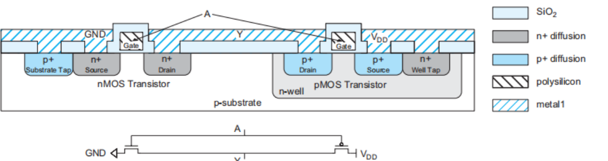

<small>  图1.34 带有阱和衬底接触的反相器横截面。彩色版本见封面内侧。  </small>


## **1.5.2 制造工艺**

尽管芯片极其复杂，但它们的成本却低得惊人，因为所有晶体管和导线都可以像印刷书籍一样以类似的方式“印制”出来。制造流程由一系列步骤组成，在这些步骤中，通过一种称为**光刻**的工艺来定义芯片的各层结构。由于每一步都处理一整片装满芯片的晶圆，因此芯片的成本与其面积成正比，而非与晶体管数量成正比。随着制造工艺的进步，工程师能够制造出更小的晶体管，从而在相同面积内集成更多器件，每个晶体管的成本也随之降低。更小的晶体管速度也更快，因为电子从源极到漏极的行程更短；同时能耗也更低，因为给栅极充电所需的电子更少！这就解释了计算机和电子产品每代都变得更便宜、性能更强的显著趋势。

反相器可以通过一组假设的**六块掩模版**来定义：n阱、多晶硅、n⁺扩散、p⁺扩散、接触孔和金属（实际工艺中的掩模组往往更为复杂，其原因在第3章讨论）。掩模版规定了芯片上各部件将被制造的位置。**图1.35(a)** 展示了这六块掩模版的俯视图（彩色图片见封面内侧）。**图1.34**中反相器的横截面是沿虚线方向剖开的。请花些时间自行理解俯视图与横截面之间的对应关系——这对理解芯片版图至关重要。 

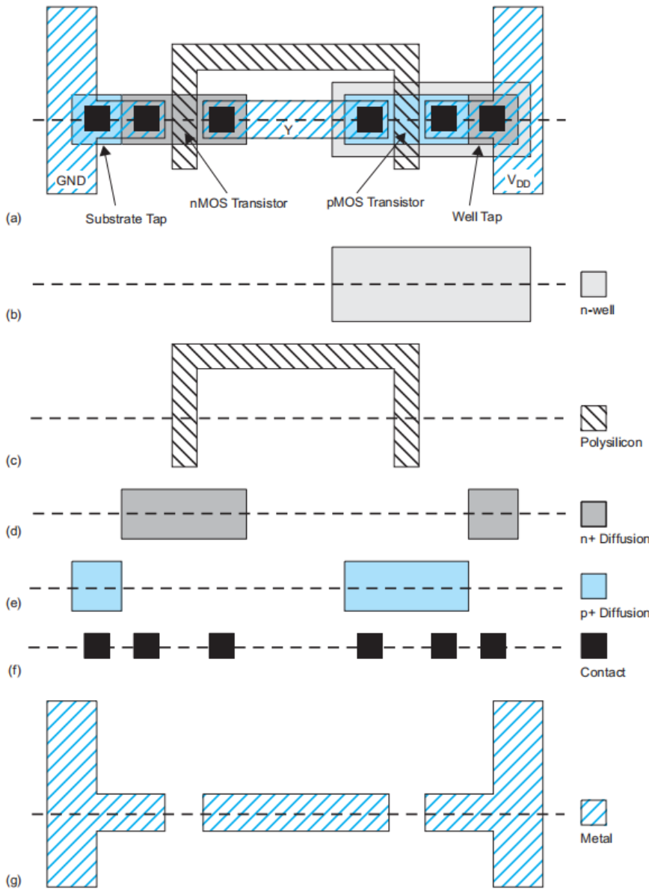

<small>  图1.35 反相器掩模版组。彩色版本见封面内侧。  </small>

考虑一个简单的制造工艺来说明这一概念。该工艺从在裸露的p型硅晶圆上创建n阱开始。图1.36显示了在形成n阱所涉及的每个加工步骤之后晶圆的横截面；图1.36(a)展示了加工前的裸露衬底。形成n阱需要向硅衬底中添加足够的V族掺杂剂，以在阱区域将衬底从p型转变为n型。为了限定哪些区域接受n阱，我们在整个晶圆上生长一层保护性氧化层，然后在需要形成阱的位置将其去除。随后添加n型掺杂剂；掺杂剂被氧化层阻挡，但在没有氧化层的地方进入衬底并形成阱。下一段将详细描述这些步骤。

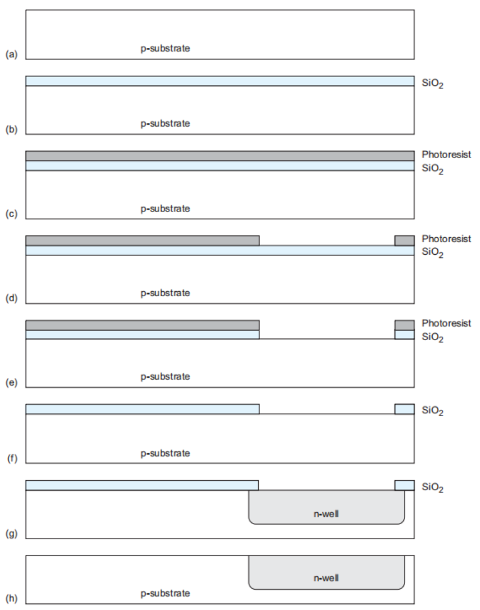

<small>  图1.36 制造n阱过程中的横截面  </small>


晶圆首先在高温（通常为900–1200°C）炉管中进行氧化，使Si与O₂反应，在晶圆表面生成SiO₂（图1.36(b)）。该氧化层需要被图案化以定义n阱。将有机光刻胶²旋涂在晶圆上（光刻胶在曝光处会软化）（图1.36(c)）。通过n阱掩模版（图1.35(b)）对光刻胶进行曝光，该掩模版仅允许光线在需要形成阱的区域通过。去除软化的光刻胶，以暴露下面的氧化层（图1.36(d)）。用氢氟酸（HF）刻蚀掉未被光刻胶保护的氧化层（图1.36(e)），然后用称为“食人鱼”刻蚀的混合酸去除剩余的光刻胶（图1.36(f)）。阱形成在未被氧化层覆盖的衬底区域中。添加掺杂剂的两种方法是扩散和离子注入。在扩散工艺中，晶圆被放置在含有掺杂剂气体的炉管中。加热时，掺杂剂原子扩散进入衬底。注意，由于横向扩散，阱的实际宽度大于氧化层上的开孔宽度（图1.36(g)）。在离子注入中，掺杂剂离子在电场中被加速并轰击进入衬底。无论采用哪种方法，氧化层都能防止掺杂剂原子进入不需要形成阱的衬底区域。最后，用HF去除剩余的氧化层，留下裸露的晶圆，在适当位置形成阱。

接下来形成晶体管的栅极。栅极由多晶硅（通常称为polysilicon）构成，位于薄层氧化层之上。该薄氧化层在炉管中生长。然后将晶圆放入含硅烷气体（SiH₄）的反应器中，再次加热，通过化学气相沉积工艺生长多晶硅层。多晶硅被重掺杂以形成具有较好导电性的导体。所得横截面如图1.37(a)所示。

与之前一样，使用光刻胶和多晶硅掩模版（图1.35(c)）对晶圆进行图案化，使多晶硅栅极保留在薄栅氧化层之上（图1.37(b)）。

随后引入n⁺区域，用于晶体管的有源区和阱接触。与阱的形成类似，先生长一层保护性氧化层（图1.37(c)），并用n扩散掩模版（图1.35(d)）进行图案化，以暴露需要掺杂剂的区域（图1.37(d)）。尽管图1.37(e)中的n⁺区域通常采用离子注入形成，但在历史上是通过扩散形成的，因此至今仍常被称为n扩散。注意，nMOS晶体管上方的多晶硅栅极阻挡了扩散，使得源极和漏极被栅极下方的沟道隔开。这被称为自对准工艺，因为晶体管的源极和漏极自动形成在栅极两侧，无需精确对准掩模版。最后，去除保护性氧化层（图1.37(f)）。

对p扩散掩模版（图1.35(e)）重复上述过程，得到图1.38(a)所示的结构。此处同样使用氧化层作为掩蔽层，因此不再示出。生长场氧化层以隔离晶圆与金属，并用接触孔掩模版（图1.35(f)）进行图案化，在需要金属与扩散区或多晶硅连接的位置留下接触孔（图1.38(b)）。最后，在整个晶圆上溅射铝，同时填充接触孔。溅射是将铝轰击成蒸气，均匀覆盖晶圆表面。用金属掩模版（图1.35(g)）对金属层进行图案化，并通过等离子体刻蚀去除除导线以外所有区域的金属（图1.38(c)）。至此完成了简单的制造工艺。

现代制造流程更为复杂，因为它们必须在晶体管沟道周围形成复杂的掺杂分布，并印制出比光刻所用光波长更小的特征尺寸。然而，这些复杂工艺所需的掩模版可以从我们刚刚讨论过的这套简单掩模版自动生成。现代工艺还拥有5~10层以上的金属层，因此金属和接触孔步骤需要针对每一层重复进行。芯片制造已成为一种商品化服务，许多不同的代工厂都可以根据一套基本掩模版来制造设计。

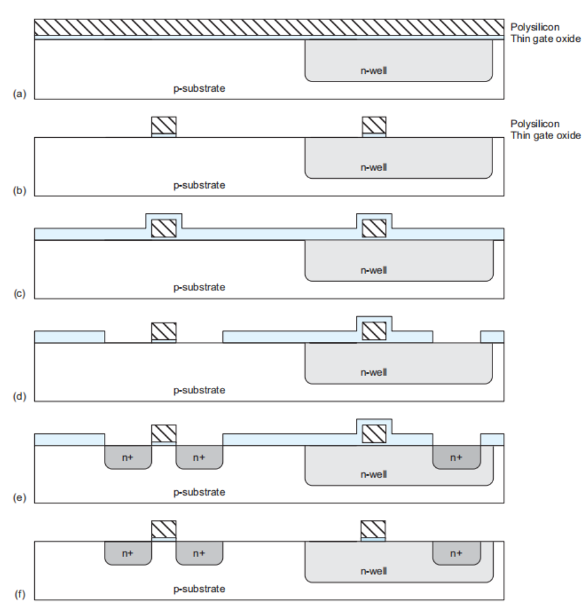


<small>  图1.37 制造多晶硅和n扩散过程中的横截面  </small>


版图设计规则描述了在特定制造工艺中，特征可以做到多小，以及它们之间可以多紧密地可靠排列。工业设计规则通常以微米为单位指定。这使得从一个工艺迁移到更先进的工艺或不同代工厂的工艺变得困难，因为并非所有规则都以相同方式缩放。

大学有时通过使用可缩放设计规则来简化设计，这些规则足够保守，可以适用于许多制造工艺。Mead和Conway[Mead80]推广了基于单一参数λ的可缩放设计规则，该参数表征了工艺的分辨率。λ通常为最小绘制晶体管沟道长度的一半。该长度是晶体管源极和漏极之间的距离，由多晶硅导线的最小宽度决定。例如，180nm工艺的最小多晶硅宽度（因而晶体管长度）为0.18μm，并使用尺寸为λ整数倍的设计规则。然而，它们使版图缩放变得微不足道；同一版图只需指定新的λ值即可迁移到新工艺。本章将以λ为单位来介绍设计规则。以λ规则的简单性和易于缩放为代价，牺牲了微米规则潜在的密度优势。设计人员通常用特征尺寸来描述工艺。特征尺寸指最小晶体管长度，因此λ是特征尺寸的一半。


## 1.5.3 版图设计规则

版图设计规则描述了在特定制造工艺中，特征可以做到多小，以及它们之间可以多紧密地可靠排列。工业设计规则通常以微米为单位指定。这使得从一个工艺迁移到更先进的工艺或不同代工厂的工艺变得困难，因为并非所有规则都以相同方式缩放。

大学有时通过使用可缩放设计规则来简化设计，这些规则足够保守，可以适用于许多制造工艺。Mead和Conway[Mead80]推广了基于单一参数λ的可缩放设计规则，该参数表征了工艺的分辨率。λ通常为最小绘制晶体管沟道长度的一半。该长度是晶体管源极和漏极之间的距离，由多晶硅导线的最小宽度决定。例如，180nm工艺的最小多晶硅宽度（因而晶体管长度）为0.18µm，并使用λ = 0.09µm的设计规则。基于λ的规则必然是保守的，因为它们将尺寸向上取整为λ的整数倍。然而，它们使版图缩放变得微不足道；同一版图只需指定新的λ值即可迁移到新工艺。本章将以λ为单位来介绍设计规则。以λ规则的简单性和易于缩放为代价，牺牲了微米规则潜在的密度优势。设计人员通常用特征尺寸来描述工艺。特征尺寸指最小晶体管长度，因此λ是特征尺寸的一半。

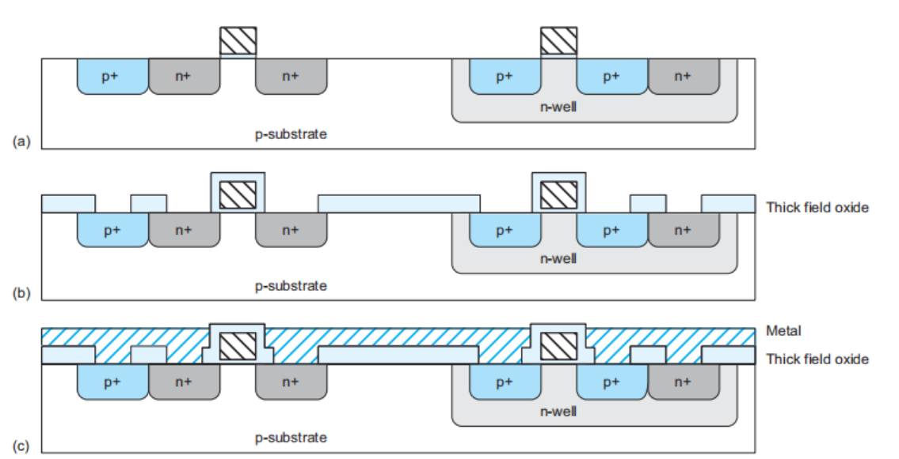

<small>  图 1.38 制造p扩散、接触孔和金属过程中的横截面  </small>

遗憾的是，在180nm以下，设计规则已变得非常复杂且具有工艺特异性，可缩放设计规则难以应用。然而，从一套简单的可缩放规则中获得的直观认识，仍然是理解更复杂规则的宝贵基础。第3章将更详细地探讨其中一些工艺特定规则。

MOSIS服务[Piña02]是一个低成本原型制作服务，它收集来自学术、商业和政府客户的设计，并将它们汇总到一套掩模版上，以分摊间接成本并产生足够吸引制造公司的产量。MOSIS开发了一套基于λ的可缩放设计规则，覆盖了广泛的制造工艺。这些规则描述了避免线条断裂的最小宽度、避免线条之间短路的最小间距，以及确保两层完全重叠的最小交叠量。

对于n阱工艺中带有两层金属的版图，一套保守但易于使用的设计规则如下：

- 金属和扩散区的最小宽度和间距为4λ。
- 接触孔为2λ × 2λ，并且必须在上下各层中被至少1λ的包围。
- 多晶硅的宽度为2λ。
- 多晶硅在需要形成晶体管的地方与扩散区重叠2λ，在不需要形成晶体管的地方与扩散区间距为1λ。
- 多晶硅与多晶硅之间、接触孔与接触孔之间，以及多晶硅与接触孔之间的间距为3λ。
- n阱围绕pMOS晶体管的范围为6λ，且与nMOS晶体管保持6λ的距离。

图1.39展示了具有两层金属工艺的基本MOSIS设计规则。第3.3节将详细阐述这些规则，并与工业设计规则进行比较。

在三层金属工艺中，第三层金属的宽度通常为6λ，间距为4λ。通常，层数更多的工艺会提供更厚、更宽的顶层金属，其电阻更低。

晶体管尺寸通常用其宽长比（W/L）来表示。例如，图1.39中多晶硅与n扩散交叉处形成的nMOS晶体管，其W/L为4/2。在0.6μm工艺中，这对应于实际宽度1.2μm和长度0.6μm。这种最小宽度的带接触孔的晶体管通常称为单位晶体管。pMOS晶体管通常比nMOS晶体管更宽，因为空穴迁移速度比电子慢，因此需要更宽的晶体管才能提供相同的电流。图1.40(a)示出了一个单位反相器版图，其中包含一个单位nMOS晶体管和一个两倍宽度的pMOS晶体管。图1.40(b)给出了该反相器的电路示意图，并标注了每个晶体管的宽长比。在数字系统中，通常选择具有最小可能长度的晶体管，因为短沟道晶体管速度更快、面积更小且功耗更低。图1.40(c)示出了一种我们常用的简写形式，即以单位宽度的倍数表示，并假定长度为最小值。

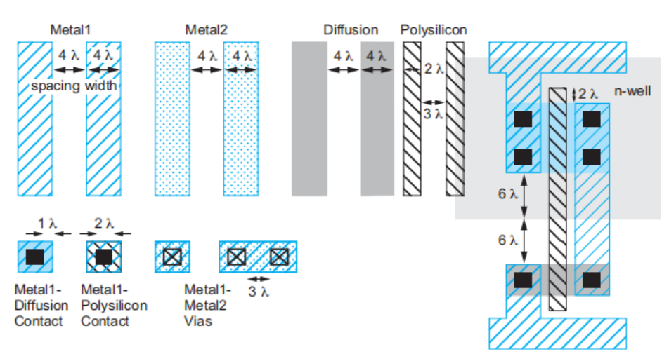

<small>  图 1.39 简化的基于λ的设计规则 </small>


## 1.5.4 门级版图

在设计版图拓扑结构以最小化门或其他单元（如加法器或存储单元）的面积时，可以发挥大量巧思，也可能耗费大量时间。对于许多应用而言，一种直接的版图设计就已足够，并且可以通过自动生成或手工快速构建。本节介绍一种基于“扩散线”规则的简单版图风格，该风格常用于自动化版图系统中的标准单元。此风格由四个水平条带组成：单元底部的金属地线、n扩散区、p扩散区和顶部的金属电源线。电源线和地线通常称为电源轨。多晶硅线垂直走线，形成晶体管的栅极。单元内部的金属线将晶体管适当地互连起来。

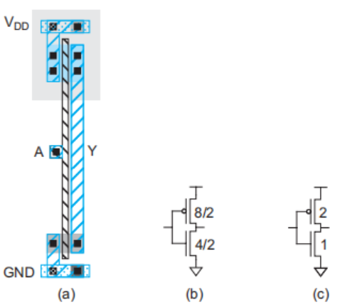

<small>  图 1.40 标注尺寸的反相器 </small>

图1.41(a)展示了这样一个反相器版图。输入A可以从上方、下方或左侧通过多晶硅连接。输出Y在单元右侧以金属线引出。回想一下，p型衬底和n阱必须分别连接到地和电源。图1.41(b)展示了相同的反相器，其中阱接触和衬底接触分别放置在电源轨和地轨下方。图1.42示出了一个三输入与非门。注意nMOS晶体管是串联连接的，而pMOS晶体管是并联连接的。电源线和地线向两侧各延伸2λ，因此如果两个单元拼接在一起，其内容之间将间隔4λ，满足设计规则。单元高度为36λ，如果计入单元与其上方另一条导线之间的4λ间距，则为40λ。所有这些示例均使用宽度为4λ的晶体管。晶体管宽度的选择将在第4–5章中进一步讨论，单元版图风格将在第14.7节中讨论。

这些单元的设计使得栅极连接从多晶硅的上方或下方引出。在当代标准单元中，多晶硅通常不作为布线层使用，因此单元必须允许金属2到金属1以及金属1到多晶硅的接触孔连接到每个栅极。虽然这增大了单元面积，但允许在金属布线层上自由访问所有端子。

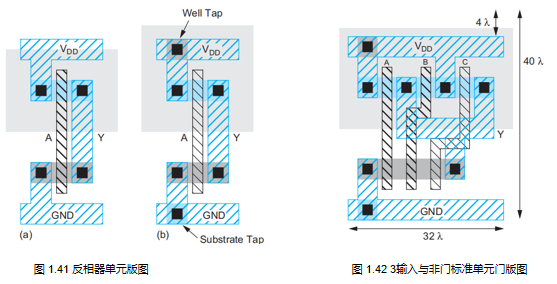


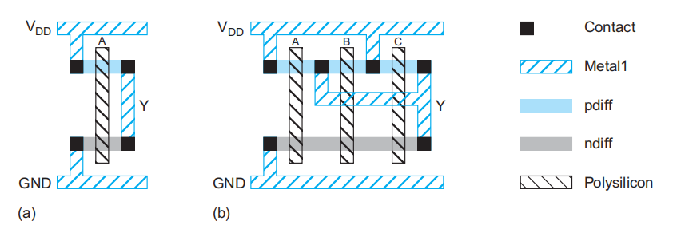

<small>  图 1.43 反相器和三输入与非门的棒状图。彩色版本见封面内侧。 </small>


## 1.5.5 棒状图

由于版图设计耗时，设计人员需要在投入完整版图之前，快速规划单元并估算面积。棒状图易于绘制，因为它们不需要按比例绘制。图1.43和封面内侧展示了反相器和一个三输入与非门的棒状图。虽然本书使用点状图案，但版图设计人员使用干擦记号笔或彩色铅笔。

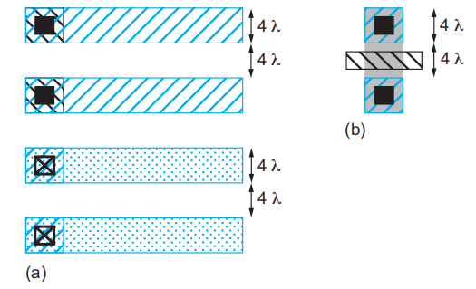

<small>  图 1.44 布线轨道间距 </small>


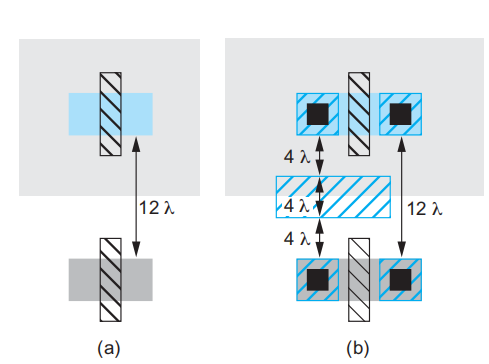

<small>  图 1.45 nMOS晶体管和pMOS晶体管之间的间距 </small>


经过练习，即使棒状图未按比例绘制，也很容易从相应的棒状图估算出版图面积。尽管电路示意图侧重于晶体管，但版图面积通常由金属导线决定，晶体管仅仅是放置在导线下方的元件。我们将一条布线轨道定义为放置一条导线及其与下一条导线之间所需间距的足够空间。如果我们的导线宽度为4λ，与下一条导线的间距为4λ，则轨道间距为8λ，如图1.44(a)所示。该间距也为在导线之间放置晶体管留出了空间（图1.44(b)）。因此，通过数金属轨道的数量并乘以8λ来估算单元的高度和宽度是合理的。一个稍微复杂之处在于，n阱所决定的nMOS与pMOS晶体管之间需要12λ的间距，如图1.45(a)所示。该空间可被额外的一条导线轨道占据，如图1.45(b)所示。因此，无论该轨道中是否实际使用了导线，都必须在nMOS和pMOS晶体管之间分配一条额外的轨道。图1.46展示了如何通过计数轨道来估算三输入与非门的尺寸。有4条垂直导线轨道，乘以每轨道8λ，得到单元宽度为32λ。有5条水平轨道，得到单元高度为40λ。即使水平轨道未按比例绘制，它们仍然易于计数。图1.42显示，实际的与非门版图与棒状图预测的尺寸相符。如果晶体管宽度大于4λ，则额外的宽度必须计入面积估算中。当然，这些估算相对于完整的设计规则而言过于简化，对于真正关键的单元，应进行试布版图。

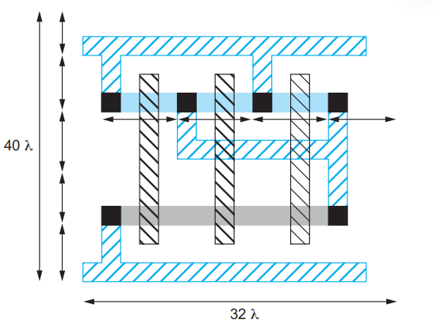

<small>  图 1.46 3输入与非门面积估算 </small>


示例1.3  
绘制一个计算 Y = !((A + B + C) · D) 的CMOS门（见图1.18）的棒状图，并估算单元宽度和高度。  
**解**：图1.47示出了一个棒状图。计数水平和垂直轨距，估算单元尺寸为40λ × 48λ。


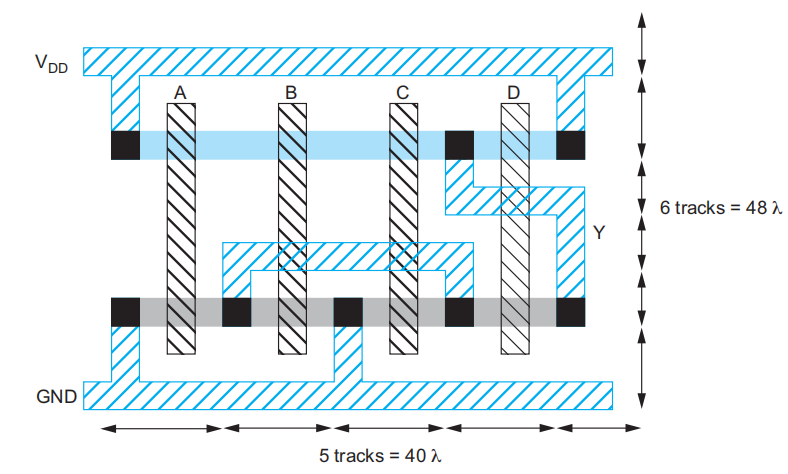

<small> 图 1.47 实现函数 Y = !((A + B + C) · D) 的CMOS复合门 </small>

# 1.6 设计划分

至此，您已经了解到MOS晶体管表现为压控开关。您知道如何用晶体管构建逻辑门。您也知道了晶体管是如何制造的，以及如何绘制版图来指定晶体管的放置和互连方式。您已经掌握了足够的知识来开始构建自己的简单芯片。

现代VLSI设计中最大的挑战不在于设计单个晶体管，而在于管理系统复杂性。现代系统芯片（SOC）设计将存储器、处理器、高速I/O接口和专用的特定应用逻辑集成在单个芯片上。它们使用数亿或数十亿个晶体管，设计成本高达数千万美元（或更多）。实现方案必须由庞大的工程师团队分工完成，并且每位工程师都必须具有很高的生产效率。如果划分过于死板，每个模块可能会独立优化而忽视相邻模块，导致系统整体效果不佳。相反，如果每个任务都与其他所有任务相互依赖，设计进度将过于缓慢。设计经理面临着在这些极端之间选择合适权衡的挑战。在这些选择上，实践经验无可替代，拥有多个设计经验的有才华的工程师对大型项目的成功至关重要。

设计通过多个抽象层次进行，在需要之前隐藏细节。结构化设计的实践——也用于大型软件项目——利用层次性、规则性、模块性和局部性原则来管理复杂性。


## 1.6.1 设计抽象

数字VLSI设计通常划分为五个抽象层次：架构设计、微架构设计、逻辑设计、电路设计和物理设计。架构描述系统的功能。例如，x86微处理器架构规定了指令集、寄存器集和存储器模型。微架构描述架构如何划分为寄存器和功能单元。80386、80486、Pentium、Pentium II、Pentium III、Pentium 4、Core、Core 2、Atom、Cyrix MII、AMD Athlon和Phenom都是为x86架构提供不同性能/晶体管数量/功耗权衡的微架构。逻辑描述功能单元是如何构建的。例如，x86整数单元中32位加法器的各种逻辑设计包括行波进位、超前进位和进位选择。电路设计描述如何使用晶体管来实现逻辑。例如，超前进位加法器可以使用静态CMOS电路、多米诺电路或传输晶体管。电路可以针对高性能或低功耗进行定制。物理设计描述芯片的版图。模拟和RF VLSI设计涉及相同的步骤，但具有不同的抽象层次。

这些要素本质上是相互依存的，并且都影响每个设计目标。例如，微架构和逻辑的选择在很大程度上取决于芯片上可以放置的晶体管数量，而这又取决于物理设计和工艺技术。类似地，将缓存访问从两个周期减少到一个周期的创新电路设计会影响哪种微架构最为理想。时钟频率的选择取决于微架构、逻辑、电路设计和物理设计之间复杂的相互作用。更深的流水线允许更高的频率，但会消耗更多功耗，并且当流水线前期的操作依赖于后期的操作时，会导致更大的性能损失。许多功能具有各种逻辑和电路设计，在速度、面积、功耗和设计工作量之间进行权衡。定制物理设计可以实现更紧凑、更快的电路和更低的制造成本，但涉及巨大的人力成本。使用CAD系统进行自动布局可以减少人力并加快上市时间。

为了应对这些相互依赖性，微架构、逻辑、电路和物理设计必须至少部分并行进行。微架构师依赖电路和物理设计研究来了解所提议的微架构特性的成本。工程师有时被归类为“矮胖型”或“高瘦型”（我们向您保证，这绝非针对个人！）。高瘦型工程师对广泛的主题都有所了解。矮胖型工程师在狭窄的领域内知识渊博。数字VLSI设计偏爱那些能够评估系统某一部分的选择如何影响系统其他部分的高瘦型工程师。


## 1.6.2 结构化设计

层次性是管理复杂设计的关键工具。大型系统可以层次化地划分为多个内核。每个内核由各种单元构建而成。每个单元又由多个功能模块组成。这些模块又由单元构建，而单元最终由晶体管构成。通过将组件视为具有良好定义接口和功能的黑盒子，而不是查看每个单独的晶体管，可以在顶层更容易地理解系统。设计的逻辑视图、电路视图和物理视图应共享相同的层次结构，以便于验证。设计层次结构可以看作一棵树形结构，整个芯片为根，原始单元为叶。

规则性通过设计最少数量的不同模块来帮助管理设计复杂性。一旦一个模块被设计和验证，就可以在许多地方重复使用。模块化要求模块具有良好定义的接口，以避免意外的相互作用。局部性涉及在物理和时间上将信息保留在其使用位置。结构化设计将在第14.2节中进一步讨论。


## 1.6.3 行为域、结构域和物理域

另一种查看设计划分的方式如图1.48所示的Y图表[Gajski83, Kang03]所示。Y图表上的放射线代表三个不同的设计域：行为域、结构域和物理域。这些域可用于描述几乎任何工件的设计，因此构成了描述设计过程的通用分类法。在每个域内，都有多个设计抽象层次，从非常高的层次开始，最终下降到需要聚合以产生顶层功能的各个元素（就芯片设计而言，即晶体管）。

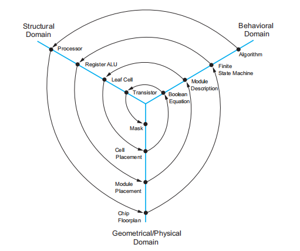

<small> 图 1.48 Y图表（经麦格劳-希尔公司许可，转载自[Kang03]）。 </small>


行为域描述特定系统的功能。例如，在最高层次上，我们可能指定一个电话按键音发生器。这种行为可以逐步细化，以更精确地描述构建该音发生器所需完成的工作（即所需的频率、输出电平、允许的失真等）。

在每个抽象层次上，都可以开发相应的结构描述。结构域描述为实现特定行为所需的模块互连。例如，在最高层次上，按键音发生器可能包括键盘、音发生器芯片、音频放大器、电池和扬声器。最终，在较低的抽象层次上，描述构建音发生器所需的各个门级连接，进而到晶体管级连接。

对于每个抽象层次，物理域描述解释如何物理构建该抽象层次。在高层，这可能包括工程图纸，展示如何将键盘、音发生器芯片、电池和扬声器组装到相关外壳中。在芯片顶层，这可能包括芯片规划图；在较低层次，则是单个晶体管的实际几何形状。

设计过程可以视为在保持域等效性的同时，从一个域到另一个域的转换。行为描述被转换为结构描述，结构描述再被转换为物理描述。这些转换可以是手动的，也可以是自动的。无论哪种方式，验证域间转换的正确性都是常规设计实践。这确保了设计意图跨域传递。通过层次化地指定每个域的逐级抽象细节，我们能够设计非常庞大的系统。

严格描述域和抽象层次的原因在于定义一个精确的设计流程，使得系统的最终功能可以一直追溯到初始行为描述。在理想流程中，不应产生错误设计。如果出现异常，则应修正设计流程，使这些异常不再发生。设计人员应养成严格的设计流程纪律，了解每一次转换及其如何以及为何是可靠无误的。通常，这些步骤在现代设计流程中完全自动化，但了解这些步骤的基础非常重要，以便在出现偏差时进行调试。

Y图表可用于说明各个域以及在不同设计抽象层次上域之间的转换。随着设计过程从外环向内环推进，它从较高的抽象层次和层级向较低的层次推进。

本章剩余大部分内容是一个简单微处理器设计的案例研究，旨在说明VLSI设计在非平凡系统中的应用各个方面。我们首先描述该处理器的架构和微架构，然后考虑逻辑设计并讨论硬件描述语言。该处理器采用我们在1.4节中讨论过的静态CMOS电路构建；同时讨论晶体管级设计和网表格式。我们继续探讨该处理器的物理设计，包括芯片规划和面积估算。设计验证至关重要，并且在设计的每个层次上都对每个元素进行验证。最后，将版图转换为掩模版，以便芯片制造、封装和测试。


# 1.7 示例：一个简单的MIPS微处理器

我们考虑MIPS微处理器架构的一个8位子集[Patterson04, Harris07]，因为它被广泛研究且相对简单，但仍足够大以说明层次化设计。本节描述我们将要实现的架构和多周期微架构。如果您不熟悉计算机体系结构，可以将MIPS处理器视为黑盒子，并跳至第1.8节。

在www.cmosvlsi.com上提供了一套实验练习，您可以通过使用名为Electric的免费开源CAD工具，或使用Cadence和Synopsys的商业设计工具，自行构建微处理器来学习VLSI设计。


## 1.7.1 MIPS架构

MIPS32架构是一种简单的32位RISC架构，具有相对较少的特殊之处。我们的架构子集使用32位指令编码，但仅使用8个8位通用寄存器，命名为$0–$7。我们还使用一个8位的程序计数器（PC）。寄存器$0被硬连线为包含数值0。指令包括ADD、SUB、AND、OR、SLT、ADDI、BEQ、J、LB和SB。

每条指令的功能和编码如表1.7所示。每条指令使用三种模板之一进行编码：R型、I型和J型。R型指令（基于寄存器）用于算术运算，指定两个源寄存器和一个目标寄存器。I型指令用于需要指定一个16位常量（也称为立即数）和两个寄存器的情况。J型指令（跳转）将指令字的大部分用于26位的跳转目标。每种编码的格式定义在图1.49中。所有格式的六个最高有效位是操作码（op）。R型指令均共享op = 000000，并使用额外的六个功能位（funct）来区分不同的功能。

表1.7 MIPS指令集（支持的子集）

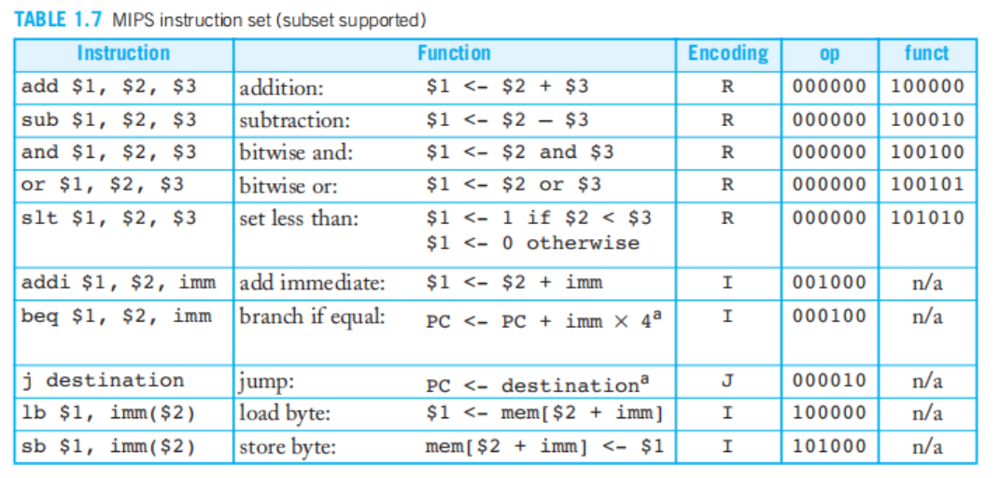

<small>a. 从技术上讲，MIPS地址按字节寻址。指令需要4字节的字，并且必须从地址为4的倍数的位置开始。为了在完整的32位MIPS架构中最有效地使用指令位，分支和跳转常量以字为单位指定，并且必须乘以4（左移2位）才能转换为字节地址。</small>


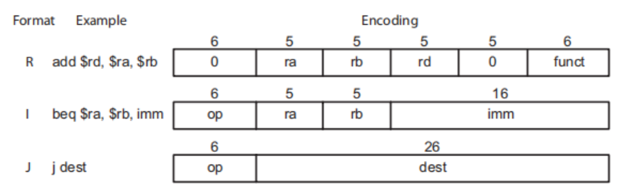

<small> 图1.49 指令编码格式 </small>

我们可以用汇编语言为MIPS处理器编写程序，程序中的每一行包含一条指令，如ADD或BEQ。然而，MIPS硬件最终必须将程序读作一系列32位的数，称为机器语言。汇编器使用表1.7和图1.49中定义的编码，自动完成从汇编语言到机器语言的繁琐翻译过程。用汇编语言编写非平凡的程序同样繁琐，因此程序员通常使用C或Java等高级语言工作。编译器将程序从高级语言源代码翻译为相应的机器语言目标代码。


示例1.4  
图1.50显示了一个简单的C程序，该程序计算第n个斐波那契数fn，对于n > 0，递归定义为fn = fn–1 + fn–2，f–1 = –1，f0 = 1。将该程序翻译为MIPS汇编语言和机器语言。  
解：图1.51给出了一个带注释的汇编语言程序。图1.52将该汇编语言翻译为机器语言。

```c
int fib(void) 
{
 int n = 8; /* compute nth Fibonacci number */ 
 int f1 = 1, f2 = -1; /* last two Fibonacci numbers */
 while (n != 0) { /* count down to n = 0 */ 
 f1 = f1 + f2; 
 f2 = f1 - f2; 
 n = n - 1; 
 } 
 return f1;
```

<small> 图 1.50 斐波那契程序的c代码</small>

## 1.7.2 多周期MIPS微架构

我们将实现[Patterson04]第5章和[Harris07]第7章中给出的多周期MIPS微架构，并修改为处理8位数据。该微架构如图1.53所示。细线表示单条信号，粗线表示总线。控制逻辑和控制信号以蓝色高亮显示，数据通路以黑色显示。控制信号通常驱动多路选择器的选择信号和寄存器的使能信号，以指示数据通路如何执行指令。

指令执行通常从左到右流动。程序计数器（PC）指定指令的地址。指令在四个周期内每次从片外存储器加载1个字节，进入32位指令寄存器（IR）。操作码字段（指令的位[31:26]）被发送到控制器，控制器对数据通路进行排序，以执行正确的操作来完成该指令。例如，在ADD指令中，两个源寄存器从寄存器文件中读出，进入临时寄存器A和B。在下一个周期，aludec单元命令算术/逻辑单元（ALU）对输入进行加法运算。结果被捕获到ALUOut寄存器中。在第三个周期，结果被写回寄存器文件中相应的目标寄存器。

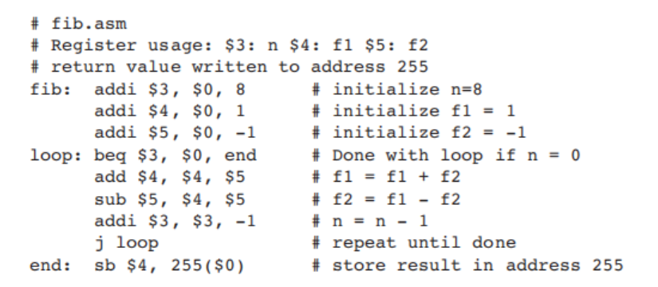

<small> 图1.51 斐波那契程序的汇编语言代码</small>


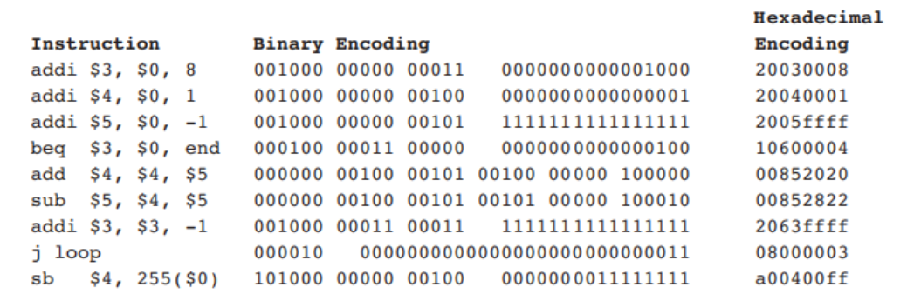

<small> 图1.52 斐波那契程序的机器代码</small>

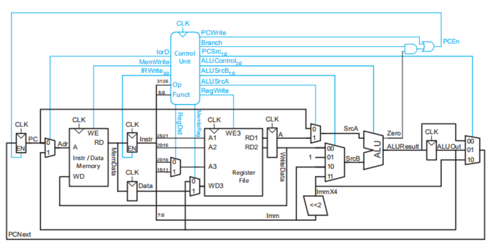

<small> 图1.53 多周期MIPS微架构。经Elsevier许可，改编自[Patterson04]和[Harris07]。</small>


控制器包含一个有限状态机（FSM），用于生成多路选择器选择信号和寄存器使能信号，以对数据通路进行排序。FSM的状态转换图如图1.54所示。如前所述，前四个状态从存储器中取指。然后，FSM根据Op进行分支，以执行特定的指令。ADDI指令的FSM状态缺失，留作读者练习。

请注意，FSM产生一个2位的ALUOp输出。控制器中的ALU译码器单元使用组合逻辑，根据ALUOp和Funct字段计算出一个3位的ALUControl信号，如表1.8所规定。ALUControl驱动ALU中的多路选择器，以选择相应的运算。


表1.8 ALU控制信号的确定

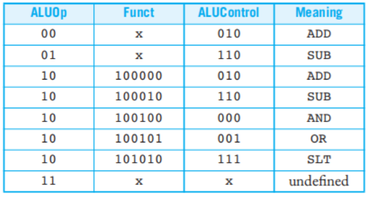

示例1.5  
参考图1.53和图1.54，说明MIPS处理器如何取指并执行SUB指令。  

解：第一步是取指32位指令。这需要四个周期，因为指令必须通过8位存储器接口传输。在每个周期，我们需要从程序计数器指定的存储器地址中读取一个字节，然后将程序计数器加1，以指向下一个字节。  

取指由图1.54中FSM的状态0–3完成。我们从状态0开始。程序计数器（PC）包含指令第一个字节的地址。控制器必须选择IorD = 0，以使多路选择器将该地址送往存储器。同时必须断言MemRead，使存储器将字节读出到MemData总线上。最后，应断言IRWrite0，以将memdata写入指令寄存器（IR）的最低有效字节。  

同时，我们需要递增程序计数器。我们可以通过ALU来实现：将PC作为第一个输入，1作为第二个输入，并选择加法操作。要选择PC作为第一个输入，设置ALUSrcA = 0。要选择1作为第二个输入，设置ALUSrcB = 01。要执行加法，根据表1.8，设置ALUOp = 00。要在周期结束时将结果写回程序计数器，设置PCSrc = 00且PCEn = 1（通过设置PCWrite = 1实现）。  

所有这些控制信号在图1.54的状态0中标出。其他寄存器使能信号如未明确断言则假定为0，其他多路选择器选择信号为无关项。接下来的三个状态与此相同，只是分别写入IR的第1、2和3字节。  

下一步是读取源寄存器，在状态4完成。两个源寄存器由IR的位[25:21]和[20:16]指定。寄存器文件读取这些寄存器，并将值放入A和B寄存器。对于SUB指令，不需要额外的控制信号（尽管状态4会计算分支地址，以备指令为BEQ时使用）。

下一步是执行减法。根据Op字段（IR的位[31:26]），FSM跳转到状态9，因为SUB是一条R型指令。通过设置ALUSrcA = 1和ALUSrcB = 00，将两个源寄存器选为ALU的输入。选择ALUOp = 10，使ALU控制译码器将ALUControl信号选择为110，即减法。其他R型指令的执行方式相同，只是译码器接收不同的Funct代码（IR的位[5:0]），从而生成不同的ALUControl信号。结果被放入ALUOut寄存器中。

最后，结果必须写回寄存器文件，在状态10完成。数据来自ALUOut寄存器，因此MemtoReg = 0。目标寄存器由指令的位[15:11]指定，因此RegDst = 1。必须断言RegWrite以执行写入。然后，控制FSM返回状态0，取指下一条指令。


# 1.8 逻辑设计

我们通过定义顶层芯片接口和框图来开始逻辑设计。然后我们将各单元层次化地分解，直到达到叶单元。我们使用硬件描述语言（HDL）来指定逻辑，这提供了比原理图或版图更高的抽象层次。这种代码通常被称为寄存器传输级（RTL）描述。


## 1.8.1 顶层接口

顶层输入和输出列于表1.9中。本示例采用两相时钟系统以避免保持时间问题。复位将PC初始化为0，并将控制FSM初始化为起始状态。

表1.9 顶层输入和输出

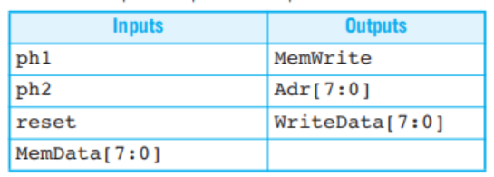

其余信号用于8位存储器接口（假设存储器位于片外）。处理器发送一个8位地址Adr，并有选择地断言MemWrite。在读周期中，存储器在MemData线上返回一个值，而在写周期中，存储器接受来自WriteData的输入。在许多系统中，MemData和WriteData可以合并到一条双向总线上，但在本示例中，我们保留图1.53中的接口。图1.55示出了一个由MIPS处理器、外部存储器、复位开关和时钟发生器构建的简单计算机系统。


## 1.8.2 框图

芯片被划分为两个顶层单元：控制器和数据通路，如图1.56中的框图所示。控制器包括控制FSM、ALU译码器以及用于计算PCEn的两个门电路。ALU译码器由组合逻辑组成，用于确定ALUControl信号。8位数据通路包含芯片的其余部分。它可以被视为字片或位片的集合。字片是包含8位触发器、加法器、多路选择器或其他元件的一列。例如，图1.57示出了一个8位2:1多路选择器的字片。它包含八个单独的2:1多路选择器，以及一个包含缓冲器和反相器的拉链，用于将正相和互补选择信号驱动到所有八个多路选择器。与在每个多路选择器中放置反相器相比，将这些驱动器分出到拉链中可以节省面积。或者，数据通路也可以视为八行位片。每个位片包含每个组件的一位，以及将这些位连接在一起的水平导线。

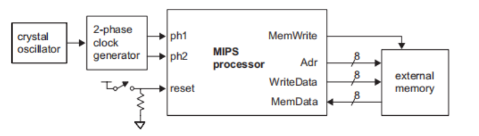

<small> 图1.55 MIPS计算机系统</small>

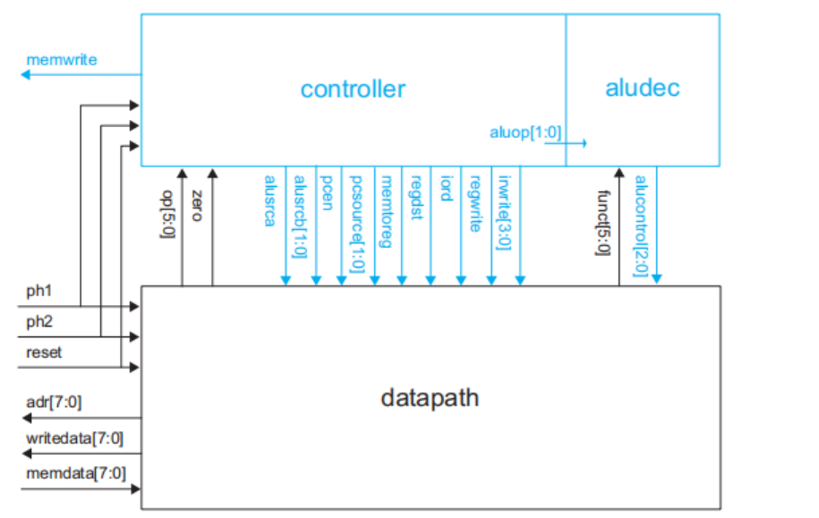

<small> 图1.56  顶层MIPS模块框图</small>

芯片划分受到预期物理设计的影响。数据通路包含大部分晶体管，且结构非常规整。通过手工精心设计每个字片或位片并将电路拼接在一起，我们可以在适中的设计工作量下实现高密度。使用字片来构建数据通路通常更容易，因为某些结构（如ALU中的零检测电路）在每个位片中并不相同。然而，从位片的角度来思考是规划数据通路布线的一种有价值的方法。

控制器的结构则少得多。手动将FSM转换为门电路非常繁琐，并且在新设计中，控制器是最有可能存在错误和最后一刻更改的部分。因此，我们将使用硬件描述语言更抽象地指定控制器，并使用综合和布局布线工具或可编程逻辑阵列（PLA）自动生成它。

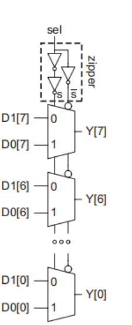

<small> 图1.57 8位2:1多路选择器字片</small>

## 1.8.3 层次结构

设计复杂系统的最佳方法是将其分解为更简单的部分。图1.58示出了MIPS处理器设计层次结构的一部分。控制器包含controller_pla和aludec，而aludec又由标准单元库（如与非门、或非门和反相器）构建而成。数据通路由8位字片组成，每个字片通常也由标准单元（如加法器、寄存器文件位、多路选择器和触发器）构建。其中某些单元在多个地方被复用。

设计层次结构在逻辑设计、电路设计和物理设计中不必完全相同。例如，在逻辑视图中，存储器最好被视为一个黑盒，而在电路实现中，它可能包含译码器、单元阵列、列多路选择器等。然而，不同的层次结构会使验证复杂化，因为它们必须被展平直到相互一致为止。实际上，最好使逻辑、电路和物理设计层次结构尽可能保持一致。


## 1.8.4 硬件描述语言

设计人员需要快速反馈，以判断逻辑设计是否合理。将框图和FSM状态转换图转换为电路原理图既耗时又容易出错；在经历整个流程之前，明智的做法是了解顶层设计是否存在需要完全重新设计的主要错误。HDL提供了一种在更高抽象层次上指定设计的方法，以提高设计者的效率。它们最初用于文档编写和仿真，但现在已用于直接从HDL综合出门级电路。

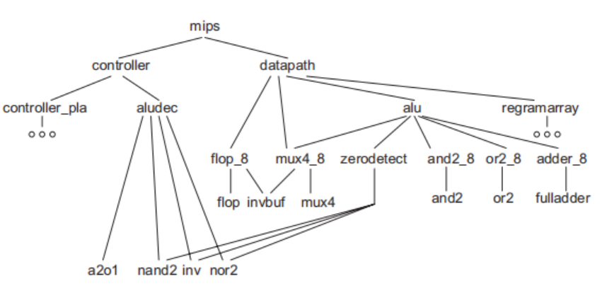

<small> 图1.58 MIPS设计层级</small>

两种最流行的HDL是Verilog和VHDL。Verilog由Advanced Integrated Design Systems（后更名为Gateway Design Automation）于1984年开发，到1991年已成为事实上的行业开放标准。2005年，SystemVerilog扩展被标准化，本书中使用了其中一些特性。VHDL代表VHSIC硬件描述语言，而VHSIC本身是美国国防部的一个超高速集成电路项目，由政府资助的委员会开发。正如从其出身可以预料的那样，Verilog更简洁，语法更接近C语言，而VHDL支持一些对大型团队项目有用的抽象。许多硅谷公司使用Verilog，而国防和电信公司通常使用VHDL。两种语言都没有决定性的优势，因此业界不得不同时支持两者。附录A提供了并排的Verilog和VHDL教程。为简洁起见，本书中的示例以Verilog给出。

在用HDL编码时，重要的是要记住您是在指定并行工作的硬件，而不是顺序执行的软件。有两种通用的编码风格。结构型HDL指定单元如何由其他单元或基本门和晶体管组成。行为型HDL指定单元的功能。

逻辑仿真器仿真HDL代码；它可以报告结果是否符合预期，并可以显示波形以帮助调试差异。逻辑综合工具类似于硬件的编译器：它将HDL代码映射到称为标准单元的门库上，以在满足某些时序约束的同时最小化面积。只有HDL结构的一个子集是可综合的；附录中强调了该子集。例如，测试平台中使用的文件I/O命令显然是不可综合的。逻辑综合通常产生的电路既不如熟练设计师手工设计的密集，也不如它们快速。然而，集成电路工艺现在已经非常先进，综合电路对于当今制造的大多数专用集成电路（ASIC）来说已经足够好。可以使用布局布线工具自动生成版图。

MIPS处理器的Verilog和VHDL模型列于附录A.12中。在Verilog中，每个单元称为一个模块。输入和输出的声明与C程序类似，并为总线指定位宽。内部信号也必须以类似于局部变量的方式声明。该处理器使用层次化方式进行描述，顶层使用结构型Verilog，叶单元使用行为型Verilog。例如，controller模块展示了如何在行为型Verilog中指定有限状态机，而aludec模块展示了如何指定复杂的组合逻辑。数据通路以字片为单位进行结构型描述，而字片本身则用行为型描述。

为了说明起见，8位加法器字片可以在结构上描述为行波进位加法器，由八个级联的全加器组成。全加器可以在结构上表示为和与进位子电路。而和与进位子电路又可以用行为方式描述。全加器模块如图1.59所示，进位子电路将在第1.9节进一步探讨。

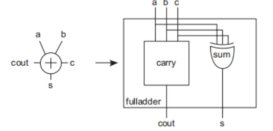

<small> 图1.59 全加器</small>

```verilog
module adder(input logic [7:0] a, b, 
 input logic c, 
 output logic [7:0] s, 
output logic cout);
wire [6:0] carry;
 fulladder fa0(a[0], b[0], c, s[0], carry[0]);
 fulladder fa1(a[1], b[1], carry[0], s[1], carry[1]);
 fulladder fa2(a[2], b[2], carry[1], s[2], carry[2]);
 ...
 fulladder fa7(a[7], b[7], carry[6], s[7], cout);
endmodule
module fulladder(input logic a, b, c, 
 output logic s, cout);
 sum s1(a, b, c, s); 
 carry c1(a, b, c, cout); 
endmodule
module carry(input logic a, b, c, 
 output logic cout);
assign cout = (a&b) | (a&c) | (b&c); 
endmodule
```


# 1.9 电路设计

电路设计涉及安排晶体管以执行特定逻辑功能。给定电路设计，我们可以估算延迟和功耗。电路可以表示为原理图，或以文本形式表示为网表。常见的晶体管级网表格式包括Verilog和SPICE。Verilog网表用于功能验证，而SPICE网表包含延迟和功耗仿真所需的更详细的信息。

由于晶体管栅极是良好的绝缘体，它可以建模为电容C。当晶体管导通时，源极和漏极之间会有一定的电流I流过。电流和电容都与晶体管宽度成正比。

逻辑门的延迟由其能提供的电流和所驱动的电容决定，如图1.60所示，为一个反相器驱动另一个反相器的情况。电容根据本构方程进行充电或放电。

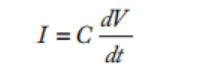

如果施加平均电流I，则在0和VDD之间切换的时间t为

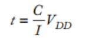

因此，延迟随负载电容增加而增加，随驱动电流增加而减小。为了进行这些计算，我们必须深入晶体管开关级模型之下的细节。第2章将建立更详细的晶体管模型，考虑电流和电容的影响。电路设计的目标之一是选择晶体管宽度以满足延迟要求。相关方法将在第4章中讨论。

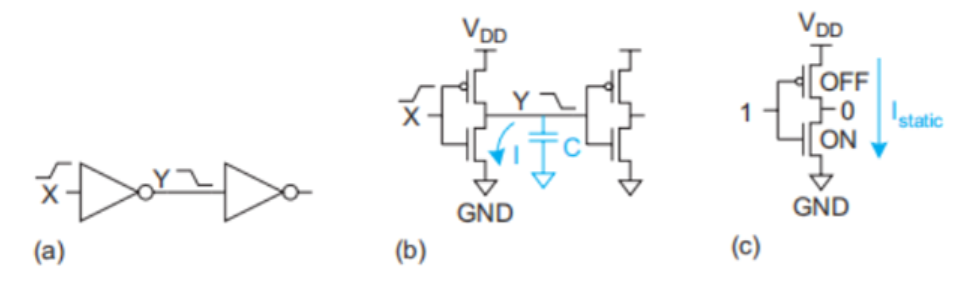

<small> 图1.60 电路延迟与功耗：（a）反相器对，（b）开关过程中显示电容和电流的晶体管级模型，（c）静态工作时的静态泄漏电流。</small>


为负载电容充电和放电需要消耗能量。这被称为动态功耗，因为它是电路主动开关时消耗的。电容器以频率f充放电时所消耗的动态功率为

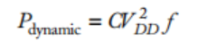

即使门电路不进行开关切换，它也会消耗一定的静态功耗。由于截止晶体管存在泄漏，会有少量电流Istatic在电源和地之间流动，导致静态功耗为

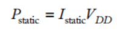


第5章将更详细地探讨功耗。

特定的逻辑功能可以通过多种方式实现。该功能应该用与门、或门、与非门还是或非门来构建？每个门的扇入和扇出应该是多少？每个门上的晶体管应该做多宽？这些选择中的每一个都会影响电容和电流，从而影响电路的速度和功耗，以及面积和成本。

如前所述，在许多设计方法中，逻辑综合工具会自动做出这些选择，在标准单元中搜索最佳实现。对于许多应用来说，综合已经足够好了。当系统对高速或低功耗有苛刻要求，或者制造数量足够大以证明额外工程投入是合理的时候，定制电路设计对芯片的关键部分就变得很重要。

电路设计人员通常在晶体管和/或门级绘制原理图。例如，图1.61显示了全加器中进位电路的两种替代电路设计。图1.61(a)中的门级设计需要26个晶体管和四级门延迟（回想一下，与门和或门是由与非门和或非门后接反相器构成的）。图1.61(b)中的晶体管级设计仅需12个晶体管和两级门延迟，说明了优化电路设计以利用CMOS技术优势的好处。

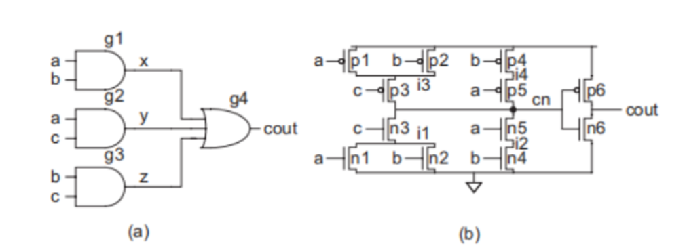

<small> 图1.61 carry 子电路</small>

然后将这些原理图网表化以进行仿真和验证。一种常见的网表格式是结构型Verilog HDL。门级设计可以网表化如下：

```verilog
module carry(input logic a, b, c, 
 output logic cout);
logic x, y, z;
and g1(x, a, b); 
and g2(y, a, c); 
and g3(z, b, c); 
 or g4(cout, x, y, z); 
endmodule
```


这是一种与技术无关的结构描述，因为使用了通用门，并未指定实际的门实现。晶体管级网表如下：

```verilog
module carry(input logic a, b, c, 
 output tri cout);
tri i1, i2, i3, i4, cn;
supply0 gnd;
supply1 vdd;
tranif1 n1(i1, gnd, a); 
 tranif1 n2(i1, gnd, b); 
 tranif1 n3(cn, i1, c); 
 tranif1 n4(i2, gnd, b); 
 tranif1 n5(cn, i2, a); 
 tranif0 p1(i3, vdd, a); 
 tranif0 p2(i3, vdd, b); 
tranif0 p3(cn, i3, c); 
 tranif0 p4(i4, vdd, b); 
 tranif0 p5(cn, i4, a); 
 tranif1 n6(cout, gnd, cn); 
 tranif0 p6(cout, vdd, cn); 
endmodule
```

晶体管表示为：
晶体管类型 名称（漏极，源极，栅极）；
tranif1对应nMOS晶体管，当栅极为1时导通，而tranif0对应pMOS晶体管，当栅极为0时导通。附录A.11更详细地介绍了Verilog网表。

到目前为止，我们仍然没有确定门速度或功耗所需的信息。我们需要指定晶体管的尺寸和寄生电容。由于Verilog被设计为开关级和门级语言，它不太适合这种细节层次的结构描述。因此，我们转向另一种电路仿真器SPICE常用的结构语言。晶体管级进位子电路在电路级上的规范可以表示如下：

```
.SUBCKT CARRY A B C COUT VDD GND 
MN1 I1 A GND GND NMOS W=2U L=0.6U AD=1.8P AS=3P 
MN2 I1 B GND GND NMOS W=2U L=0.6U AD=1.8P AS=3P 
MN3 CN C I1 GND NMOS W=2U L=0.6U AD=3P AS=3P 
MN4 I2 B GND GND NMOS W=2U L=0.6U AD=0.9P AS=3P 
MN5 CN A I2 GND NMOS W=2U L=0.6U AD=3P AS=0.9P 
MP1 I3 A VDD VDD PMOS W=4U L=0.6U AD=3.6P AS=6P 
MP2 I3 B VDD VDD PMOS W=4U L=0.6U AD=3.6P AS=6P 
MP3 CN C I3 VDD PMOS W=4U L=0.6U AD=6P AS=6P
MP4 I4 B VDD VDD PMOS W=4U L=0.6U AD=1.8P AS=6P 
MP5 CN A I4 VDD PMOS W=4U L=0.6U AD=6P AS=1.8P 
MN6 COUT CN GND GND NMOS W=4U L=0.6U AD=6P AS=6P 
MP6 COUT CN VDD VDD PMOS W=8U L=0.6U AD=12P AS=12P 
CI1 I1 GND 6FF 
CI3 I3 GND 9FF 
CA A GND 12FF 
CB B GND 12FF 
CC C GND 6FF 
CCN CN GND 12FF 
CCOUT COUT GND 6FF 
.ENDS
```

晶体管由以M开头的行来指定，格式如下：
M名称 漏极 栅极 源极 衬底 类型 W=宽度 L=长度 
 AD=漏极面积 AS=源极面积
到目前为止，MOS开关一直被伪装成三端器件（栅极、源极和漏极），但实际上它们是四端器件，衬底或阱构成体端。Verilog中未列出体连接，但SPICE需要它。类型指定晶体管是p器件还是n器件。宽度、长度和面积参数指定实际晶体管的物理尺寸。单位包括U（微，10⁻⁶）、P（皮，10⁻¹²）和F（飞，10⁻¹⁵）。电容器由以C开头的行来指定，格式如下：
C名称 节点1 节点2 值
在此描述中，SPICE中的MOS模型使用指定的器件尺寸来计算MOS晶体管固有的寄生电容。上述描述中额外的电容语句指定了器件结构非固有的额外布线电容。这取决于门的物理设计。长导线还会引入电阻，从而增加延迟。在结构规范电路级，给出了完整描述进位门在速度、功耗和连接性方面所需的所有连接。第8章将更详细地描述SPICE模型。


# 1.10 物理设计

## 1.10.1 布局规划

物理设计从布局规划开始。布局规划估算芯片中主要单元的面积，并定义它们的相对位置。布局规划对于确定所提议的设计是否能适应所分配的芯片面积预算，以及估算布线长度和布线拥塞至关重要。一旦逻辑被粗略定义，就应尽快准备初始布局规划。与往常一样，这个过程涉及反馈。布局规划通常会建议对逻辑（和微架构）进行更改，而更改反过来又会改变布局规划。例如，假设微架构师认为缓存需要2个周期的访问延迟。如果布局规划表明数据缓存可以放置在数据通路中执行单元的旁边，则缓存访问时间可能会减少到单个周期。这可以允许微架构师在提供相同性能的同时减少缓存容量。一旦缓存缩小，必须重新考虑布局规划，以利用数据通路附近新释放的空间。随着复杂设计开始趋于稳定，布局规划通常会被层次化地细分，以描述单元内的功能块。

布局规划的挑战在于，无需进行芯片的详细设计（而详细设计本身又取决于布局规划和线长）即可估算每个单元的面积。本节假设已经做出了良好的估算，并描述布局规划的样貌。接下来的几节将描述布局规划中可能出现的各类组件，并建议估算组件尺寸的方法。图1.62显示了MIPS处理器的芯片布局规划，包括压焊框。顶层模块是控制器和数据通路。两个模块之间有一个布线通道，为控制信号连入数据通路提供布线空间。数据通路进一步划分为字片。压焊框包含40个I/O焊盘，这些焊盘连接到芯片封装上的引脚。其中29个焊盘用于信号；其余为VDD和GND。

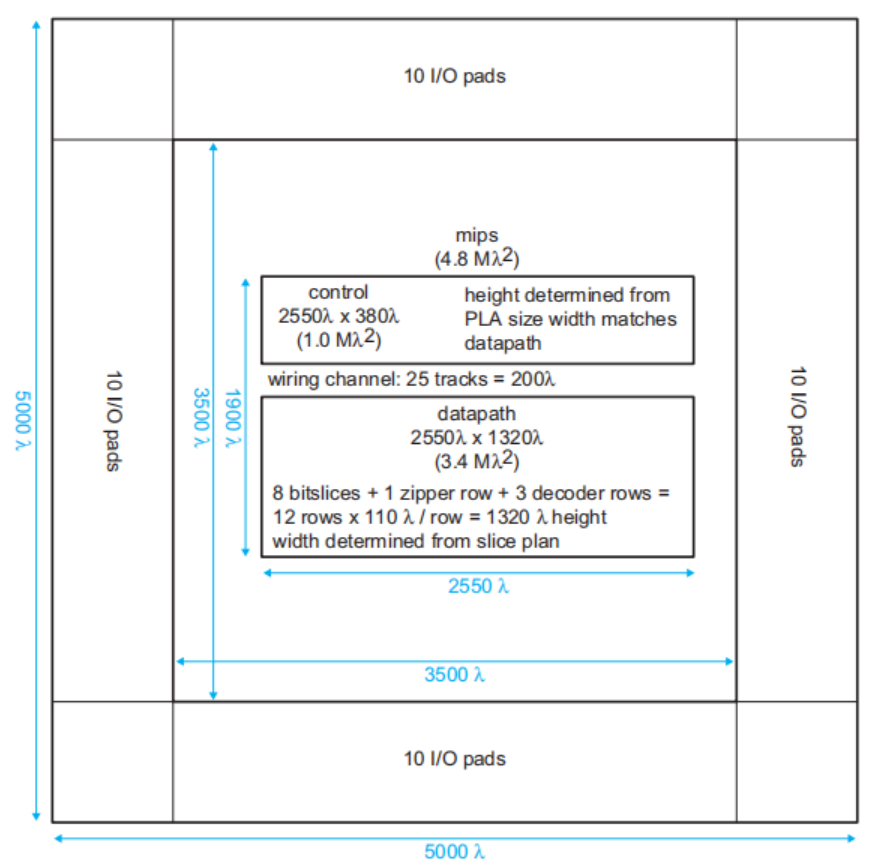

<small> 图1.62 MIPS布局规划</small>

布局规划按比例绘制并标注尺寸。该芯片采用0.6μm工艺设计，芯片尺寸为1.5×1.5 mm，因此芯片边长为5000λ。每个焊盘尺寸为750λ×350λ，因此压焊框内部的最大可用核心面积为3500λ×3500λ = 12.25 Mλ²。由于布线通道的存在，实际核心面积为4.8 Mλ²，大于各模块面积之和。这种设计被称为焊盘限制型，因为I/O焊盘决定了芯片面积。大多数商业芯片是内核限制型，因为芯片面积由除去焊盘之外的逻辑决定。通常，布局规划中的模块应为矩形，因为设计人员很难将逻辑塞入不规则形状的区域（尽管某些CAD工具可以很好地完成）。图1.63显示了实际的芯片版图。注意外围的40个I/O焊盘。压焊框内侧是金属2的VDD和GND环，分别标有+和–。

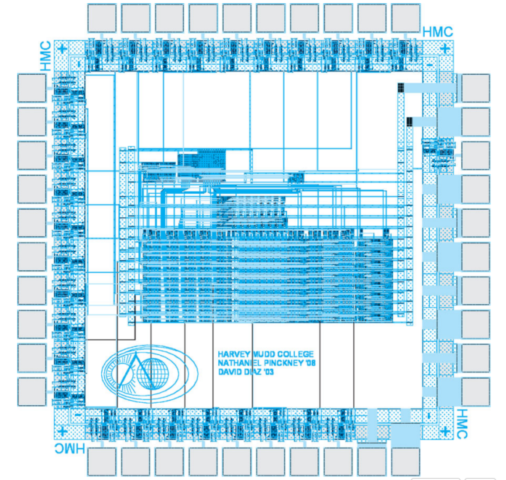

<small> 图1.63  MIPS版图</small>

片上结构可分为随机逻辑、数据通路、阵列、模拟和输入/输出（I/O）。随机逻辑（如aludecoder）结构较少。数据通路处理多位数据字，并对每个位执行大致相同的功能，因此它们由多个N位字片组成。阵列（如RAM、ROM和PLA）由在二维方向上重复的相同单元组成。如果版图可以复用或自动生成，则生产率最高。数据通路和阵列是很好的VLSI构建模块，因为单个精心设计的单元可以在一个或两个维度上复用。存储器阵列和随机逻辑已有自动版图生成器，但数据通路的自动生成工具尚不成熟。因此，许多设计方法忽略数据通路的潜在结构，而采用随机逻辑工具对其进行布局，除非性能或面积至关重要。模拟电路仍需仔细设计和仿真，但通常只涉及少量版图，因为它们晶体管数量相对较少。I/O单元也针对每种制造工艺进行了高度调整，通常由工艺供应商提供。

随机逻辑和数据通路通常由标准单元（如反相器、与非门和触发器）构建。标准单元提高了生产率，因为每个单元只需绘制和验证一次。通常，标准单元库从第三方供应商处购买。

布局规划期间的另一个重要决策是选择金属方向。MIPS布局规划使用水平金属1导线、垂直金属2导线和水平金属3导线。每层之间交替方向使得在不同层上交叉导线变得容易。


## 1.10.2 标准单元

一个简单的标准单元库如封面内侧所示。电源和地线在金属1上水平走线。这些供电轨的宽度为8λ（以承载更大电流），中心间距为90λ。nMOS晶体管放置在单元底部40λ区域内，pMOS晶体管则放置在顶部50λ区域内。因此，单元可以通过拼接方式连接，使供电轨和n阱对齐。衬底接触和阱接触放置在供电轨下方。输入和输出通过垂直走线的金属2提供。每个单元的宽度为8λ的整数倍，以提供整数个金属2布线轨道。单元内部，多晶硅垂直走线以形成栅极，扩散区和金属1水平走线，但在不干扰其他连接时，金属1也可垂直走线以节省空间。

单元在行内平铺排列。每一行在垂直方向上与前一行底部至少间隔110λ。在2层金属工艺中，水平金属1导线放置在行间的布线通道中。需要布线的导线数量决定了布线通道的高度。版图通常使用自动布局布线工具生成。图1.64显示了由这种工具生成的控制器版图。请注意，在本图及后续版图中，pMOS晶体管周围的n阱通常不再示出。

当有更多金属层可用时，布线可在单元上方进行，布线通道可能变得不必要。例如，在3层金属工艺中，金属3以10λ的间距水平走线。因此，每个单元上方可容纳11条水平布线轨道。如果这足以容纳所有水平导线，则布线通道可以取消。

自动综合和布局布线工具已足够成熟，可以将整个设计映射到标准单元上。图1.65显示了使用附录A.12中给出的VHDL模型，在130nm工艺和七层金属下综合得到的完整8位MIPS处理器。与图1.63相比，综合出的设计除了可以识别出导线下方26行标准单元外，几乎没有明显的结构。面积约为4Mλ²。综合设计往往比优秀的定制设计稍慢，但设计工作量要少一个数量级。

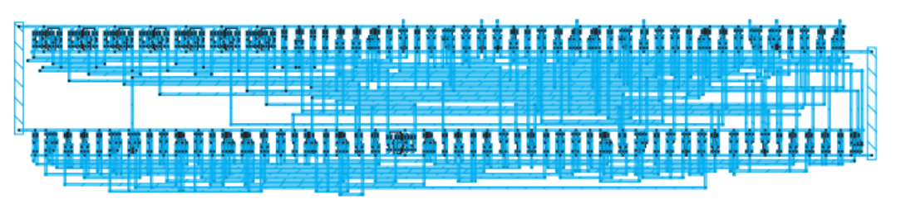

<small> 图1.64 MIPS控制器版图（综合后）</small>


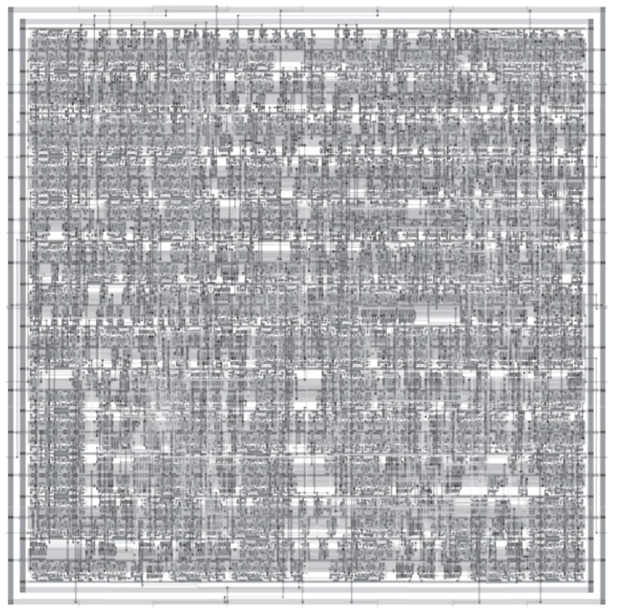

<small> 图1.65 综合后的MIPS处理器</small>


## 1.10.3 间距匹配

图1.64中控制器的面积主要由布线通道决定。当逻辑更加规整时，可以通过在单元中包含导线并使其“拼接”在一起来提高版图密度。拼接单元需要更多的设计和版图工作量，但能实现更小的面积和更短（即更快）的导线。设计拼接单元的关键问题是间距匹配。相互连接的单元在连接边上的尺寸必须相同。图1.66显示了几个间距匹配的单元。缩小单元D的尺寸并不有助于减少版图面积。另一方面，增大单元D的尺寸也会影响B和/或C的面积。

图1.67更详细地显示了MIPS数据通路。八个水平位片清晰可见。版图顶部的拉链包含三行译码器，该译码器与数据通路中的寄存器文件进行间距匹配。垂直金属2导线用于控制信号，包括时钟、多路选择器选择和寄存器使能。水平金属3导线在单元顶部走线，沿位片传输数据。

单元中晶体管的宽度以及必须在数据通路上方走线的导线数量决定了数据通路单元的最小高度。对于相对简单的数据通路，典型高度为60–100λ。单元的宽度取决于单元内容。

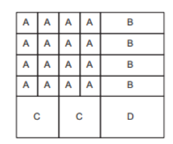

<small> 图1.66拼接单元的间距匹配</small>

## 1.10.4 切片规划

图1.68显示了数据通路的切片规划。该图示说明了字片的排列顺序以及每个位片内布线轨道的分配情况。圆点表示总线穿过某单元并在该单元内部使用。每个单元都标注了其类型和宽度（以轨道数计）。例如，程序计数器（pc）是PC触发器的输出，同时也用作srcA和地址多路选择器的输入。切片规划使得在布局数据通路之前，能够轻松计算导线长度并评估布线拥塞。在此例中，明显可见最大的拥塞发生在寄存器文件上方，那里需要七条布线轨道。

切片规划对于估算数据通路面积也至关重要。每个字片都标注了其宽度（以轨道数计）。该信息可通过查看单元库版图获得。将切片规划中每个元件的宽度相加，可以看到数据通路宽度为319个轨道，即2552λ宽。8位数据通路共有8个位片。此外，还有一行用于拉链，另有三行用于三个寄存器文件地址译码器，总共12行。按每行110λ的间距计算，数据通路高度为1320λ。地址译码器仅占其行的一小部分，留下浪费的空余空间。在更密集的设计中，控制器可以共享部分未使用的面积。

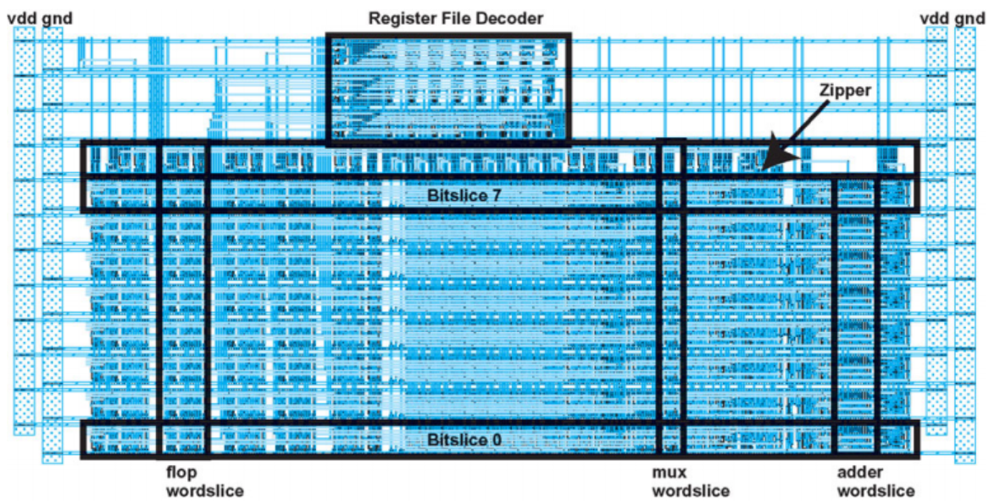

<small> 图1.67 MIPS datepath版图</small>


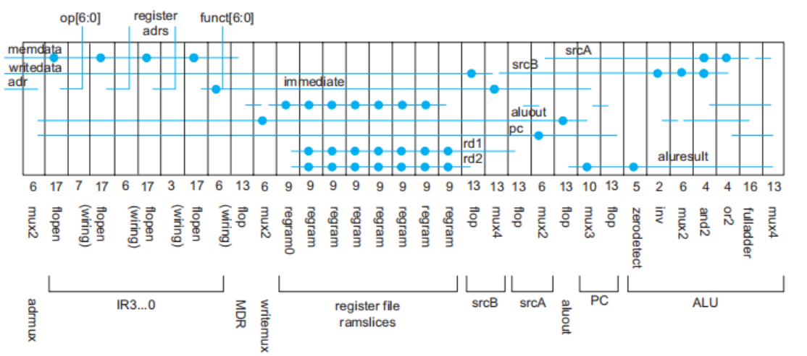

<small> 图1.68 数据通路切片规划</small>


## 1.10.5 阵列

图1.69显示了一个用于控制FSM下一状态和输出逻辑的可编程逻辑阵列（PLA）。PLA可以计算任何以乘积和形式表示的逻辑函数。左侧结构称为与阵列，右侧结构称为或阵列。PLA将在第12.7节中进一步讨论。

该PLA版图对每个输入使用2条垂直轨道，每个输出使用3条垂直轨道，外加约6条用于开销。每个乘积项或最小项使用1.5条水平轨道，外加约14条用于开销。因此，PLA的面积很容易计算。PLA总面积为500λ×350λ，再加上控制FSM所需的四个外部触发器所占的336λ×220λ。控制器的高度由PLA的高度加上用于布线输入和输出的几条布线轨道决定。相比之下，图1.64中综合生成的控制器尺寸为1500λ×400λ，因为布线轨道浪费了太多空间。

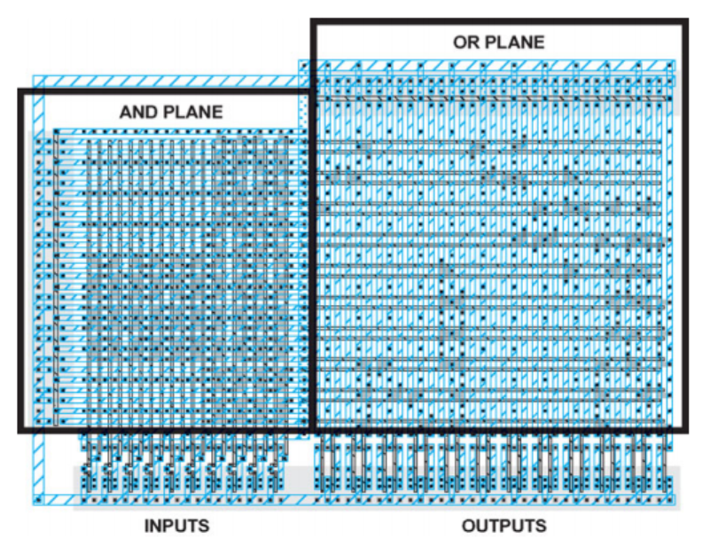

<small> 图1.69 控制FSM的PLA</small>

## 1.10.6 面积估算

良好的布局规划依赖于合理的面积估算，而在逻辑最终确定之前，这可能难以做到。有经验的设计师可以通过与过去绘制的类似模块面积进行比较来估算模块面积。在没有此类比较数据的情况下，表1.10列出了一些典型数值。务必考虑以8λ/轨道的间距计算的布线通道。较大的晶体管显然占据更大的面积，因此这可以作为宽度W和长度L的函数计入面积估算中。对于存储器，不要忘记译码器和其他外围电路，它们通常占用与存储位本身相当的面积。具体情况可能有所不同，但数据通路和阵列通常比标准单元实现更高的密度。

表1.10 典型版图密度

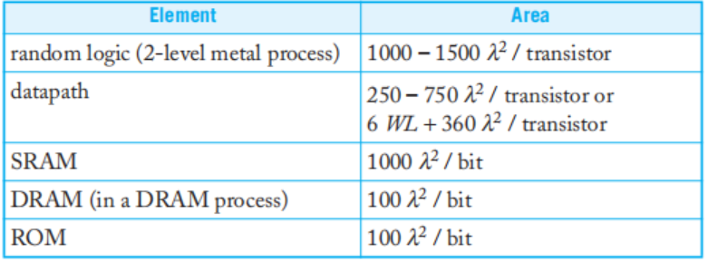

只要有足够的时间，几乎总能在设计的各个地方缩减几个λ。然而，这种努力通常不是好的投资，除非某个元件被如此频繁地重复使用，以至于占据了芯片面积的很大一部分，或者由于布局规划错误导致某个模块的空间过小，必须在芯片完成之前将该模块缩小。在布局规划中做出保守的面积估算是明智的，尤其是当某个模块有可能增加更多功能时。

一些单元库供应商以kgates/mm²为单位指定典型布线后的标准单元版图密度。通常，一个门被定义为具有六个晶体管的3输入静态CMOS与非门或或非门。采用八层金属的65 nm工艺（λ ≈ 0.03 μm），其随机逻辑密度可达160–500 kgates/mm²。这相当于每个晶体管约370–1160λ²。具有多层金属的工艺可获得高密度，因为不需要布线通道。


# 1.11 设计验证

集成电路足够复杂，以至于任何可能出错的地方，都很可能会出错。设计验证对于在制造之前捕获错误至关重要，通常占芯片设计工作的一半或更多。

随着设计表示变得更加详细，验证时间也会增加。在大规模电路级仿真器（如SPICE）上对整个芯片进行大量周期仿真以证明版图正确是不现实的。相反，设计通常在架构层面使用C等语言模型进行功能测试，在逻辑层面通过仿真HDL描述进行验证。然后，检查电路以确保它们是逻辑的忠实表示，并检查版图以确保它们是电路的忠实表示，如图1.70所示。电路和版图还必须满足时序和功耗规格。

测试平台用于验证逻辑是否正确。测试平台实例化待测逻辑。它读取一个包含输入和预期输出的文件（称为测试向量），将其应用于待测模块，并记录不匹配项。附录A.12提供了一个用于验证MIPS处理器逻辑的测试平台示例。

有多种技术可用于电路验证。如果逻辑综合到单元库上，综合后的门级网表可以再次用HDL表示，并使用相同的测试向量进行仿真。或者，可以对晶体管级网表进行测试向量仿真，尽管这可能给时序电路带来棘手的竞争条件。强大的形式验证工具也可用于检查电路是否执行与相关逻辑相同的布尔函数。非常规电路应进行充分仿真，以确保它们执行预期的逻辑功能并具有足够的噪声容限；本书通篇讨论了电路陷阱。

版图与原理图一致性检查工具（LVS）检查版图中的晶体管是否以与电路原理图相同的方式连接。设计规则检查器（DRC）验证版图是否满足设计规则。电气规则检查器（ERC）扫描其他潜在问题，如噪声或过早老化；此类问题也将在本书后面讨论。

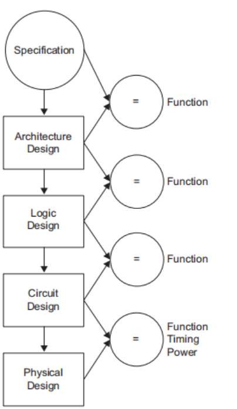

<small> 图1.70 设计和验证序列</small>


# 1.12 制造、封装与测试

芯片设计完成后，即进行**流片**以投入制造。“流片”一词源于早期将掩模版规格写入磁带的旧做法；如今，掩模版描述通常以电子方式发送给制造商。两种常见的掩模版描述格式是**Caltech交换格式（CIF）**[Mead80]（主要用于学术界）和**Calma GDS II流格式（GDS）**[Calma84]（用于工业界）。

掩模版通过用电子束在玻璃上刻蚀铬图案来制作。纳米工艺的一套掩模版可能非常昂贵。例如，180nm工艺中大型芯片的掩模版成本大约为25万美元。在65nm工艺中，掩模版成本约为300万美元。美国的MOSIS服务以及欧洲的EUROPRACTICE和日本的VDEC等对应机构，将多个来自学术界和工业界的小型设计合并到一套掩模版上，从而将成本分摊给众多客户。在高校折扣下，多项目晶圆上一次流片40颗小芯片的成本，在130nm工艺下约为10,000美元，在0.6μm工艺下可低至约2,000美元。MOSIS还为课程项目芯片提供一定的制造资助。

集成电路制造厂（晶圆厂）如今耗资数十亿美元，并在数年内就会过时。一些大公司仍然拥有自己的晶圆厂，但越来越多的无晶圆半导体公司将制造外包给台积电、联电和IBM等代工厂。

多颗芯片同时在一片硅晶圆上制造，晶圆直径通常为150–300毫米（6–12英寸）。制造过程需要许多沉积、掩蔽、刻蚀和注入步骤。大多数制造厂针对晶圆吞吐量而非延迟进行优化，导致交付周期长达10周。图1.71显示了一名工程师在洁净室中手持一片完成的300mm晶圆。洁净室经过过滤以消除大部分可能损坏部分处理晶圆的灰尘和其他颗粒。该工程师穿着“兔子服”以避免污染洁净室。图1.72是8位MIPS处理器的显微照片（在显微镜下拍摄的照片）。

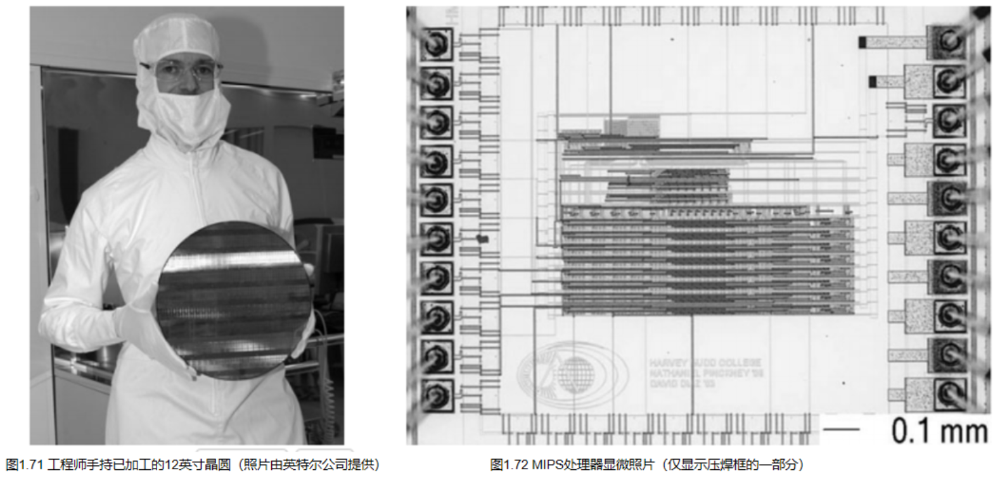

加工好的晶圆被切割成裸片（芯片）并进行封装。图1.73显示了1.5×1.5 mm芯片的40引脚双列直插式封装（DIP）。这种引线键合封装使用细金线将裸片上的焊盘连接到封装中心腔体内的引线框架上。这些引线在图1.72的焊盘上可见。更先进的封装在成本、引脚数、引脚带宽、功耗处理能力和可靠性之间提供不同的权衡，这将在第13.2节中讨论。倒装芯片技术将小焊球直接放置在裸片上，消除了键合线电感，并允许在整个芯片面积上（而不仅仅在周边）进行接触。

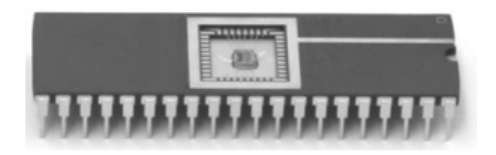

<small> 图1.73 40引脚双列直插式封装中的芯片</small>

即使晶圆上的微小缺陷或灰尘颗粒也可能导致芯片失效。芯片在出售前需要进行测试。能够处理高速芯片的测试仪成本高达数百万美元，因此许多芯片采用内建自测试功能来减少所需的测试仪时间。第15章专门讨论设计验证和测试。


## 总结与展望

“如果汽车遵循与计算机相同的发展周期，那么一辆劳斯莱斯今天将只卖100美元，每加仑行驶一百万英里，并且每年爆炸一次……”
——罗伯特·X·克林格里

在摩尔定律的驱动下，CMOS技术已主导半导体行业。本章探讨了设计简单CMOS集成电路的原理。MOS晶体管可视为电控开关。静态CMOS门由nMOS晶体管的下拉网络和pMOS晶体管的上拉网络构成。晶体管和导线通过一系列沉积、光刻和刻蚀步骤在硅晶圆上制造。这些步骤由一组掩模版定义，并以芯片版图形式绘制。设计规则规定了版图中各元素的最小宽度和间距。芯片设计过程可分为架构设计、逻辑设计、电路设计和物理设计。芯片的性能、面积和功耗受到各个层次上相互关联的决策的影响。设计验证在构建此类复杂系统中起着重要作用；硬件可靠性要求远高于通常对软件的要求。

主要设计目标包括可靠性、性能、功耗和成本。任何芯片都应以高概率在其预期寿命内可靠运行。例如，芯片必须设计为不会因过热或电压过高而损坏。性能受时钟速度和并行性等许多因素影响。CMOS晶体管每次开关都会消耗功率，因此动态功耗与晶体管的数量、尺寸以及开关速率相关。在特征尺寸低于180nm时，晶体管即使在截止状态下也会泄漏大量电流。因此，芯片即使在空闲时也会产生静态功耗。VLSI设计的一个核心挑战是，在特定应用中如何更好地权衡性能与功耗之间的关系。芯片成本包括设计和掩模版的一次性工程费用，以及与芯片尺寸相关的每颗芯片制造成本。在特征尺寸较小的工艺中，单位成本会降低，因为可以在给定面积内封装更多晶体管，但一次性工程费用会增加。最新的制造工艺仅对销量巨大的芯片具有成本效益。尽管如此，成熟且成本低廉的制造工艺仍然存在许多有趣的市场。

为了量化芯片如何满足这些目标，我们必须开发并分析更完整的模型。本书其余部分将扩展本章介绍的内容。当然，晶体管不仅仅是开关。第2章研究晶体管的电流和电容，这对于估算延迟和功耗至关重要。第3章更详细地介绍CMOS工艺技术和版图规则。接下来的四章讨论电路设计人员关注的基本问题。第2章的模型过于详细，不便于手工应用于大型系统，但又不足以完全捕捉现代晶体管的复杂性。第4章开发简化模型以估算电路延迟。如果现代芯片设计一味追求极致性能而不考虑功耗，它们将会烧毁。因此，必须在功耗和性能之间进行估算和权衡。此外，低功耗对于移动电池供电系统至关重要。功耗在第5章中讨论。导线对于整体性能和功耗的贡献与晶体管同等重要，并在第6章中讨论。第7章讨论具有高良率和低故障率的稳健电路设计。

仿真在第8章中讨论，用于获得更准确的性能和功耗预测，并验证电路和逻辑的正确性。第9章讨论组合电路设计。有多种电路系列可供选择，它们在速度、功耗、复杂性和鲁棒性方面各有不同的权衡。第10章继续讨论时序电路设计，包括时钟和锁存技术。

接下来的三章深入探讨CMOS子系统。第11章分类介绍了多种数据通路子系统的设计，包括加法器、移位器、乘法器和计数器。第12章类似地描述了存储器子系统，包括SRAM、DRAM、CAM、ROM和PLA。第13章讨论专用子系统，包括电源分配、时钟和I/O。

最后几章讨论CMOS系统设计的实际问题。第14章重点介绍当前一系列设计方法，并指出CMOS特有的问题。第15章讨论测试、可测性设计和调试技术。如今，几乎所有数字集成电路的设计都使用硬件描述语言（HDL）。附录A提供了Verilog和VHDL（两种主流的HDL）的并排教程。

若干小节标有“可选”图标。这些章节更详细地描述了特定主题。初次阅读时可跳过这些章节，待实际需要时再返回阅读。为控制本书篇幅，部分可选主题已发布在互联网上而非印刷版中。这些章节可在www.cmosvlsi.com找到，并标有“网络增强”图标。配套教材《使用Cadence和Synopsys CAD工具进行数字VLSI芯片设计》[Brunvand09]涵盖了使用主流工业CAD工具构建芯片的实际细节。


